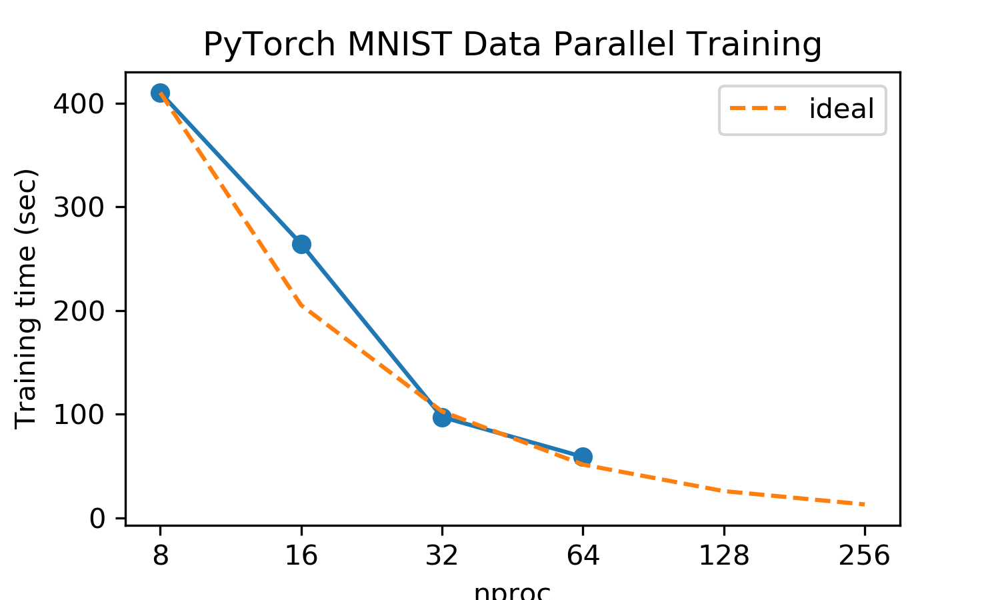
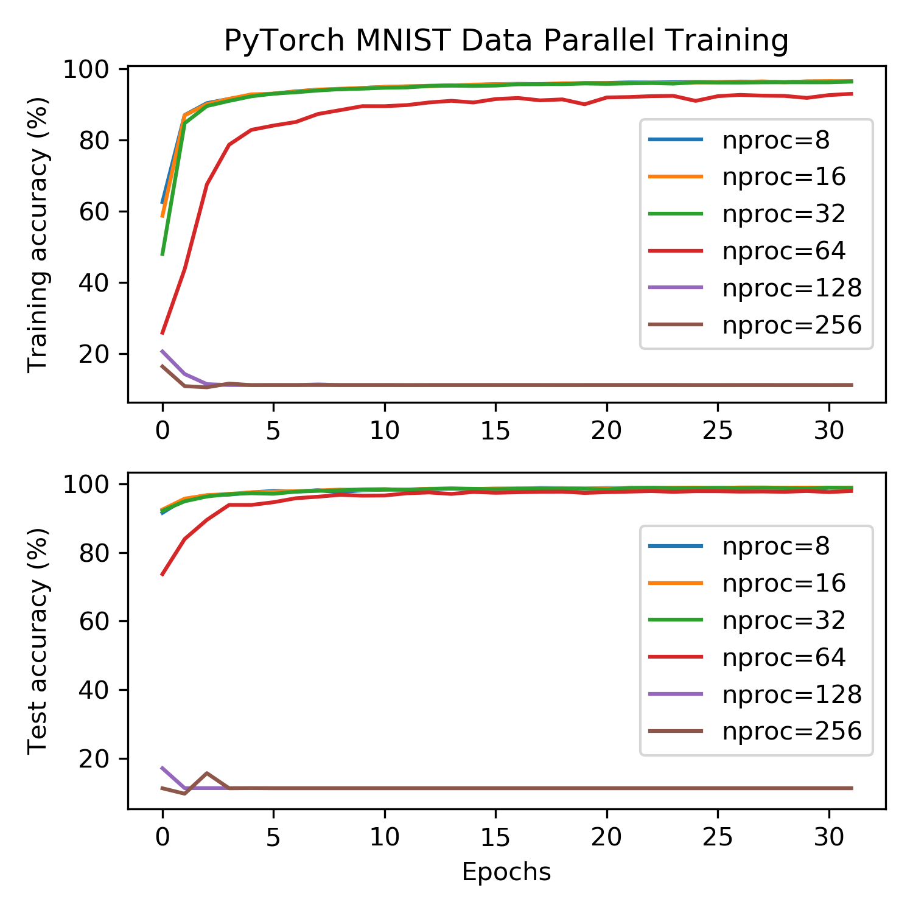

# Hands on for Data Parallel Deep Learning on Theta (CPU)

1. Request an interactive session on Theta:
```bash
qsub -n 4 -q debug-cache-quad -A SDL_Workshop -I -t 1:00:00
```

2. Setup the Python environment to include TensorFlow, Keras, PyTorch, and Horovod:
```bash
module load datascience/pytorch-1.7
module load datascience/tensorflow-2.3
```

3. Run examples
   - PyTorch MNIST
     ```bash
     aprun -n 16 -N 4 -e OMP_NUM_THREADS=32 -d 32 -j 2 -e KMP_BLOCKTIME=0 -cc depth python pytorch_mnist.py --device cpu
     ```
    
   - TensorFlow MNIST
     ```bash
     aprun -n 16 -N 4 -e OMP_NUM_THREADS=32 -d 32 -j 2 -e KMP_BLOCKTIME=0 -cc depth python tensorflow2_mnist.py --device cpu
     ```
    
   - TensorFlow Keras MNIST
     ```bash
     aprun -n 16 -N 4 -e OMP_NUM_THREADS=32 -d 32 -j 2 -e KMP_BLOCKTIME=0 -cc depth python tensorflow2_keras_mnist.py --device cpu
     ```

4. Test scaling and investigate the issue of large batch size training

    Note, this requires a new job allocation to a separate job queue. The following script performes a simple scaling test with the MNIST dataset
	* PyTorch model -  [sumissions/theta/qsub_pytorch_mnist_scale.sh](sumissions/theta/qsub_pytorch_mnist_scale.sh):
    ```bash
    qsub -O pytorch_mnist_scale -n 128 -q default -A SDL_Workhop sumissions/theta/qsub_pytorch_mnist_scale.sh
    ```
	* TensorFlow with Keras API - [sumissions/theta/qsub_keras_mnist_scale.sh](sumissions/theta/qsub_keras_mnist_scale.sh): 
	```bash
    qsub -O pytorch_mnist_scale -n 128 -q default -A SDL_Workhop sumissions/theta/qsub_keras_mnist_scale.sh
    ```

    You can check the test accuracy and the timing for different scales. 
	
	In this case, we run for 32 epochs. The time to solution decreases linearly as we increase the number of processes. The communication overhead is not significant. 
	

	However the training accuracy and test accuracy decreases as we increase the number of worker. As we can see upto 128 processes, the training accuracy and test accuracy is \~10\%, which means that the training does not converge to a local mimimum at all. The reason is that when we the learning rate is scaled as 128*0.01 = 1.28 which might be too large in the beginning. One solution is to use several warm up epochs in which the learning rate remains as 0.01. 
	

5. The impact of warmup epochs

    We could use a small learning rate (do not scale by the number of workers) in the begining 1 or 2 epochs, and see whether that improve the training results at large scale.
