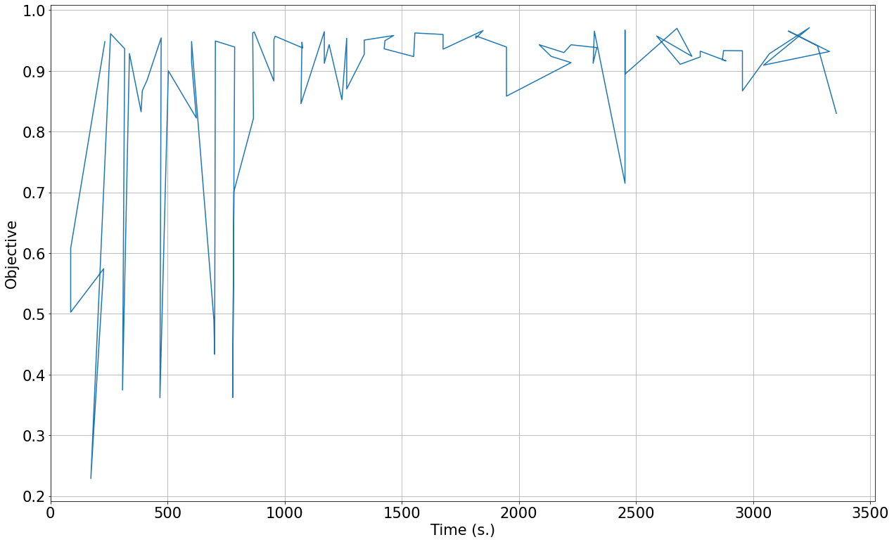
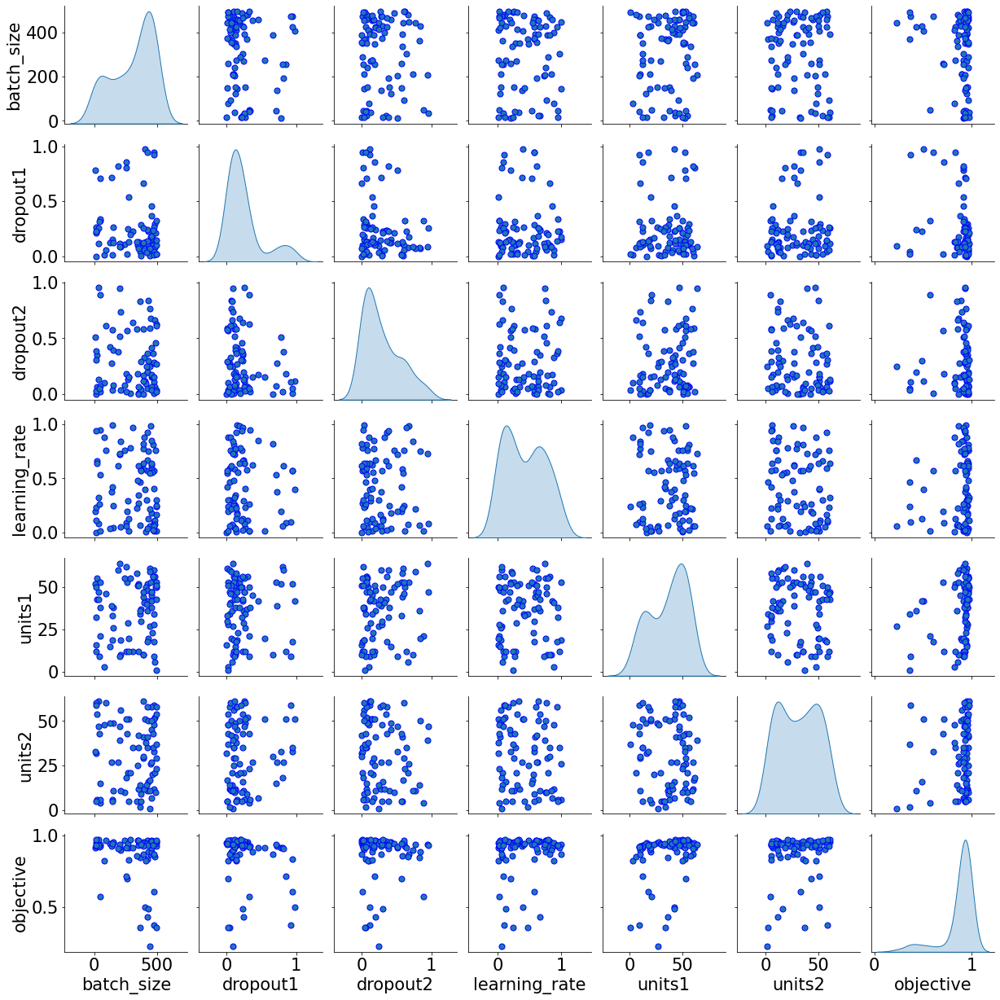
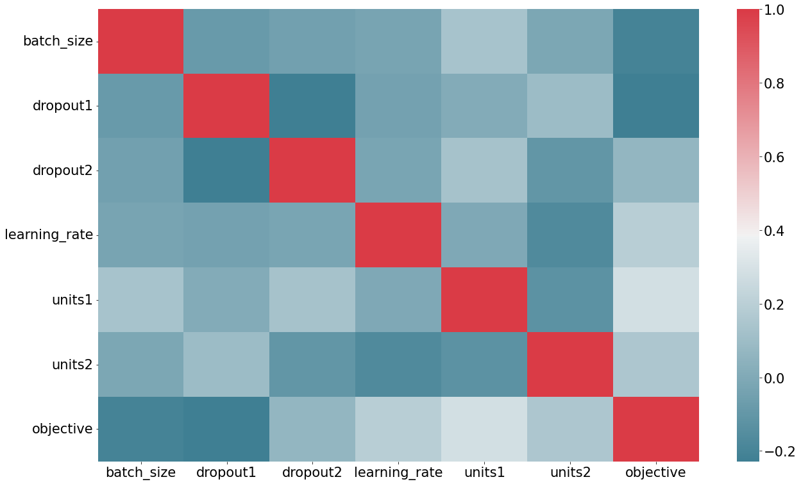

# Hyperparameter Search Using DeepHyper on Theta

**TODO**:

- [ ] The `deephyper/0.2.1` module seems broken somehow, workaround for now:
  - [ ] Issues encountered when trying to install deephyper with Horovod, but should run without issue using analytics and balsam.

```bash
module load postgresql
module load miniconda-3
conda create -n dh-env
conda activate dh-env
conda install -y gxx_linux-64 gcc_linux-64
conda install -y tensorflow -c intel
# DeepHyper + Analytics Tools (Parsing logs, Plots, Notebooks)
pip install "deephyper[analytics,balsam]"
# or DeepHyper + Analytics Tools (Parsing logs, Plots, Notebooks) + Horovod
pip install "deephyper[analytics,hvd,balsam]"
```

---

*Contact:*

- Sam Foreman (foremans@anl.gov)
- Kyle Felker (felker@anl.gov)
- Romit Maulik (rmaulik@anl.gov)
- Misha Salim (msalim@anl.gov)

---

Every DeepHyper search requires at least 2 Python objects as input:

1. `run`: Python function representing your "black-box" function, which returns the real-valued objective to be maximized.

2. `Problem`: a Python class instance of `deephyper.problem.BaseProblem` which defines the search space of input parameters to `run`.

We will demonstrate DeepHyper's HPS capabilities applied to the MNIST dataset, with the goal of tuning the hyperparameters to maximize the classification accuracy. This walkthrough will exclusively use TensorFlow's Keras API for defining the neural network; refer back to [`tensorflow2_keras_mnist.py`](../../01_distributedDeepLearning/Horovod/tensorflow2_keras_mnist.py).

## Environment setup on [`Theta`](https://www.alcf.anl.gov/support-center/theta) at [ALCF](https://www.alcf.anl.gov):

To start on Theta, let's set up a clean workspace for the HPS:

```bash
# Create a new workspace with Balsam DB
module unload balsam  # Already included in  DeepHyper-0.2.1
module load deephyper/0.2.1  # Includes Balsam, TensorFlow, Keras, etc...
rm -r ~/.balsam  # reset default settings (for now)
```

If you haven't already:

```bash
git clone https://github.com/argonne-lcf/sdl_ai_workshop
```

Navigate into the `BasicHPS/` directory:

```bash
cd sdl_ai_workshop/03_distributedHyperOpt/01_BasicHPS
git pull  # make sure you're up to date
```


We can now setup our search to run model evaluations in parallel across multiple nodes of Theta. The most scalable way of accomplishing this with DeepHyper is through the project's coupling to the [Balsam](https://balsam.readthedocs.io/en/latest/) service, which is an HPC-focused workflow managment system (WMS).

First, create a new Balsam database named `db`:

```bas
balsam init db
```

Start the Balsam server process and connect to the `db` database:

```bash
source balsamactivate db
```

## Setup the HPS

### Load data

We can load and split the MNIST data into distinct train / test sets using the code from [`load_data.py`](load_data.py):

```python
import tensorflow as tf

def load_data():
    """Returns MNIST data as `(x_train, y_train), (x_test, y_test)`."""
    (x_train, y_train), (x_test, y_test) = tf.keras.datasets.mnist.load_data()
    # Flatten the data and normalize
    x_train = x_train.reshape(60000, 784).astype('float32') / 255
    x_test = x_test.reshape(10000, 784).astype('float32') / 255
    
    print(f'(x_train, y_train): ({x_train.shape}, {y_train.shape})')'
    print(f'(x_test, y_test): ({x_test.shape}, {y_test.shape})')'
    
    return (x_train, y_train), (x_test, y_test)

if __name__ == '__main__':
    load_data()
```

Running this interactively should produce:

```bash
python3 load_data.py
```

```bash
(x_train, y_train): ((60000, 784), (60000,))
(x_test, y_test): ((10000, 784), (10000,))
```

### Model Implementation (with [tf.Keras](https://www.tensorflow.org/api_docs/python/tf/keras))

We include below the code for building, training, and evaluating the trained MNIST model. Note that this is indentical to the [`model_run.py`](model_run.py). For simplicity we look at a multi-layer perceptron with two hidden layers, built using [tf.keras.Sequential](https://www.tensorflow.org/api_docs/python/tf/keras/Sequential).

```python
import os
import sys
import tensorflow as tf

# Identify current working directory and inject it into `sys.path`
here = os.path.dirname(os.path.abspath(__file__))
sys.path.insert(0, here)
from load_data import load_data

keras = tf.keras
layers = tf.keras.layers

def run(point: dict = None):
    print(point)
    
    (x_train, y_train), (x_test, y_test) = load_data()
    
    # Reserve 10,000 samples for validation
    x_val = x_train[-10000:]
    y_val = y_train[-10000:]
    x_train = x_train[:-10000]
    y_train = y_train[:-10000]

    epochs = 10  # Fixed num of epochs (for now)

    # Get hyperparameters from `point`
    optimizer = point.get('optimizer', None)    # Optimizer to use for training
    batch_size = point.get('batch_size', None)  # Batch size
    activation = point.get('activation', None)  # Activation fn to use
    units1 = point.get('units1', None)          # Number of units in 1st hidden layer
    units2 = point.get('units2', None)          # Number of units in 2nd hidden layer
    dropout1 = point.get('dropout1', None)      # dropout ratio in 1st hidden layer
    dropout2 = point.get('dropout2', None)      # dropout ratio in 2nd hidden layer

    # Build & compile model for training
    model = tf.keras.Sequential([
        layers.Dense(units1, activation=activation),
        layers.Dropout(dropout1),
        layers.Dense(units2, activation=activation),
        layers.Dropout(dropout2),
        layers.Dense(10)
    ])

    model.compile(
        optimizer=optimizer,
        loss=keras.losses.SparseCategoricalCrossentropy(from_logits=True),
        metrics=['accuracy'],
    )

    _ = model.fit(
        x_train,
        y_train,
        batch_size=batch_size,
        epochs=epochs,
        verbose=1,
        # We need to pass some validation for
        # monitoring validation loss and metrics
        # at the end of each epoch
        validation_data=(x_val, y_val),
    )
    score = model.evaluate(x_test, y_test, verbose=2)
    print(f'test_loss, test_accuracy: {score[0]}, {score[1]}')

    return score[1]


if __name__ == '__main__':
    from problem import Problem
    point = Problem.starting_point_asdict[0]
    run(point)
```


### Defining the Search Space

The `run` function shown below expects a hyperparameter dictionary with keys shown in `POINT` below.

We define acceptable ranges for these hyperparameters with the `Problem` object inside [`problem.py`](problem.py) . Hyperparameter ranges are defined using the following syntax:

- Discrete integer ranges are generated from a tuple `(lower: int, upper: int)`
- Continuous prarameters are generated from  a tuple `(lower: float, upper: float)`
- Categorical or nonordinal hyperparameter ranges can be given as a list of possible values `[val1, val2, ...]`

#### Problem definition

We include below the complete problem definition from [`problem.py`](problem.py) which is responsible for defining the search space in terms of the hyperparameter regions.

To make things a little more interesting, we provide an example illustrating how [`ConfigSpace`](https://automl.github.io/ConfigSpace/master/) can be used to  include [conditional hyperparameters](https://automl.github.io/ConfigSpace/master/API-Doc.html#conditions)) (= hyperparameters that are sampled only if a specific condition is met), adding an additional layer of customization to our search problem.

Explicitly, we introduce the `momentum` hyperparameter which can be used to tune the `SGD` optimizer. Since the effects of varying this hyperparameter only impact the model performance when using the `SGD` optimizer, we add it as a conditional hyperparameter to our `Problem`.

Note that this is a simple example of what can be achieved using `ConfigSpace`, additional information can be found in the documentation [`user-guide`](https://automl.github.io/ConfigSpace/master/User-Guide.html)

```python
import ConfigSpace as cs
from deephyper.problem import HpProblem

Problem = HpProblem()

# call signature: Problem.add_dim(name, value)
Problem.add_dim('units1', (1, 64))            #  int in range 1-64
Problem.add_dim('units2', (1, 64))            #  int in range 1-64
Problem.add_dim('dropout1', (0.0, 1.0))       #  float in range 0-1
Problem.add_dim('dropout2', (0.0, 1.0))       #  float in range 0-1
Problem.add_dim('batch_size', (5, 500))       #	 int in range 5-500
Problem.add_dim('learning_rate', (0.0, 1.0))  #  float in range 0-1
Problem.add_dim('activation', ['relu', 'elu', 'selu', 'tanh'])

optimizer = Problem.add_dim('optimizer', [
    'Adam', 'RMSprop', 'SGD', 'Nadam', 'Adagrad'
])

# Only vary momentum if optimizer is SGD
momentum = Problem.add_hyperparameter("momentum", value=(0.5, 0.9))
Problem.add_condition(cs.EqualsCondition(momentum, optimizer, "SGD"))

# Add a starting point to try first
Problem.add_starting_point(
    units1=16,
    units2=32,
    dropout1=0.0,
    dropout2=0.0,
    batch_size=16,
    activation='relu',
    optimizer='SGD',
    learning_rate=0.001,
)


if __name__ == "__main__":
    print(Problem)
```

## Launch an Experiment

The deephyper Theta module has a convenience script included for quick generation of DeepHyper Async Bayesian Model Search (AMBS) search jobs. Simply pass the paths to the `model_run.py` script (containing the `run()` function), and the `problem.py` file (containing the `HpProblem`) as follows:

```bash
deephyper balsam-submit hps mnist-demo -p problem.py -r model_run.py \
    -t 20 -q debug-cache-quad -n 2 -A datascience -j mpi
```

### Monitor Execution and Check Results

You can use Balsam to watch when the experiement starts running and track how many models are running in realtime. Once the ambs task is RUNNING, the `bcd` command line tool provides a convenient way to jump to the working directory, which will contain the DeepHyper log and search results in CSV or JSON format.

Notice the objective value in the second-to-last column of the `results.csv` file:

```bash
 balsam ls --wf mnist-demo
```
 ```bash
                              job_id |       name |   workflow | application |   state
--------------------------------------------------------------------------------------
b1dd0a04-dbd5-4601-9295-7465abe6b794 | mnist-demo | mnist-demo | AMBS        | CREATED
 ```
```bash
# We can jump directly to the working directory containing the DeepHyper log
# using the `bcd` command-line tool
. bcd b1dd  # Note: 'b1dd' is the prefix of the `job_id` above; yours will be different
```

### DeepHyper analytics

We will now perform an analysis of our HPS using `deephyper-analytics` + `Jupyter Notebook` via `ssh`.

1. First, we generate the analysis by running (from the directory containing the `results.csv` file containing the results of our HPS:

   ```bash
   deephyper-analytics hps -p results.csv
   ```

   This should generate a `dh-analytics-hps.ipynb` notebook file that we can run to gain insight into our HPS results.

2. Next we start a `jupyter notebook` (still from `thetalogin` node) via:

   ```bash
   jupyter notebook --no-browser --port=1234  # you can change this number
   ```

3. Open another terminal on your local machine, which we will use for connecting to the remote jupyter session:

   ```bash
   # Using the number you used in the `--port` argument above
   ssh -L 1234:localhost:1234 username@theta.alcf.anl.gov
   ```

   This will listen on port 1234 (**you can change this number**) on your local machine, which is forwarded from port 1234 of the remote machine.

4. Open a browser on your local machine, input `localhost:1234`, and copy the token from step 1.

   1. *Note*: If you would rather use a password, set a password instead using `jupyter notebook password`.

5. Open the `dh-analytics-hps.ipynb` notebook file.

## Deephyper analytics - hyperparameter search study

**path to data file**: /lus/theta-fs0/projects/datascience/foremans/sdl_workshop/sdl_ai_workshop/03_distributedHyperOpt/01_BasicHPS/db/data/mnist-demo/mnist-demo_f18954a8/results.csv

for customization please see: https://matplotlib.org/api/matplotlib_configuration_api.html

### Setup & Data loading


```python
path_to_data_file = '/lus/theta-fs0/projects/datascience/foremans/sdl_workshop/sdl_ai_workshop/03_distributedHyperOpt/01_BasicHPS/db/data/mnist-demo/mnist-demo_f18954a8/results.csv'
```


```python
import matplotlib
import matplotlib.pyplot as plt
import numpy as np
import pandas as pd
import seaborn as sns
from pprint import pprint
from datetime import datetime
from tqdm import tqdm
from IPython.display import display, Markdown

width = 21
height = width/1.618

matplotlib.rcParams.update({
    'font.size': 21,
    'figure.figsize': (width, height), 
    'figure.facecolor': 'white', 
    'savefig.dpi': 72, 
    'figure.subplot.bottom': 0.125, 
    'figure.edgecolor': 'white',
    'xtick.labelsize': 21,
    'ytick.labelsize': 21})

df = pd.read_csv(path_to_data_file)

display(Markdown(f'The search did _{df.count()[0]}_ **evaluations**.'))

df.head()
```


The search did _83_ **evaluations**.


<table border="1" class="dataframe">
  <thead>
    <tr style="text-align: right;">
      <th></th>
      <th>activation</th>
      <th>batch_size</th>
      <th>dropout1</th>
      <th>dropout2</th>
      <th>learning_rate</th>
      <th>optimizer</th>
      <th>units1</th>
      <th>units2</th>
      <th>objective</th>
      <th>elapsed_sec</th>
    </tr>
  </thead>
  <tbody>
    <tr>
      <th>0</th>
      <td>relu</td>
      <td>16</td>
      <td>0.000000</td>
      <td>0.000000</td>
      <td>0.001000</td>
      <td>SGD</td>
      <td>16</td>
      <td>32</td>
      <td>0.9482</td>
      <td>232.342371</td>
    </tr>
    <tr>
      <th>1</th>
      <td>elu</td>
      <td>476</td>
      <td>0.948959</td>
      <td>0.009631</td>
      <td>0.571907</td>
      <td>Adam</td>
      <td>18</td>
      <td>33</td>
      <td>0.6079</td>
      <td>86.468845</td>
    </tr>
    <tr>
      <th>2</th>
      <td>selu</td>
      <td>408</td>
      <td>0.976134</td>
      <td>0.118996</td>
      <td>0.397005</td>
      <td>RMSprop</td>
      <td>42</td>
      <td>51</td>
      <td>0.5027</td>
      <td>86.495200</td>
    </tr>
    <tr>
      <th>3</th>
      <td>elu</td>
      <td>50</td>
      <td>0.320273</td>
      <td>0.890479</td>
      <td>0.016656</td>
      <td>RMSprop</td>
      <td>21</td>
      <td>4</td>
      <td>0.5742</td>
      <td>227.137991</td>
    </tr>
    <tr>
      <th>4</th>
      <td>elu</td>
      <td>443</td>
      <td>0.094276</td>
      <td>0.247923</td>
      <td>0.059827</td>
      <td>SGD</td>
      <td>27</td>
      <td>1</td>
      <td>0.2288</td>
      <td>172.484504</td>
    </tr>
  </tbody>
</table>

### Statistical summary


```python
df.describe()
```


<table border="1" class="dataframe">
  <thead>
    <tr style="text-align: right;">
      <th></th>
      <th>batch_size</th>
      <th>dropout1</th>
      <th>dropout2</th>
      <th>learning_rate</th>
      <th>units1</th>
      <th>units2</th>
      <th>objective</th>
      <th>elapsed_sec</th>
    </tr>
  </thead>
  <tbody>
    <tr>
      <th>count</th>
      <td>83.000000</td>
      <td>83.000000</td>
      <td>83.000000</td>
      <td>83.000000</td>
      <td>83.000000</td>
      <td>83.000000</td>
      <td>83.000000</td>
      <td>83.000000</td>
    </tr>
    <tr>
      <th>mean</th>
      <td>308.759036</td>
      <td>0.244743</td>
      <td>0.287357</td>
      <td>0.424286</td>
      <td>36.578313</td>
      <td>31.060241</td>
      <td>0.867855</td>
      <td>1564.597181</td>
    </tr>
    <tr>
      <th>std</th>
      <td>163.412063</td>
      <td>0.256170</td>
      <td>0.262193</td>
      <td>0.311332</td>
      <td>17.364191</td>
      <td>18.795659</td>
      <td>0.163094</td>
      <td>970.251081</td>
    </tr>
    <tr>
      <th>min</th>
      <td>12.000000</td>
      <td>0.000000</td>
      <td>0.000000</td>
      <td>0.001000</td>
      <td>1.000000</td>
      <td>1.000000</td>
      <td>0.228800</td>
      <td>86.468845</td>
    </tr>
    <tr>
      <th>25%</th>
      <td>173.500000</td>
      <td>0.086972</td>
      <td>0.067248</td>
      <td>0.119295</td>
      <td>20.000000</td>
      <td>12.000000</td>
      <td>0.876850</td>
      <td>741.168682</td>
    </tr>
    <tr>
      <th>50%</th>
      <td>369.000000</td>
      <td>0.145273</td>
      <td>0.184196</td>
      <td>0.397005</td>
      <td>41.000000</td>
      <td>32.000000</td>
      <td>0.931900</td>
      <td>1424.819762</td>
    </tr>
    <tr>
      <th>75%</th>
      <td>451.000000</td>
      <td>0.264550</td>
      <td>0.442151</td>
      <td>0.663753</td>
      <td>51.000000</td>
      <td>48.500000</td>
      <td>0.950200</td>
      <td>2392.833136</td>
    </tr>
    <tr>
      <th>max</th>
      <td>498.000000</td>
      <td>0.976134</td>
      <td>0.957236</td>
      <td>0.992267</td>
      <td>64.000000</td>
      <td>61.000000</td>
      <td>0.971200</td>
      <td>3355.353517</td>
    </tr>
  </tbody>
</table>

### Search trajectory


```python
fig = plt.figure()
fig, ax = plt.subplots()
ax.plot(df.elapsed_sec, df.objective)
ax.set_ylabel('Objective')
ax.set_xlabel('Time (s.)')
ax.set_xlim(0)
ax.grid()
fig.show()
```



### Pairplots


```python
not_include = ['elapsed_sec']
sns.pairplot(df.loc[:, filter(lambda n: n not in not_include, df.columns)],
                diag_kind="kde", markers="o",
                plot_kws=dict(s=50, edgecolor="b", linewidth=1),
                diag_kws=dict(shade=True))
plt.show()
```

​    
​    

```python
fig = plt.figure()
fig, ax = plt.subplots()
corr = df.loc[:, filter(lambda n: n not in not_include, df.columns)].corr()
sns.heatmap(corr, xticklabels=corr.columns, yticklabels=corr.columns, cmap=sns.diverging_palette(220, 10, as_cmap=True), ax=ax)
ax.set_yticklabels(corr.columns, va='center')
plt.show()
```



### Best objective


```python
i_max = df.objective.idxmax()
df.iloc[i_max]
```


    activation            elu
    batch_size             17
    dropout1         0.211211
    dropout2         0.305783
    learning_rate    0.112262
    optimizer           Nadam
    units1                 50
    units2                 59
    objective          0.9712
    elapsed_sec       3240.46
    Name: 77, dtype: object


```python
dict(df.iloc[i_max])
```


    {'activation': 'elu',
     'batch_size': 17,
     'dropout1': 0.21121146317655534,
     'dropout2': 0.3057825612653313,
     'learning_rate': 0.1122622086373296,
     'optimizer': 'Nadam',
     'units1': 50,
     'units2': 59,
     'objective': 0.9711999893188475,
     'elapsed_sec': 3240.456234931946}
