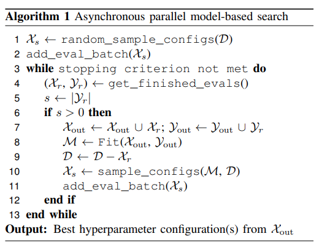
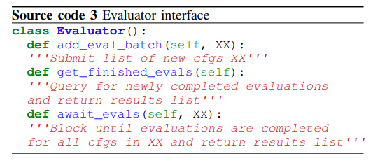

# DeepHyper: 
### Scalable Neural Architecture and Hyperparameter Search for Deep Neural Networks


DeepHyper is a scalable automated machine learning (AutoML) package for developing deep neural networks for scientific applications. It comprises two components:

1. Hyperparameter Search (HPS): optimizing hyperparameters for a given reference model

2. Neural Architecture Search (NAS): fully-automated search for high-performing deep neural network architectures

In today's discussions, we will be introducing you to HPS for arbitrary data-driven modeling tasks ranging from simple linear and tree-based models to full-blown deep learning frameworks.

####  Asynchronous parallel model-based search
A primary pillar of HPS in DeepHyper is given by an asynchronous parallel model-based search paradigm (henceforth AMBS). AMBS may be described in the following flow chart:



####  Search space

The search for a good set of hyperparameters for any ML/DL task starts with a random (or inductive) selection of sample configurations as a starting point. Search spaces may be devised for an AutoML task as follows (where the hyperparameters of a Random Forest Classifier are optimized):
```python
from deephyper.problem import HpProblem

Problem = HpProblem()

Problem.add_hyperparameter((10, 300), "n_estimators")
Problem.add_hyperparameter(["gini", "entropy"], "criterion")
Problem.add_hyperparameter((1, 50), "max_depth")
Problem.add_hyperparameter((2, 10), "min_samples_split")

# We define a starting point with the defaul hyperparameters from sklearn-learn
# that we consider good in average.
Problem.add_starting_point(
    n_estimators=100, criterion="gini", max_depth=50, min_samples_split=2
)

if __name__ == "__main__":
    print(Problem)
```
Samples from this search space can be utilized in an evaluation as follows:
```python
from sklearn.utils import check_random_state
from sklearn.ensemble import RandomForestClassifier
from dhproj.rf_tuning.load_data import load_data

def run(config):

    rs = check_random_state(42)

    (X, y), (vX, vy) = load_data()

    classifier = RandomForestClassifier(n_jobs=8, random_state=rs, **config)
    classifier.fit(X, y)

    mean_accuracy = classifier.score(vX, vy)

    return mean_accuracy
```
where the `load_data()` function loads training and validation data from the disk. Advanced functionality in HPS may also be used to search over different types of [classifiers](https://deephyper.readthedocs.io/en/latest/tutorials/hps_ml_advanced.html). Examples for the search of deep learning hyperparameters are as follows
```python
from deephyper.problem import HpProblem

Problem = HpProblem()

Problem.add_dim("units", (1, 100))
Problem.add_dim("activation", [None, "relu", "sigmoid", "tanh"])
Problem.add_dim("lr", (0.0001, 1.0))

Problem.add_starting_point(units=10, activation=None, lr=0.01)

if __name__ == "__main__":
    print(Problem)
```
where an evaluation can be obtained through
```python
import numpy as np
import keras.backend as K
import keras
from keras.callbacks import EarlyStopping
from keras.layers import Dense
from keras.models import Sequential
from keras.optimizers import RMSprop

import os
import sys

here = os.path.dirname(os.path.abspath(__file__))
sys.path.insert(0, here)
from load_data import load_data


def r2(y_true, y_pred):
    SS_res = keras.backend.sum(keras.backend.square(y_true - y_pred), axis=0)
    SS_tot = keras.backend.sum(
        keras.backend.square(y_true - keras.backend.mean(y_true, axis=0)), axis=0
    )
    output_scores = 1 - SS_res / (SS_tot + keras.backend.epsilon())
    r2 = keras.backend.mean(output_scores)
    return r2

def run(point):
    global HISTORY
    (x_train, y_train), (x_valid, y_valid) = load_data()

    model = Sequential()
    model.add(
        Dense(
            point["units"],
            activation=point["activation"],
            input_shape=tuple(np.shape(x_train)[1:]),
        )
    )
    model.add(Dense(1))

    model.summary()

    model.compile(loss="mse", optimizer=RMSprop(lr=point["lr"]), metrics=[r2])

    history = model.fit(
        x_train,
        y_train,
        batch_size=64,
        epochs=1000,
        verbose=1,
        callbacks=[EarlyStopping(monitor="val_r2", mode="max", verbose=1, patience=10)],
        validation_data=(x_valid, y_valid),
    )

    return history.history["val_r2"][-1]

if __name__ == "__main__":
    pass
```
An advanced example of deep learning HPS can be found [here](https://deephyper.readthedocs.io/en/latest/tutorials/hps_dl_basic.html).


####  Asynchronous Bayesian optimization

Following the parallelized evaluation of these configurations, a low-fidelity and high efficiency model (henceforth "the surrogate") is devised to reproduce the relationship between the input variables involved in the model (i.e., the choice of hyperparameters) and the outputs (which are generally a measure of validation data accuracy). After obtaining this surrogate of the validation accuracy, we may utilize ideas from classical methods in Bayesian optimization literature for adaptively sampling the search space of hyperparameters.

First, the surrogate is utilized to obtain an estimate for the mean value of the validation accuracy at a certain sampling location in addition to an estimated variance. The latter requirement restricts us to the use of high efficiency data-driven modeling strategies that have inbuilt variance estimates (such as a Gaussian process or Random Forest regressor). Regions where the mean is high represent opportunities for exploitation and regions where the variance is high represent opportunities for exploration. An acquisition function is constructed using these two quantities given by


The *unevaluated* hyperparameter configurations that *maximize* the acquisition function are chosen for the next batch of evaluations. Note that the choice of the variance weighting parameter controls the degree of exploration in the hyperparameter search with zero indicating purely exploitation (unseen configurations where the predicted accuracy is highest will be sampled). The top `s` configurations are selected for the new batch. The following schematic demonstrates this process:


The process of obtaining `s` configurations relies on the "constant-liar" strategy where a sampled configuration is replaced by a dummy output given by a bulk metric of all the evaluated configurations thus far (such as the maximum, mean or median validation accuracy). Prior to sampling the next configuration by acquisition function maximization, the surrogate is retrained with the dummy output as a data point. As the true validation accuracy becomes available for one of the sampled configurations, the dummy output is replaced and the surrogate is updated. This allows for scalable asynchronous (or batch synchronous) sampling of new hyperparameter configurations. 

####  Choice of surrogate model

Users should note that our choice of the surrogate is given by the Random Forest regressor due to its ability to handle non-ordinal data (hyperparameter configurations may not be purely continuous or even numerical). Evidence for how they outperform other methods (such as Gaussian processes) is also available in [1]


####  The evaluator class object

HPS applications utilize a subpackage called `evaluators` which defines the `Evaluator` interface. This is used by the asynchronous search methods described above. `Evaluator` class objects are roughly of the following form:



They possess several functions for features such as intra/internode parallelism, checkpointing, fault tolerance, evaluation caching (in case a search algorithm revisits a previously sampled configuration), graceful termination for slow or halted evaluations. An example of an `Evaluator` is the `LocalEvaluator` which allows one to quickly prototype HPS experiments on the local laptop using intranode parallelism. For larger (production) problems, an interface with Balsam (a scalable HPC workflow tool developed here at Argonne) has been implemented. Users interact with a local Balsam job database to define task graphs and dynamic workflows. This shall be explained in greater detail in the hands-on tutorials.

### What else?

While the hands-on will be covering solely HPS today, users should also be aware of **NAS**: DeepHypers neural architecture search framework. NAS has been used to _discover_ novel neural networks for problems as diverse as predicting cancer drug synergy [2] using data from the National Cancer Institute (NCI) and for forecasting the global sea-surface temperature using satellite data from NOAA [3]. NAS interprets a neural network as a directed acyclic graph with its various nodes representing potential structural choices such as whether a skip connection should be used or if a a certain nonlinear activation should be applied. Users are encouraged to visit `https://deephyper.readthedocs.io/en/latest/tutorials/nas.html` for examples and tutorials.


### References
[1] - "DeepHyper: Asynchronous hyperparameter search for deep neural networks." In 2018 IEEE 25th international conference on high performance computing (HiPC), pp. 42-51. IEEE, 2018.

[2] - "Scalable reinforcement-learning-based neural architecture search for cancer deep learning research." In Proceedings of the International Conference for High Performance Computing, Networking, Storage and Analysis, pp. 1-33. 2019.

[3] - "Recurrent neural network architecture search for geophysical emulation". In Proceedings of the International Conference for High Performance Computing, Networking, Storage and Analysis, pp. 1–14. 2020.