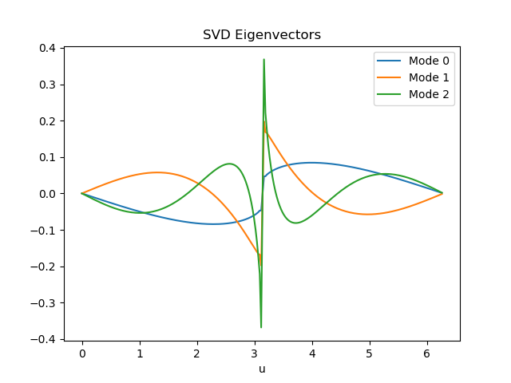
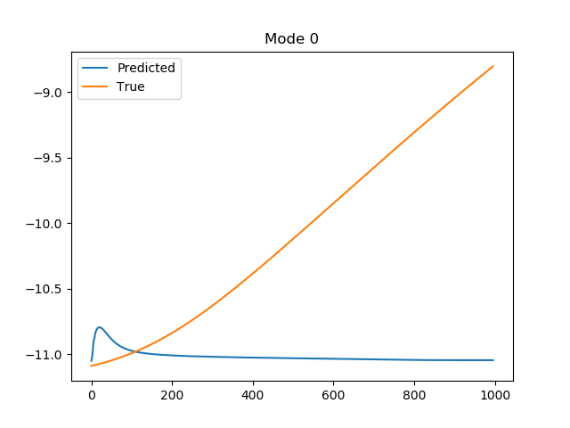
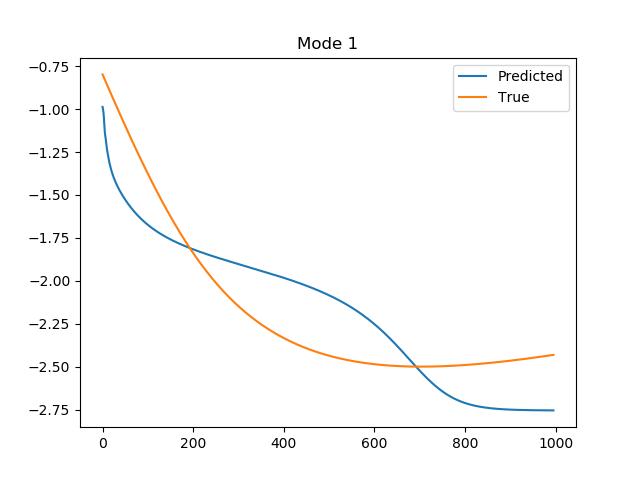
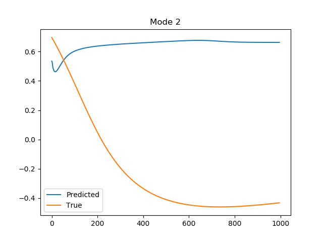

# Description

The purpose of this mini-application is to demonstrate how one may deploy scientific machine learning within a computational physics workflow. We claim that this code represents a *practical* deployment because it satisfies the following features:
1. The computation is performed using a compiled language as is the case with most legacy codes (C++).
2. We avoid disk-IO through in-situ transfer of data from the numerical computation to the machine learning computation (in Python).

In addition, this code also highlights the advantages of integrating the Python ecosystem with C++. We now have the following capabilities:
1. Utilizing arbitrary data science libraries such as TensorFlow through their Python APIs.
2. Easy in-situ visualization in matplotlib from a C++ computation.
3. A potential interface (if there are no issues with security) to streaming data from the internet (from say, a Python API).
4. Easy ability to save data using formats like HDF5 or NetCDF4.

The test-case demonstrated here is representative of several Sci-ML workloads. We aim to build a surrogate model using TensorFlow in Python from data generated by a C++ computation. The methodology we utilize is something called the "POD-LSTM" - here snapshots of the solution field are linearly compressed using an SVD and the compressed representations are used as training data within a long short-term memory (LSTM) neural network. The LSTM is used to forecast compressed representations of the solution field in the future (for more details please visit our Editor's pick article [here](https://doi.org/10.1063/5.0019884)). However, this educational proxy-app may easily be modified to solve more complex problems (for example: closure modeling, data assimilation, and control) which assess the interplay of compute and ML.

# To Run:

These are the steps to execute this code on Theta (interactively):
1. Request an interactive session on Theta
```
qsub -n 1 -q debug-cache-quad -A datascience -I -t 1:00:00
```
2. Setup the Python environment to include TensorFlow and PyTorch (though we only need the former)
```
source setup.sh
```
3. If build is successful you are ready to run the example as follows
```
aprun -n 1 -N 1 -e OMP_NUM_THREADS=32 -d 32 -j 2 -e KMP_BLOCKTIME=0 -cc depth ./app
```

# What you should see

## Field evolution


## Modal decomposition


## Forecasting the modal evolution in time (still rather poor but you get the idea)







