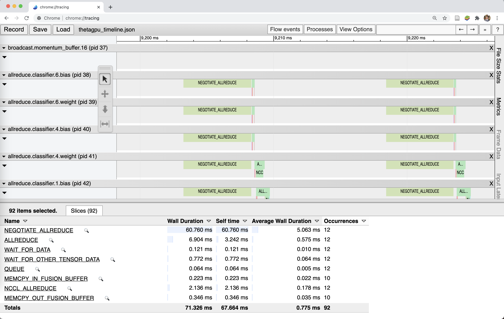

# Horovod Timeline Analysis for Data Parallel Training

Contact: Denis Boyda <dboyda@anl.gov>

This example shows the Horovod Timeline analysis. It will show the the timeline of communication in distributed training. 

To activate Horovod timeline analysis, one has to set the environment variable ```HOROVOD_TIMELINE``` which specifies the file for the output. 
```
export HOROVOD_TIMELINE=timeline.json
```
This file is only recorded on rank 0, but it contains information about activity of all workers. You can then open the timeline file using the `chrome://tracing` facility of the Chrome browser.

Horovod performs work in cycles. These cycles are used to aid [Tensor Fusion](https://github.com/horovod/horovod/blob/master/docs/tensor-fusion.rst). Horovod has the ability to record the moment when each cycle starts for debugging of Tensor Fusion. In order to enable this option one needs to define environment variable `HOROVOD_TIMELINE_MARK_CYCLES='1'`.


More details: https://horovod.readthedocs.io/en/stable/timeline_include.html

Visualize the results using Chrome [chrome://tracing/](chrome://tracing/)


## Timeline Analysis
Summitting job on thetagpusn1 with `n_nodes`, where every node has eight GPUs

```bash
cd sdl_ai_workshop/04_profilingDeepLearning/DistributedProfilers/timeline
qsub -n n_nodes qsub_gpu.sh
```
Other option is to request a node in interactive regime
```bash
qsub -A SDL_Workshop -q training-gpu -n 1 -t 60 -I
```
and run training with `n_gpus`
```bash
cd sdl_ai_workshop/04_profilingDeepLearning/DistributedProfilers/timeline
./run_gpu.sh n_gpus
```
Below there are results for single node and 2 GPUs

From results we can have several observations:
   - Total communication time is 83 seconds
   - NEGOTIATION ALLREDUCE is taking major part of the time - 64 secons
   - There is a very long initialization
   - There are idle cicles between communications
   - ALLREDUCE is using NCCL_ALLREDUCE
   - Different tensors are reduced at the same time. There is no overlap between MPI and compute


Timeline for 8 GPUs


## Optimization of Horovod communication strategies

Horovod is a great library for distributed training. It has complicated algorithms and may interleave communication and computation. Moreover, it reduces communication overhead by batching small allreduce operations to a bigger buffer which is known as [Tensor Fusion](https://github.com/horovod/horovod/blob/master/docs/tensor-fusion.rst). 

Horovod comes with some "tunable" hyperparameters which configure its algorithms. By default, Horovod is tunned for some most common operations, models and hardware but in every case it is possible to boost performance up by optimizing these hyperparameters. Environment variables `HOROVOD_HIERARCHICAL_ALLREDUCE` and `HOROVOD_HIERARCHICAL_ALLGATHER` enable hierarchical collective algorithms, `HOROVOD_CYCLE_TIME` configures time for cycles used in Horovod work, `HOROVOD_CACHE_CAPACITY` define response cache, and `HOROVOD_FUSION_THRESHOLD` is used to set the buffer to Tensor Fusion.

The good point is that none needs to tune these hyperparameters manually. Horovod provides a powerful engine for Bayesian optimization to intelligently search through the space of parameter combinations during training. [This mechanism is also used in DeepHyper to optimize architecture of neural network](../../../../03_distributedHyperOpt/README.md). Autotuning may be performed with defining two variables `HOROVOD_AUTOTUNE_LOG=tune_file_name` and `HOROVOD_AUTOTUNE=1`

To run tuning one need to request a node in interactive regime
```bash
qsub -A SDL_Workshop -q training-gpu -n 1 -t 60 -I
```
and run tuning on `n_gpus` GPUs
```bash
cd sdl_ai_workshop/04_profilingDeepLearning/DistributedProfilers/autotune
./run_gpu.sh n_gpus
```
After finishing tuning will create a file with tuning results with 5 hyperparameters and score (higher is better). If tunning was finalized it will write the best parameters to the last line. With the best tunned hyperparameters we can perfome timeline analysys again. 
```bash
cd sdl_ai_workshop/04_profilingDeepLearning/DistributedProfilers/autotune
./run_timeline n_gpus
```
Timeline for 2 GPUs with tuned hyperparameters

We notice that
   - Total communication time decreaed to 25 seconds
   - NEGOTIATION ALLREDUCE decreased as well to 12 secons
   - Different tensors are reduced at defferent time. There is an overlap between MPI and compute

