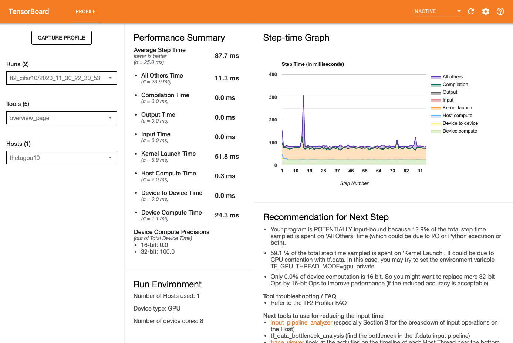

# Using the Tensorflow Profiler

Here we demonstrate how to utilize the [Tensorflow Profiler](https://www.tensorflow.org/guide/profiler) on Theta. This profiler is especially useful in quickly understanding if your workflow is limited by the model execution time or the data pipeline.

We build on the Tensorflow CIFAR10 example from the [Distributed Training](../../01_distributedDeepLearning/Horovod/) section of this repo.

There are only a few changes needed to utilize this profiler. The training loop, or portion targeted for profiling, must be wrapped in these calls:
```python
import tensorflow as tf
# ...

tf.profiler.experimental.start('/path/to/log/output/')

# ... training loop ...

tf.profiler.experimental.stop()
```

If the stop method is not called, no output will be written to disk. In addition, keep in mind that profiling utilized memory to track all the executions. This can sometimes lead to 'out of memory' errors if the profiled portions of code run too long or have large call trees. This can be circumvented by limiting the number of training steps you profile. Typically one only needs to profile 10-100 training steps to get a sense of the behavior.

In this example we run one epoch of the training since CIFAR10 is not an intensive target.

If you have installed your own tensorflow, you need to ensure you are using Tensorflow 2.2+ and have installed the `tensorboard_profiler_plugin` via `pip install`.

## Viewing output with Tensorboard

In order to view the profilers output one uses Tensorboard. This should already be installed if you have installed tensorflor or are using one of ALCF's installations. Generally, tensorboard can be run using the command:
```bash
tensorboard --port <port-number> --bind_all --logdir </path/to/log/output/>
```

This will start a webserver on the local machine that can be accessed via the `<port-number>` by opening a web browser and typing in the URL `localhost:<port-number>`.

Since you will typically be running this on the login node of one of our HPCs, you will need to do some `ssh` port forwarding to access the server. You can generally follow these steps:
1. `ssh -L$PORTA:localhost:$PORTB theta.alcf.anl.gov`
2. `module load miniconda-3/2020-07`
3. `cd /path/to/log/output`
4. `tensorboard --port $PORTB --bind_all --logdir </path/to/log/output/>`  wait for message that says server has started
5. Open browser on your laptop and go to `localhost:$PORTA`

Here `PORTA` and `PORTB` are set to different values, both need to be larger than 1024. For example, one could use `PORTA=9000` and `PORTB=9001`.

After navigating to the page in your browser you should see a page similar to this.




## On ThetaKNL
```bash
qsub submit_theta.sh
```

## On ThetaGPU

Run on ThetaGPU using
```bash
qsub submit_thetagpu.sh
```

