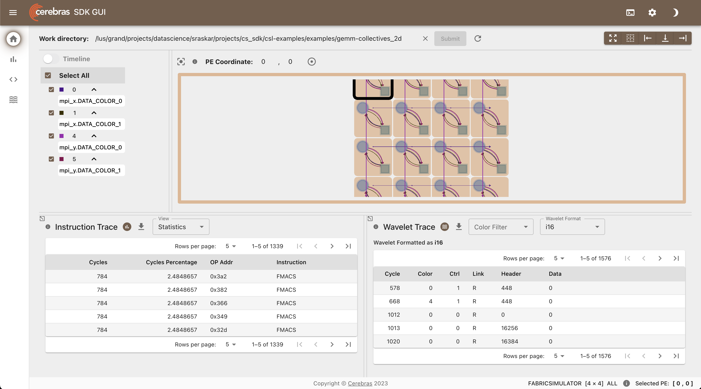

# Getting Started with the Cerebras SDK

## SDK Overview 

CSL is a low-level kernel programming language for the Cerebras system, in which users both write the code running on individual Processing Elements (PE), and specify the placement of programs and routing of data on the WSE. 

Users write two components to specify their programs: 
1. Device code in CSL, which runs on the CS system
2. Host code in Python, which uses Cerebras APIs to move data between and launch functions on the CS system.

CSL provides libraries for several common primitive operations, such as broadcasts, gathers, and scatters across rows or columns of PEs.

There are two ways to use Cerebras SDK
1. Simulator 
2. Appliacne Mode   
   
## SDK with Simulator

Cerebras SDK depends on a singularity container and scripts that are part of Cerebras SDK to execute a code written in CSL on a simulator. It contains:
1. Singularity Container: Supported on x86 computer, or an ARM/ Apple Silicon computer via emulation. 
2. `cslc` : Compler for compiling `.csl` code  
3. `cs_python` : Run Python host code to drive a cycle-accurate simulation.

 
### Setup on ALCF Cerebras System

* Setup 
    On ALCF Cerebras System, Cerebras SDK is available at `/software/cerebras/cs_sdk` for your conveneince. Make a copy of it in your `$HOME` directory and add that location to your `$PATH` and you are ready go. 

    ```bash
    cp -r /software/cerebras/cs_sdk-1.2.0 ~
    export PATH=~/cs_sdk-1.2.0:$PATH
    ```

<!-- * Test Installation 
    ```bash
    $ sdk_debug_shell smoke ~/cs_sdk-1.2.0/csl-extras-202406260214-4-70afe120
    ``` -->

* Run Hands-on Session Example

  * [GEMV-Simulator](./GEMV-Simulator/README.md)

## SDK with Appliance Mode 

* Create Virtual Environment 
  ```bash
    $ mkdir ~/R_2.3.0
    $ cd ~/R_2.3.0
    $ deactivate
    $ rm -r venv_cerebras_pt
    $ /software/cerebras/python3.8/bin/python3.8 -m venv venv_cerebras_pt
    $ source venv_cerebras_pt/bin/activate
    $ pip install --upgrade pip
  ```

* Install the cerebras_appliance and cerebras_sdk Python wheels in the virtual enviroment, specifying the proper Cerebras Software release
  ```bash
    $ pip install --upgrade pip
    $ pip install cerebras_appliance==2.3.0
    $ pip install cerebras_sdk==2.3.0
  ```

* Run Examples
  * [GEMV-Appliance](./GEMV-Appliance/README.md)

## Setup on Other systems 

Cerebras Software Development Kit (SDK) can be used on any other system with Singularity. Please follow instructions on [Cerebras Documentation Page](https://sdk.cerebras.net/installation-guide) for setup instructions. 


> Instructions for [Apple Silicon Mac Installation](https://sdk.cerebras.net/installation-guide#apple-silicon-mac-installation:~:text=selecting%20a%20PE%3A-,Apple%20Silicon%20Mac%20Installation,-%C2%B6) 


# Profiling 

Use SDK Debug GUI to get insights into code execution. 
Refer to SDK GUI documentation for details. 

```bash
$ cd csl-examples/examples/gemm-collectives_2d
INFO: Using SIF: /software/cerebras/cs_sdk-1.2.0/sdk-cbcore-202406260214-3-f03c8e31.sif
INFO: User's specified CSL_IMPORT_PATH=
NOTE: CSL_IMPORT_PATH accepts colon separated list of paths generated by 'realpath <path>'
Click this link to open URL:  http://cer-login-03.ai.alcf.anl.gov:8000/sdk-gui
Click this link to open URL:  http://140.221.80.27:8000/sdk-gui
Press Ctrl-C to exit
WARNING:csviz:Path /cbcore/web/csviz/releases/latest/graph/logo192.png is to a non-existent file
WARNING:cerebras.common.decorators:Call to deprecated function EnumFiles
WARNING:csviz:Path /cbcore/web/csviz/releases/latest/graph/logo192.png is to a non-existent file
```

Forward port 8000 from theta-gpu to your local computer.
Open http://localhost:8000/sdk-gui/ on your local computer. 



## Next Steps

* Follow [Cerebras SDK Tutorial](https://github.com/Cerebras/csl-examples/tree/master/tutorials) for optimized implementation of GEMV.
* Try [benchmarks](https://github.com/Cerebras/csl-examples/tree/master/benchmarks) from csl-examples repository. 

## Useful Resources

* [Cerebras SDK Documentation](https://sdk.cerebras.net/)
* [Cerebras CSL Examples Github Repo](https://github.com/Cerebras/csl-examples)
* [Request Cerebras SDK](https://cerebras.ai/homepage-landing/developers/sdk-request/)


