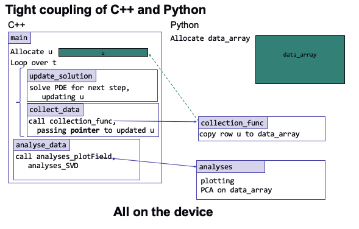

This example was originally written by Romit Maulik, modified by Saumil Patel, and edited by Bethany Lusch.

# Description

The purpose of this mini-application is to demonstrate how one may deploy scientific machine learning within a computational physics workflow. We claim that this code represents a *practical* deployment because it satisfies the following features:
1. The computation is performed using a compiled language as is the case with most legacy codes (C++).
2. We avoid disk-IO through in-situ transfer of data from the numerical computation to the machine learning computation (in Python).

In addition, this code also highlights the advantages of integrating the Python ecosystem with C++. We now have the following capabilities:
1. Utilizing arbitrary data science libraries such as TensorFlow through their Python APIs.
2. Easy in-situ visualization in matplotlib from a C++ computation.
3. A potential interface (if there are no issues with security) to streaming data from the internet (from say, a Python API).
4. Easy ability to save data using formats like HDF5 or NetCDF4.

The test-case demonstrated here aims to capture a modal decomposition using an SVD.  This is representative of a Sci-ML workload. We aim to build this toward a surrogate model using TensorFlow in Python from data generated by a C++ computation. Further details on developing the surrogate model can be found [here](archive/ThetaGPU/Background.md)

Here is how we connected C++ and Python:

For running this mini-app on ThetaKNL/GPU, look at the scripts/README within `ML_PythonC++_Embedding/ThetaGPU_OCCA/` subdirectories.

To see a similar coupling but with OpenFOAM on the C++ side (CFD software), check out our PythonFOAM work ([paper](https://arxiv.org/pdf/2103.09389.pdf), [code](https://github.com/argonne-lcf/PythonFOAM)). 

## What you should see when you run this on ThetaGPU

### Field evolution

### Modal decomposition

