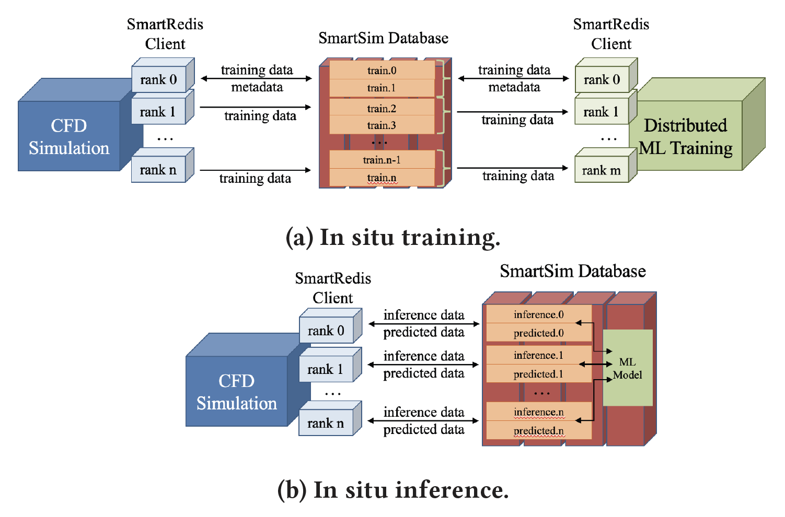
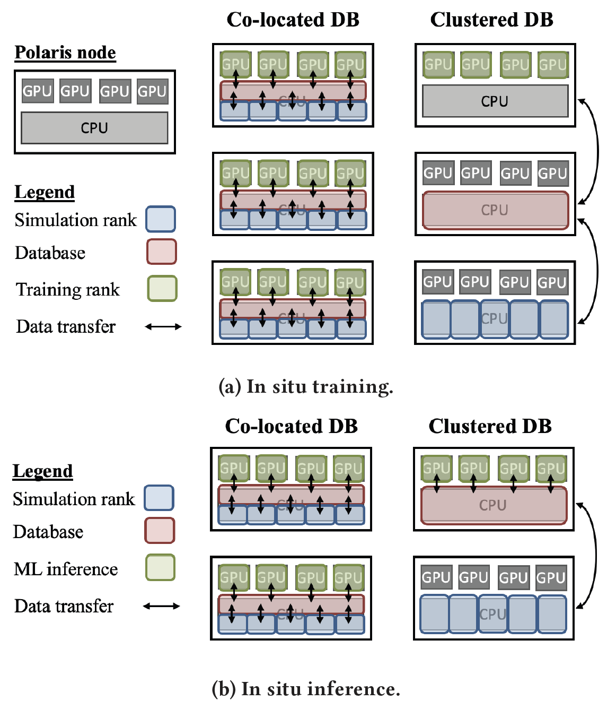
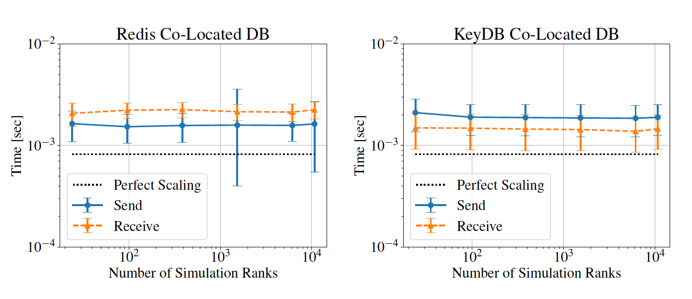
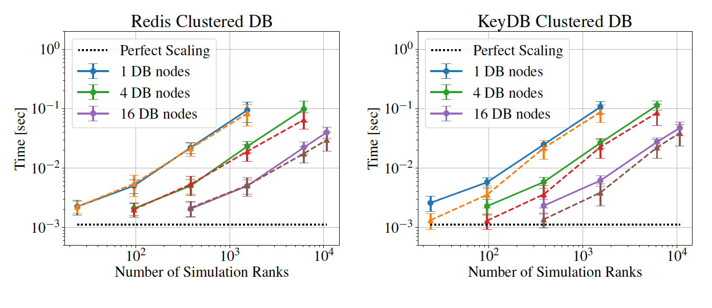
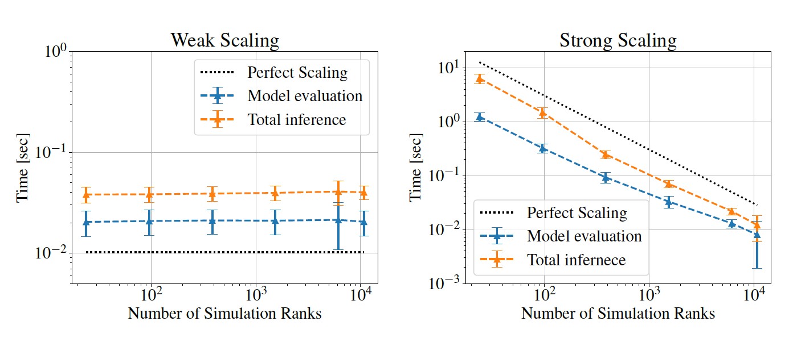

# Combining Simulation and AI/ML with SmartSim
Examples created by Riccardo Balin at ALCF.


## Introduction

SmartSim is an open source tool developed by the Hewlett Packard Enterprise (HPE) designed to facilitate the integration of traditional HPC simulation applications with machine learning workflows.
There are two core components to SmartSim:
- Infrastructure library (IL)
  - Provides API to start, stop and monitor HPC applications from Python
  - Interfaces with the scheduler launch jobs (PBSPro on Polaris and Cobalt on Theta/ThetaGPU)
  - Deploys a distributed in-memory database called the Orchestrator
- SmartRedis client library
  - Provides clients that connect to the Orchestrator from Fortran, C, C++, Python code
  - The client API library enables data transfer to/from database and ability to load and run JIT-traced Python and ML runtimes acting on stored data

For more resources on SmartSim, follow the links below:
- [Source code](https://github.com/CrayLabs/SmartSim)
- [Documentation](https://www.craylabs.org/docs/overview.html)
- [Zoo of examples](https://github.com/CrayLabs/SmartSim-Zoo)


## Deploying Workflows with SmartSim

There are two main types of workflows for combining simulation and ML in situ with SmartSim: online training and online inference.
- Online training
  - During online training, the simulation producing the training data and the ML training program using the data run simultaneously
  - There are three components: the data producer (e.g., a numerical simulation), the SmartSim Orchestrator, and the data consumer (e.g., a distributed training program)
  - Data flows from the simulation to the distributed training through the database
  - Training data is stored in-memory within the Orchestrator for the duration of the job, avoiding any I/O bottleneck and disk storage issues
  - Simulation and training are fully decoupled -- do not block each other and run on separate resources (CPU and/or GPU)
- Online inference
  - During online inference, the simulation uses an ML model to replace expensive or inaccurate computations
  - There are two components: the simulation and the SmartSim Orchestrator
  - Simulation sends model inputs for inference to database, evaluates any model and any pre- and post-processing computations within database, retreives the predictions, and keeps going with rest of computations
  - Compatible TensorFlow, TensorFlow Lite, Torch, and ONNXRuntime backends for model evaluations
  - Supports both both CPU and GPU backends enabling model evaluation on GPU
  - Simulation and model evaluation are loosely coupled -- run on separate resources but inference blocks simulation progress

|  |
| ---- |
| Figure 1. Online training and inference workflows with SmartSim. Taken from [Balin et al. 2023](https://arxiv.org/abs/2306.12900v1). |

Additionally, there are two approaches to deploying the SmartSim workflow, both for training and inference: clustered and co-located.
- Clustered
  - SmartSim Orchestrator, simulation and ML component run on distinct set of nodes of the same machine
  - Deploy a single database sharded across a cluster of nodes
  - Pros: 
    - All training/inference data is contained in a single database and is visibible by any rank of simulation or ML applications
    - Offers the most flexibility to create complex workflows with additional components (e.g., add in situ visualization, train multiple models by connecting multiple ML applications to Orchestrator, run multiple simulations all contributing to training data set, and more ...)
  - Cons:
    - Reduced data transfer performance to/from Orchestrator as simulation and ML applications scale out
- Co-Located
  - SmartSim Orchestrator, simulation and ML component share resources on each node
  - Distinct database is deployed on each node
  - Pros:
     - Most efficient implementation to scale out (data transfer to/from database effectively constant with number of nodes!)
  - Cons:
    - Training/inference data is distributed across the various databases, accessing off-node data is non-trivial
    - This limits complexity of workflow and number of components deployed

|  |
| ---- |
| Figure 2. Online training and inference with the colocated and clustered approaches on Polaris. Taken from [Balin et al. 2023](https://arxiv.org/abs/2306.12900v1). |


|  |
| ---- |
| Figure 3. Weak scaling of data send and retrieve operations between simulation reproducer and SmartSim database with the colocated deployment. Tests used up to 448 nodes of Polaris. Taken from [Balin et al. 2023](https://arxiv.org/abs/2306.12900v1). |

|  |
| ---- |
| Figure 4. Weak scaling of data send and retrieve operations between simulation reproducer and SmartSim database with the clustered deployment. Tests used up to 464 nodes of Polaris. Taken from [Balin et al. 2023](https://arxiv.org/abs/2306.12900v1). |

|  |
| ---- |
| Figure 4. Weak and strong scaling of ML model inference from simulation reproducer on SmartSim database with the clustered deployment. Tests used up to 448 nodes of Polaris and performed inference of the ResNet50 model. Taken from [Balin et al. 2023](https://arxiv.org/abs/2306.12900v1). |


## Installing SmartSim on Polaris

A Conda environment with the SmartSim and SmartRedis modules installed has been made available for you to use on Polaris. 
The examples below make use of this environment. 
You can activate it by executing
```
module load conda/2022-09-08
conda activate /eagle/projects/fallwkshp23/SmartSim/ssim
```

Please note that this environment does not contain all the modules available with the base env from the `conda/2022-09-08` module, however it contains many of the essential packages, such as PyTorch, TensorFlow, Horovod, and MPI4PY.
If you wish to expand upon this Conda env, feel free to clone it or build your own version of it following this [installation script](SmartSim_env/build_SSIM_Polaris.sh) and executing it *from a compute node* with the command
```
source build_SSIM_Polaris.sh
```
It is recommended you build the Conda env inside a project space rather than your home space on ALCF systems because it will produce a lot of files and consume disk space. 


## Online Training from NekRS of Wall Shear Stress Model

This [example](train_example) demonstrates how online training of an ML model can be performed concurrently with a simulation using the SmartSim/SmartRedis libraries on Polaris.
The example comes from the fields of computational fluid dynamics (CFD) and turbulence modeling, specifically wall-shear modeling or wall-modeling. The goal is to estimate the wall-shear stress of a turbulent channel flow (i.e., the turbulent flow between two parallel plates) using the velocity at a prescribed location above the wall as the input.
The example will use the highly-scalable and efficient CFD solver [nekRS](https://github.com/Nek5000/nekRS), and in particular an ALCF fork of the official repo made specifically to be a sand box for ways of coupling AI/ML and HPC simulation called [nekRS-ML](https://github.com/argonne-lcf/nekRS-ML). 
The `smartredis` branch of nekRS-ML will be used, and the binary has already been built for you and is located at
```
/eagle/projects/fallwkshp23/NekRS-ML/exe/Polaris/smartredis/bin/nekrs
```

To run the example from an interactive node on Polaris:
1. Get an interactive allocation running `./subInteractive.sh`
2. Change directory to the training example
3. Source the environment with `source env.sh`
4. Execute the run script with `./run.sh`

To run the example from a batch script:
1. Change directory to the training example
2. Submit the script to the Polaris queue with `qsub submit.sh`

Details of the example are as follows:
* The run and submit scripts execute a Python driver script (`ssim_driver_polaris.sh`) which uses the SmartSim API to set up and deploy the workflow. It launches the nekRS and colocated database together with a single `mpiexec` command, followed by the distributed training Python script (`trainer.py`) which is launched separately with another `mpiexec` command.
* The default run configuration arguments are contained in the `yaml` [config file](train_example/conf/ssim_config.yaml), but the settings for this specific example are passed as command line arguments to the driver script and place nekRS on the first 2 A100 GPU of a node and the distributed training on the other 2 GPU of the same node. The database always runs on the CPU. This example therefore couples a parallel CFD simulation with a parallel ML training application sharing data with each other through the SmartSim database. Note:
  * The example is set to run on a single Polaris node, but the config settings can be changed to run on multiple nodes by increasing the `run_args.simprocs` and `run_args.mlprocs` parameters while keeping `run_args.simprocs_pn=2` and `run_args.mlprocs_pn=2`.
  * In order to place the ML training on the GPU not occupied by nekRS, the `affinity_ml.sh` script is used.
  * When scaling out the example, the number of nekRS processes should be greater than or equal to the number of ML processes.
  * The default deployment is with the colocated database, but the driver script can also deploy the clustered database by changing the `database.deployment` configuration argument, however a minimum of 3 nodes are needed in this case.
* NekRS communicates to the SmartSim database through a [SmartRedis plugin](https://github.com/argonne-lcf/nekRS-ML/blob/smartredis/src/plugins/smartRedis.hpp) that was added to the code. The functions from this plugin are then called within the `turbChannel.udf` file in the `UDF_Setup()` and `UDF_ExecuteStep()` functions.
* The training script also communicates with the SmartSim database using the SmartRedis API, with the key components being 1) a custom PyTorch Dataset which generates the key strings of the tensors to retrieve from the database and 2) a nested loop over Dataloaders in order to first retrieve all the tensors and then perform mini-batch SGD on the collected data.
* With a sucessful run, nekRS will run ... and the training script will converge the model within ... . Note:
  * The first time executing the example, nekRS will have to perform a JIT compilation of the kernels before starting the simulation and this will take a few minutes. Since the training script is waiting for data to be populated in the database to start training, the training program is also waiting on nekRS for a few minutes. Successive runs won't have this issue and will start the simulation and training right away.
  * Due to an issue with the strain rate computation within nekRS, the value of the wall-shear stress is currently set to the analytical value based on the Reynolds number of the channel instead of the instantaneous value computed from the local flow, so the model trains very quickly and reaches very low values of the loss. 

## Online Inference from NekRS of Wall Shear Stress Model

This [example](inference_example) demonstrates how online inference of an ML model can be performed from a simulation using the SmartSim/SmartRedis libraries on Polaris.
The example follows the training one described above, therefore still uses the `smartredis` branch of nekRS-ML and the executable at the same path.

To run the example from an interactive node on Polaris:
1. Get an interactive allocation running `./subInteractive.sh`
2. Change directory to the training example
3. Source the environment with `source env.sh`
4. Execute the run script with `./run.sh`

To run the example from a batch script:
1. Change directory to the training example
2. Submit the script to the Polaris queue with `qsub submit.sh`

Details of the example are as follows:
* The run and submit scripts execute a Python driver script (`ssim_driver_polaris.sh`) which uses the SmartSim API to set up and deploy the workflow. It launches the nekRS and colocated database together with a single `mpiexec` command, as well as uploading a pre-trained ML model from file onto the database.
* The default run configuration arguments are contained in the `yaml` [config file](inference_example/conf/ssim_config.yaml), but the settings for this specific example are passed as command line arguments to the driver script and place nekRS on the first 3 A100 GPU of a node and leave the fourth GPU on the same node to perform inference. The database always runs on the CPU. This example therefore couples a parallel CFD simulation with a SmartSim database containing an ML model, which allows the simulation to send/retrieve data and execute the model on that data. Note:
  * The example is set to run on a single Polaris node, but the config settings can be changed to run on multiple nodes by increasing the `run_args.simprocs` parameter while keeping `run_args.simprocs_pn=3`.
  * The path to the ML model to load is set with the `inference.model_path` config argument and the hardware on which to perform inference is set with `inference.device`. Use `CPU` to perform inference on the CPU and `GPU:X` to targer the GPU, where X is the GPU ID on the node.
  * The default deployment is with the colocated database, but the driver script can also deploy the clustered database by changing the `database.deployment` configuration argument, however a minimum of 2 nodes are needed in this case.
* NekRS communicates to the SmartSim database through a [SmartRedis plugin](https://github.com/argonne-lcf/nekRS-ML/blob/smartredis/src/plugins/smartRedis.hpp) that was added to the code. The functions from this plugin are then called within the `turbChannel.udf` file in the `UDF_Setup()` and `UDF_ExecuteStep()` functions.
* With a sucessful run, nekRS will run ... . Note:
  * The first time executing the example, nekRS will have to perform a JIT compilation of the kernels before starting the simulation and this will take a few minutes. Successive runs won't have this issue and will start the simulation right away.
  * Due to an issue with the strain rate computation within nekRS, the target value of the wall-shear stress for comparison with the model predictions is currently set to the analytical value based on the Reynolds number of the channel instead of the instantaneous value computed from the local flow. This is consistent with the training example above. 


