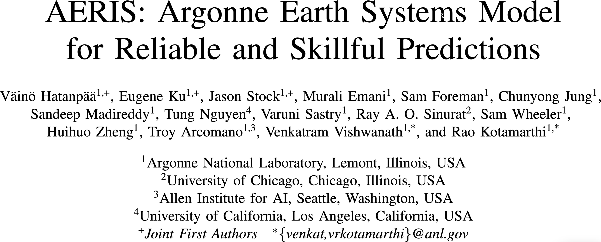
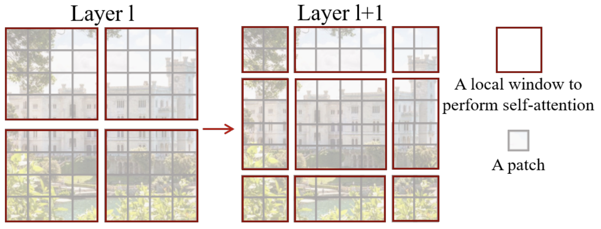
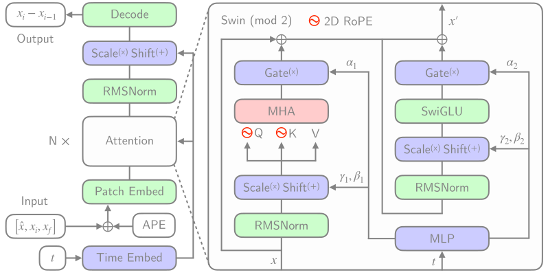
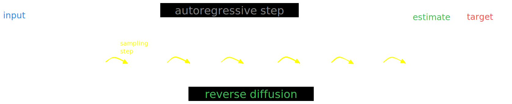
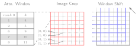
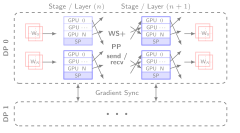
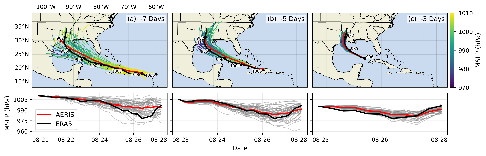
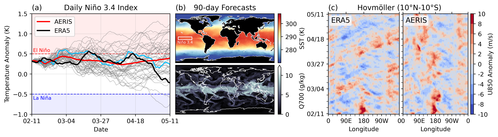

# AERIS: Argonne Earth Systems Model for Reliable and Skillful Predictions

Sam Foreman  
_2025-10-08_

> [!NOTE]
> View online:
>
> - [HTML](https://samforeman.me/talks/2025/10/08/index.html)
> - [Slides](https://samforeman.me/talks/2025/10/08/slides.html)

## Contents

- [🌎 AERIS](#-aeris)
- [High-Level Overview of AERIS](#high-level-overview-of-aeris)
- [Contributions](#contributions)
- [Model Overview](#model-overview)
- [Windowed Self-Attention](#windowed-self-attention)
- [Model Architecture: Details](#model-architecture-details)
- [Issues with the Deterministic Approach](#issues-with-the-deterministic-approach)
- [Transitioning to a Probabilistic Model](#transitioning-to-a-probabilistic-model)
- [Training at Scale](#training-at-scale)
- [Sequence-Window-Pipeline Parallelism `SWiPe`](#sequence-window-pipeline-parallelism-swipe)
- [Aurora](#aurora)
- [AERIS: Scaling Results](#aeris-scaling-results)
- [Hurricane Laura](#hurricane-laura)
- [S2S: Sub-seasonal-to-Seasonal Forecasts](#s2s-subsseasonal-to-seasonal-forecasts)
- [Seasonal Forecast Stability](#seasonal-forecast-stability)
- [Next Steps](#next-steps)
- [References](#references)
- [Extras](#extras)
  - [Overview of Diffusion Models](#overview-of-diffusion-models)

## 🌎 AERIS

Figure 1: [arXiv:2509.13523](https://arxiv.org/abs/2509.13523)

> We demonstrate a significant advancement in AI weather and climate
> modeling with AERIS by efficient scaling of window-based transformer
> models. We have performed global medium-range forecasts with
> performance competitive with GenCast and surpassing the IFS ENS model,
> with longer, 90- day rollouts showing our ability to learn atmospheric
> dynamics on seasonal scales without collapsing, becoming the first
> diffusion-based model that can work across forecast scales from 6
> hours all the way to 3 months with remarkably accurate out of
> distribution predictions of extreme events.

## High-Level Overview of AERIS

Figure 2: Rollout of AERIS model, specific humidity at 700m.

Table 1: Overview of AERIS model and training setup

|           Property | Description      |
|-------------------:|:-----------------|
|             Domain | Global           |
|         Resolution | 0.25° & 1.4°     |
|      Training Data | ERA5 (1979–2018) |
| Model Architecture | Swin Transformer |
|        Speedup[^1] | O(10k–100k)      |

## Contributions

> [!TIP]
> ### ☔ **AERIS**
>
> *First billion-parameter diffusion model for weather + climate*
>
> - Operates at the pixel level (1 × 1 patch size)
> - Guided by physical priors
> - Medium-range forecast skill
>   - Surpasses IFS ENS, competitive with GenCast (Price et al. (2024))
>   - Uniquely stable on seasonal scales to 90 days

> [!NOTE]
> ### 🌀 SWiPe
>
> - SWiPe, *novel* 3D (sequence-window-pipeline) parallelism strategy
>   for training transformers across high-resolution inputs
>   - Enables scalable small-batch training on large supercomputers[^2]
>     - **10.21 ExaFLOPS** @ 121,000 Intel XPUs (Aurora)

## Model Overview

Table 2: Variables used in AERIS training and prediction

|   Variable   | Description                   |
|:------------:|:------------------------------|
|    `t2m`     | 2m Temperature                |
| `X` `u`(`v`) | $u$ ($v$) wind component @ Xm |
|     `q`      | Specific Humidity             |
|     `z`      | Geopotential                  |
|    `msl`     | Mean Sea Level Pressure       |
|    `sst`     | Sea Surface Temperature       |
|    `lsm`     | Land-sea mask                 |

- **Dataset**: ECMWF Reanalysis v5 (ERA5)
- **Variables**: Surface and pressure levels
- **Usage**: Medium-range weather forecasting
- **Partition**:
  - Train: 1979–2018[^3]
  - Val: 2019
  - Test: 2020
- **Data Size**: 100GB at 5.6° to 31TB at 0.25°

## Windowed Self-Attention

- **Benefits for weather modeling**:
  - Shifted windows capture both local patterns and long-range context
  - Constant scale, windowed self-attention provides high-resolution
    forecasts
  - Designed (currently) for fixed, 2D grids
- **Inspiration from SOTA LLMs**:
  - `RMSNorm`, `SwiGLU`, 2D `RoPE`

Figure 3: Windowed Self-Attention

## Model Architecture: Details

Figure 4: Model Architecture

## Issues with the Deterministic Approach

- 
  **Transformers**:
  - *Deterministic*
  - Single input → single forecast
 
- 
  **Diffusion**:
  - *Probabilistic*
  - Single input → ***ensemble of forecasts***
  - Captures uncertainty and variability in weather predictions
  - Enables ensemble forecasting for better risk assessment

## Transitioning to a Probabilistic Model

Figure 5: Reverse diffusion with the
input condition, individual sampling
steps $t_{0} \rightarrow t_{64}$, the next time step
estimate and the
target output.

## Sequence-Window-Pipeline Parallelism `SWiPe`

- `SWiPe` is a **novel parallelism strategy** for Swin-based
  Transformers
- Hybrid 3D Parallelism strategy, combining:
  - Sequence parallelism (`SP`)
  - Window parallelism (`WP`)
  - Pipeline parallelism (`PP`)

Figure 6

Figure 7: `SWiPe` Communication Patterns

## Aurora

Table 3: Aurora[^4] Specs

| Property | Value   |
|---------:|:--------|
|    Racks | 166     |
|    Nodes | 10,624  |
| XPUs[^5] | 127,488 |
|     CPUs | 21,248  |
|     NICs | 84,992  |
|      HBM | 8 PB    |
|    DDR5c | 10 PB   |

Figure 8: Aurora: [Fact Sheet](https://www.alcf.anl.gov/sites/default/files/2024-07/Aurora_FactSheet_2024.pdf).

## AERIS: Scaling Results

Figure 9: AERIS: Scaling Results

- **10 EFLOPs** (sustained) @
  **120,960 GPUs**
- See (Hatanpää et al. (2025)) for additional details
- [arXiv:2509.13523](https://arxiv.org/abs/2509.13523)

## Hurricane Laura

Figure 10: Hurricane Laura tracks (top) and intensity (bottom).
Initialized 7(a), 5(b) and 3(c) days prior to 2020-08-28T00z.

## S2S: Subsseasonal-to-Seasonal Forecasts

> [!IMPORTANT]
>
> ### 🌡️ S2S Forecasts
>
> We demonstrate for the first time, the ability of a generative, high
> resolution (native ERA5) diffusion model to produce skillful forecasts
> on the S2S timescales with realistic evolutions of the Earth system
> (atmosphere + ocean).

- To assess trends that extend beyond that of our medium-range weather
  forecasts (beyond 14-days) and evaluate the stability of our model, we
  made 3,000 forecasts (60 initial conditions each with 50 ensembles)
  out to 90 days.
- AERIS was found to be stable during these 90-day forecasts
  - Realistic atmospheric states
  - Correct power spectra even at the smallest scales

## Seasonal Forecast Stability

Figure 11: S2S Stability: (a) Spring barrier El Niño with realistic
ensemble spread in the ocean; (b) qualitatively sharp fields of SST and
Q700 predicted 90 days in the future from the
closest ensemble member to the ERA5
in (a); and (c) stable Hovmöller diagrams of U850 anomalies (climatology
removed; m/s), averaged between 10°S and 10°N, for a 90-day rollout.

## Next Steps

- [Swift](https://github.com/stockeh/swift): Swift, a single-step
  consistency model that, for the first time, enables autoregressive
  finetuning of a probability flow model with a continuous ranked
  probability score (CRPS) objective

## References

1.  [What are Diffusion Models? \|
    Lil’Log](https://lilianweng.github.io/posts/2021-07-11-diffusion-models/)
2.  [Step by Step visual introduction to Diffusion Models. - Blog by
    Kemal
    Erdem](https://erdem.pl/2023/11/step-by-step-visual-introduction-to-diffusion-models)
3.  [Understanding Diffusion Models: A Unified
    Perspective](https://calvinyluo.com/2022/08/26/diffusion-tutorial.html)

Hatanpää, Väinö, Eugene Ku, Jason Stock, Murali Emani, Sam Foreman,
Chunyong Jung, Sandeep Madireddy, et al. 2025. “AERIS: Argonne Earth
Systems Model for Reliable and Skillful Predictions.”
<https://arxiv.org/abs/2509.13523>.

Price, Ilan, Alvaro Sanchez-Gonzalez, Ferran Alet, Tom R. Andersson,
Andrew El-Kadi, Dominic Masters, Timo Ewalds, et al. 2024. “GenCast:
Diffusion-Based Ensemble Forecasting for Medium-Range Weather.”
<https://arxiv.org/abs/2312.15796>.

## Extras

### Overview of Diffusion Models

**Goal**: We would like to (efficiently) draw samples $x_{i}$ from a
(potentially unknown) *target* distribution $q(\cdot)$.

- Given $x_{0} \sim q(x)$, we can construct a *forward diffusion
  process* by gradually adding noise to $x_{0}$ over $T$ steps:
  $x_{0} \rightarrow \left\{x_{1}, \ldots, x_{T}\right\}$.

  - Step sizes $\beta_{t} \in (0, 1)$ controlled by a *variance
    schedule* $\{\beta\}_{t=1}^{T}$, with:

    $$\begin{aligned}
    q(x_{t}|x_{t-1}) = \mathcal{N}(x_{t}; \sqrt{1-\beta_{t}} x_{t-1}, \beta_{t} I) \\
    q(x_{1:T}|x_{0}) = \prod_{t=1}^{T} q(x_{t}|x_{t-1})
    \end{aligned}$$

  - Introduce:

    - $\alpha_{t} \equiv 1 - \beta_{t}$
    - $\bar{\alpha}_{t} \equiv \prod_{s=1}^{T} \alpha_{s}$

    We can write the forward process as:

    $$ q(x_{1}|x_{0}) = \mathcal{N}(x_{1}; \sqrt{\bar{\alpha}_{1}} x_{0}, (1-\bar{\alpha}_{1}) I)$$

  - We see that the *mean*
    $\mu_{t} = \sqrt{\alpha_{t}} x_{t-1} = \sqrt{\bar{\alpha}_{t}} x_{0}$

[^1]: Relative to PDE-based models, e.g.:
    [GFS](https://www.ncdc.noaa.gov/data-access/model-data/model-datasets/global-forcast-system-gfs)

[^2]: Demonstrated on up to 120,960 GPUs on Aurora and 8,064 GPUs on
    LUMI.

[^3]: ~ 14,000 days of data

[^4]: 🏆 [Aurora Supercomputer Ranks Fastest for
    AI](https://www.intel.com/content/www/us/en/newsroom/news/intel-powered-aurora-supercomputer-breaks-exascale-barrier.html)

[^5]: Each node has 6 Intel Data Center GPU Max 1550 (code-named “Ponte
    Vecchio”) tiles, with 2 XPUs per tile.
