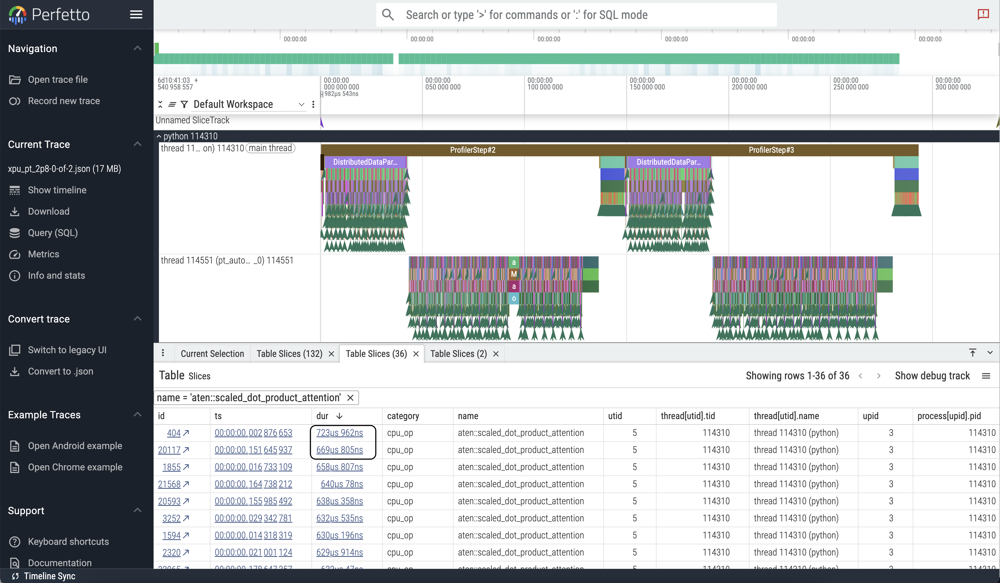
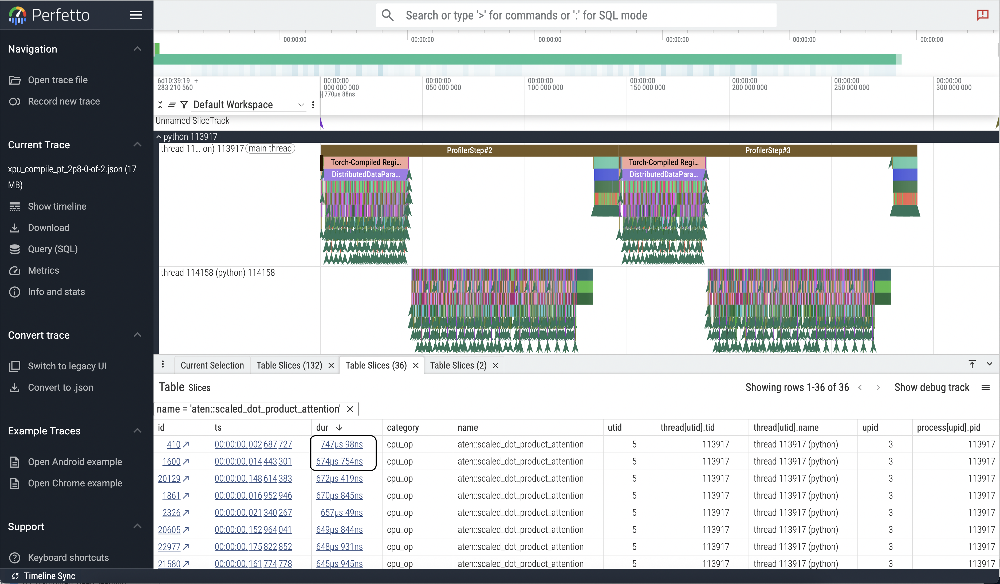
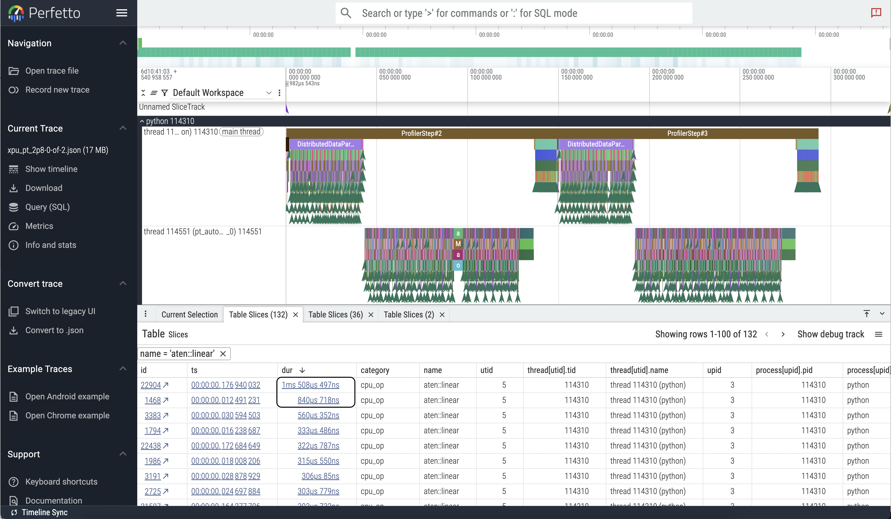
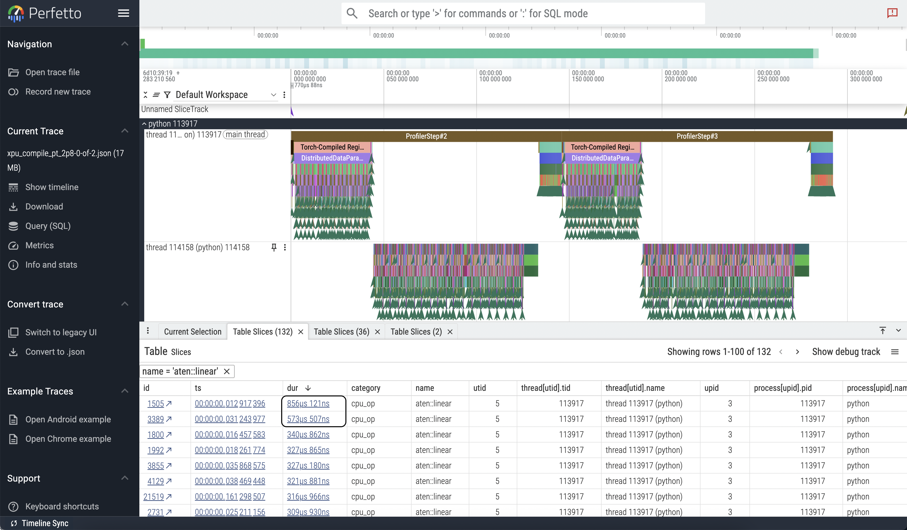

# PyTorch profiler

In this session, we will learn how to use a [PyTorch profiler](https://docs.pytorch.org/docs/stable/profiler.html) to generate 
timeline traces for a simple application. 
_Most of this talk is modeled after ALCF's [Huihuo Zheng's Talk](https://www.alcf.anl.gov/support-center/training/pytorch-profiler-ai)_ 

## Why Profilers?

Profilers allow us to analyze an applications execution to identify performance
characteristics and bottlenecks. Usually, a profiler informs us about:

- Data loading
- Compute
- Memory access patterns
- Communication (specially in distributed computing)

In this age and time, where we are increasingly becoming more dependent on 
external codes, and models; perhaps, a profiler can be treated as a useful 
_learning tool?_


There are many profilers available for profiling AI/ML applications, specially
coming from vendor specific software stack. The PyTorch profiler gives us a
native profiling capability which can be useful in comparing the performance of
an application across different hardware.

## Information provided by the profiler

The PyTorch profiler can provide us various information, including, but not 
limited to:

- __Operator Execution Time__ (CPU time & XPU time): Typically they are denoted as
`cpu_op`s and `kernel`s
- __Kernel Execution Details__: Including launch time and duration of execution
- __Operator Input Shapes__: This is optional, by setting`record_shapes=True` 
while initializing the profiler, we can see the shapes of the matrices computed
    by a `gemm` kernel, for example.
- __Stack Traces__ and __Module Hierarchy__: Setting `with_stack=True` 
allows the profiler to record the Python source code location 
(file and line number) that invoked each operation.
- __Estimated FLOPs__: For certain common operators like matrix multiplication and 
2D convolution, the profiler can estimate the number of 
floating-point operations (FLOPs) performed if `with_flops=True` is set. 
This can help in assessing the computational intensity of different parts of 
the model.
- __Execution Timeline (Trace View)__: Perhaps the most widely used and 
powerful feature for detailed analysis is the ability to export a chronological 
trace of events. This comes as a `JSON` file, and can be viewed using the 
[perfetto trace viewer](https://ui.perfetto.dev/). We will do a hands-on 
exercise to view the trace of our simple example.

## Running on Aurora

The following are the minimal steps to run our simple examples on Aurora

### Clone the repository

Once we have used `ssh` to log in to Aurora, from a login node, we can clone
the [repository](https://github.com/argonne-lcf/ATPESC_MachineLearning/tree/kh-profiling-2025) 
and switch to the correct branch the following way

```bash
git clone git@github.com:argonne-lcf/ATPESC_MachineLearning.git
cd ATPESC_MachineLearning 
git switch kh-profiling-2025
```
Now, that we have cloned the repository, we request a node for an interactive 
session

```bash
qsub -l select=1 -l walltime=00:59:00 -A ATPESC2025 -q ATPESC -l filesystems=home:flare -I
```
_Note_: The `filesystems=home:flare` is necessary, because the `conda` 
environment is coming from a world-readable location in `/lus/flare`

On the compute node, then from the inside of the 
`ATPESC_MachineLearning/01advanced_profiling_deep_learning` directory we can
activate the `conda` environment

```bash
source atpesc_2025_pytorch_2p8.env
export ZE_FLAT_DEVICE_HIERARCHY=FLAT ## Displays each 'tile' as a 'device'

Python 3.10.18 | packaged by conda-forge | (main, Jun  4 2025, 14:45:41) [GCC 13.3.0] on linux
Type "help", "copyright", "credits" or "license" for more information.
>>> import torch
>>> torch.__version__
'2.8.0.dev20250527+xpu'
>>>
```

A simple test would be to do the following:

```python
import torch
import intel_extension_for_pytorch as ipex

print(f"GPU availability: {torch.xpu.is_available()}")
print(f'Number of tiles = {torch.xpu.device_count()}')
current_tile = torch.xpu.current_device()
print(f'Current tile = {current_tile}')
print(f'Current device ID = {torch.xpu.device(current_tile)}')
print(f'Device properties = {torch.xpu.get_device_properties()}')
```

Example output:
```python
GPU availability: True
Number of tiles = 12
Current tile = 0
Current device ID = <torch.xpu.device object at 0x149e05267a30>
Device properties = _XpuDeviceProperties(
name='Intel(R) Data Center GPU Max 1550', 
platform_name='Intel(R) oneAPI Unified Runtime over Level-Zero', type='gpu', 
driver_version='1.6.32567+19', total_memory=65536MB, max_compute_units=448, 
gpu_eu_count=448, gpu_subslice_count=56, max_work_group_size=1024, 
max_num_sub_groups=64, sub_group_sizes=[16 32], 
has_fp16=1, has_fp64=1, has_atomic64=1
)
```
- each Aurora node has 6 GPUs (also called "Devices" or "cards")
- each GPU is composed of 2 tiles (also called "Sub-devices")
- With `export ZE_FLAT_DEVICE_HIERARCHY=FLAT`, each tile is mapped to one 
PyTorch device, giving a total of 12 devices per node in the above output.

## Code changes to run PyTorch on Aurora GPUs

Here we list some common changes that you may need to do to your PyTorch code in order to use Intel GPUs.

1. Import the `intel_extension_for_pytorch` **right after** importing `torch`:
   ```diff
   import torch
   + import intel_extension_for_pytorch as ipex
   ```
1. All the `API` calls involving `torch.cuda`, should be replaced with `torch.xpu`. For example:
   ```diff
   - torch.cuda.device_count()
   + torch.xpu.device_count()
   ```
1. When moving tensors and model to GPU, replace `"cuda"` with `"xpu"`. For example:
   ```diff
   - model = model.to("cuda")
   + model = model.to("xpu")
   ```
1. Convert model and loss criterion to `xpu`, and then call `ipex.optimize` for additional performance boost:
   ```python
   device = torch.device('xpu')
   model = model.to(device)
   criterion = criterion.to(device)
   model, optimizer = ipex.optimize(model, optimizer=optimizer)
   ```

## Running specific examples in this repository

Our simple example for today looks like the following

```diff
import torch
+ import intel_extension_for_pytorch as ipex
+ device = torch.device('xpu')

torch.manual_seed(0)

src = torch.rand((2048, 1, 512))
tgt = torch.rand((2048, 20, 512))
dataset = torch.utils.data.TensorDataset(src, tgt)
loader = torch.utils.data.DataLoader(dataset, batch_size=32, shuffle=True)

model = torch.nn.Transformer(batch_first=True)
optimizer = torch.optim.Adam(model.parameters(), lr=0.001)
criterion = torch.nn.CrossEntropyLoss()
model.train()
+ model = model.to(device)
+ criterion = criterion.to(device)
+ model, optimizer = ipex.optimize(model, optimizer=optimizer)

for epoch in range(10):
    for source, targets in loader:
+         source = source.to(device)
+         targets = targets.to(device)
        optimizer.zero_grad()

        output = model(source, targets)
        loss = criterion(output, targets)

        loss.backward()
        optimizer.step()
```

This is the heart of the code presented in all the examples. To make it run 
across multiple ranks and nodes with use [PyTorch DDP](https://docs.pytorch.org/docs/stable/notes/ddp.html)
and add additional pieces to enable the profiling capabilities.

### Changes for running on Multiple GPUs

```diff
+ from mpi4py import MPI
+ import os, socket
import torch
+ from torch.nn.parallel import DistributedDataParallel as DDP
import intel_extension_for_pytorch as ipex

# DDP: Set environmental variables used by PyTorch
+ SIZE = MPI.COMM_WORLD.Get_size()
+ RANK = MPI.COMM_WORLD.Get_rank()
+ LOCAL_RANK = os.environ.get('PALS_LOCAL_RANKID')
+ os.environ['RANK'] = str(RANK)
+ os.environ['WORLD_SIZE'] = str(SIZE)
+ MASTER_ADDR = socket.gethostname() if RANK == 0 else None
+ MASTER_ADDR = MPI.COMM_WORLD.bcast(MASTER_ADDR, root=0)
+ os.environ['MASTER_ADDR'] = f"{MASTER_ADDR}.hsn.cm.aurora.alcf.anl.gov"
+ os.environ['MASTER_PORT'] = str(2345)
+ print(f"DDP: Hi from rank {RANK} of {SIZE} with local rank {LOCAL_RANK}. {MASTER_ADDR}")

# DDP: initialize distributed communication with xccl backend
+ torch.distributed.init_process_group(backend='xccl', init_method='env://', rank=int(RANK), world_size=int(SIZE))

# DDP: pin GPU to local rank.
+ torch.xpu.set_device(int(LOCAL_RANK))
device = torch.device('xpu')
torch.manual_seed(0)

src = torch.rand((2048, 1, 512))
tgt = torch.rand((2048, 20, 512))
dataset = torch.utils.data.TensorDataset(src, tgt)
# DDP: use DistributedSampler to partition the training data
+ sampler = torch.utils.data.distributed.DistributedSampler(dataset, shuffle=True, num_replicas=SIZE, rank=RANK, seed=0)
+ loader = torch.utils.data.DataLoader(dataset, sampler=sampler, batch_size=32)

model = torch.nn.Transformer(batch_first=True)
# DDP: scale learning rate by the number of GPUs.
+ optimizer = torch.optim.Adam(model.parameters(), lr=(0.001*SIZE))
criterion = torch.nn.CrossEntropyLoss()
model.train()
model = model.to(device)
criterion = criterion.to(device)
model, optimizer = ipex.optimize(model, optimizer=optimizer)
# DDP: wrap the model in DDP
+ model = DDP(model)

for epoch in range(10):
    # DDP: set epoch to sampler for shuffling
+     sampler.set_epoch(epoch)

    for source, targets in loader:
        source = source.to(device)
        targets = targets.to(device)
        optimizer.zero_grad()

        output = model(source, targets)
        loss = criterion(output, targets)

        loss.backward()
        optimizer.step()

# DDP: cleanup
+ torch.distributed.destroy_process_group()
```
### `torch.compile`

To enable the compiling feature available in PyTorch we wrap the model with
`torch.compile` after wrapping it with DDP and IPEX. To be concrete

```
model = torch.compile(DDP(IPEX(model)))
```


## Eanbling the profiler

We enable the PyTorch profiler in a way that allows us to tell the profiler 
when to take the next step. For that we do the following:

```python 
from torch.profiler import profile, record_function, ProfilerActivity

activities=[ProfilerActivity.CPU, ProfilerActivity.XPU]

schedule = torch.profiler.schedule(wait=1, warmup=1, active=2, repeat=1)
prof = profile(activities=activities, record_shapes=True, schedule=schedule, profile_memory=True)
prof.start()

for epoch in range(10):
    if RANK == 0:
        print(epoch)
    # DDP: set epoch to sampler for shuffling
    sampler.set_epoch(epoch)

    for source, targets in loader:
        source = source.to(device)
        if RANK == 0:
            print(f"Microbatchsize = {source.shape[0]}")
        targets = targets.to(device)
        optimizer.zero_grad()

        output = model(source, targets)
        loss = criterion(output, targets)

        loss.backward()
        optimizer.step()
        prof.step()

os.makedirs(args.trace_dir, exist_ok=True)
prof.export_chrome_trace(f"{args.trace_dir}/xpu_pt_2p8-{RANK}-of-{SIZE}.json")
output_path = f"{args.trace_dir}/xpu_pt_2p8_self_xpu_time_total-{RANK}-of-{SIZE}.txt"
os.makedirs(os.path.dirname(output_path), exist_ok=True)

with open(output_path, "w") as f:
    f.write(prof.key_averages().table(
        sort_by="self_xpu_time_total", row_limit=-1))
```

### Another way of enabling the profiler

To trace individual functions in a complex code, the profilers `record_function` 
method can be used as well:

```
with profilel(activities=[ProfilerActivity.CPU, ProfilerActivity.XPU],
 record_shapes=True,
 profile_memory=True,
 with_stack=True) as prof:
    with record_function(“data_preprocessing”): #user custom annotation
        ...
        # portion of the code you would like to
    train(model, loader, epochs=args.epochs, steps_per_epoch = args.steps)
```
This method works well for non-compiled use cases. If we want to profile a
compiled model, this method may not work, as indicated by the following warning
message generated during my attempts:

```
[rank0]:W0731 15:32:04.367000 92672 site-packages/torch/_logging/_internal.py:1146] 
[0/0] Profiler function <class 'torch.autograd.profiler.record_function'> will be ignored
```
This indicates that the `record_function` annotation will get ignored, quite
possibly because of kernel fusion during the JIT compilation to produce the
optimized compute graph. We wanted to profile a compiled model and observe the
visible effects in timeline traces, so we choose the first method.


### Job Scripts and Python scripts

This repository contains 4 `.py` scripts

- `pytorch_2p8_ddp.py` contains the example code above
- `pytorch_2p8_ddp_prof.py` the example code with the profiler enabled
- `pytorch_2p8_ddp_compile.py` model compiled example code
- `pytorch_2p8_ddp_compile_prof.py` compiled model with profiler enabled

and associated job scripts to run from an interactive session, which can be
converted to a batch submission script by adding the `PBS` directives after the
`#! /bin/bash` line in each scripts.

- `run_ddp_pytorch_2p8_N1_R12.sh`
- `run_ddp_prof_pytorch_2p8_N1_R12.sh`
- `run_ddp_pytorch_2p8_compile_N1_R12.sh`
- `run_ddp_prof_pytorch_2p8_compile_N1_R12.sh`

To run any of the examples, we just need to do
```bash
bash run_ddp_pytorch_2p8_N1_R12.sh
```
for example.

If the profiling runs finish successfully, we should see a directory with the 
profiling data created inside the `/traces/pytorch_2p8` directory. The 
locations and names of these directories are controlled by the two variables 
in the following directories in the job scripts

```bash
TRACE_DIR_ROOT=./traces/pytorch_2p8
TRACE_DIR=${TRACE_DIR_ROOT}/xpu_pt_2p8_E${EPOCHS}_N${NODES}_R${PPN}_$(tstamp)
```

In each job script, there are two variables
```
N ## Number of total ranks

PPN ## Number of ranks per node
```
For profiles shown here, I used `N=1, PPN=1`. I have tested the code to run and
profile up to 12 ranks per node, in 2 nodes. The code is set up to run at any 
scale, _profiling can be challenging beyond a certain point because of resource 
limitations_.

## Example Profiles

A typical timeline trace looks like the following:


The first thing to notice is that, we can see `ProfilerStep#2` and 
`ProfilerStep#3` -- two steps being recorded, as per request with the 
scheduler initialized with `active=2`. We also skip the first iteration, and 
do the second as warm-up iterations, and record the subsequent 2 iterations as
active.

And, the timeline trace from the compiled model looks like:


In the compiled trace, two important features are

- The consistency in execution of the two profiler steps. They are very similar
in time span
- The data-loading becomes faster in the second step, whereas it takes one more
step for the non-compiled compute graph to offer similar execution time. This 
is more likely to be compensated in the first iteration, where the compilation
is happening. We do not record that step here -- would be interesting to see
the execution time for the first step, but it is quite common to skip the first
step when analyzing the execution pattern of an AI/ML application.

One of the useful features of the perfetto viewer is collecting the slices with
the same name and being able to sort them. If we click on a colored box, and 
a window with the current selection opens up at the bottom, on the left hand 
side. Then if we click on the name of the function or the kernel; the option of
"Slices with the same name" shows up, and that can show interesting things.

For example, if we look at two important functions, the `linear layer` and the 
`Scaled dot product attention` in that way, we see that compiling affects the 
`linear layer` more than the `Attention`.





We see that, the highest duration call of `Attention` in the modes are 
different by ~5 ms, compiled being lower.

Whereas, in the case of the `linear layer`, the highest duration call in the 
eager mode is ~48 ms vs ~2 ms!! But the subsequent calls are almost ~2x higher 
in the compiled case (~700 ms vs. ~310 ms). 





Therefore, it is difficult to give a fixed strategy, at least for our "toy" use
case. But from our experiments, we could see a more consistent execution times
and patterns from the compiled case. For a real life workload, extensive 
experimentation will be needed to device the optimal training strategy.

### An Exercise

Binding the available CPU cores to appropriate devices (GPU tiles) is of
critical importance, as this is a way to leverage the architectural features in
an optimal way. The following diagrams show the schematics of the connectivity
of the 6 GPUs (12 tiles) with the 2 CPUs (sockets).


Also, the output of the
```bash
## From a compute node
module load xpu-smi
xpu-smi topology -m
```
shows the affinity of each GPU to a particular socket.

In choosing our CPU bindings we should be mindful about the fact that
cores of CPU 0 should be pinned to GPU 0, 1 and 2, and cores of CPU 1 should be used
for the other three GPUs.

In our job scripts we do this by setting up the bindings as follows:

```
## For 12 ranks per node
#export CPU_AFFINITY="list:4-7:8-11:12-15:16-19:20-23:24-27:56-59:60-63:64-67:68-71:72-75:76-79"
#export CCL_WORKER_AFFINITY="42,43,44,45,46,47,94,95,96,97,98,99"
#export ZE_AFFINITY_MASK="0,1,2,3,4,5,6,7,8,9,10,11"

## For 1 rank per node
export CPU_AFFINITY="list:4-7"
export CCL_WORKER_AFFINITY="42"
export ZE_AFFINITY_MASK="0"
```

Maybe, it is worthwhile trying to play with different bindings and run the 
application with multiple ranks and nodes and see if we can learn more about 
the Aurora node architecture? Profile the application with various bindings on
multiple ranks, and see whether the kernel launch or execution times get 
affected by them. 

__Caution__: It is possible that sometimes the application might hang, 
specially in multiple ranks and nodes while profiling. In that case, instead of
waiting for a long time, I would recommend re-starting the job afresh.

_Special thanks to Filippo Simini for this example_


