# Training Foundation Models on Supercomputers

Sam Foreman  
2025-09-24

- [🚀 Scaling: Overview](#rocket-scaling-overview)
- [Training on a Single Device](#training-on-a-single-device)
- [👬 Training on Multiple GPUS: Data
  Parallelism](#two_men_holding_hands-training-on-multiple-gpus-data-parallelism)
  - [Data Parallelism](#data-parallelism)
- [➡️ Data Parallel: Forward
  Pass](#arrow_right-data-parallel-forward-pass)
- [⬅️ Data Parallel: Backward
  Pass](#arrow_left-data-parallel-backward-pass)
- [🔄 Data Parallel:
  Training](#arrows_counterclockwise-data-parallel-training)
- [📡 Communication](#satellite-communication)
- [🤔 Plan of Attack](#thinking-plan-of-attack)
- [🚧 Common Pitfalls](#construction-common-pitfalls)
- [🎀 Best Practices](#ribbon-best-practices)
- [Going Beyond Data Parallelism](#going-beyond-data-parallelism)
  - [Going beyond Data Parallelism: DeepSpeed +
    `ZeRO`](#going-beyond-data-parallelism----deepspeed--zero)
  - [🕸️ Additional Parallelism
    Strategies](#spider_web-additional-parallelism-strategies)
  - [Pipeline Parallelism (PP)](#pipeline-parallelism-pp)
  - [Tensor Parallel (TP)](#tensor-parallel-tp)
  - [Tensor Parallel (TP)](#tensor-parallel-tp-1)
  - [Tensor (/ Model) Parallel Training:
    Example](#tensor--model-parallel-training-example)
- [Scaling Results](#scaling-results)
  - [🧬 MProt-DPO: Scaling Results](#dna-mprot-dpo-scaling-results)
  - [🌎 AERIS: Scaling Results](#earth_americas-aeris-scaling-results)
- [🍋 `ezpz`](#lemon-ezpz)
- [🍋 `ezpz` @ ALCF](#lemon-ezpz--alcf)
- [🧪 Simple Distributed Test](#test_tube-simple-distributed-test)
- [➕ How to Modify Existing
  Code](#heavy_plus_sign-how-to-modify-existing-code)
- [✨ Features](#sparkles-features)
- [🧪 Experiment Tracking](#test_tube-experiment-tracking)
- [🤏 Minimal Example](#pinching_hand-minimal-example)
- [References](#references)

## 🚀 Scaling: Overview

- ✅ **Goal**:
  - Minimize: <span class="highlight-red">Cost</span> (i.e. amount of
    time spent training)
  - Maximize: <span class="highlight-blue">Performance</span>

  > [!NOTE]
  >
  > ### 📑 Note
  >
  > See [🤗 Performance and
  > Scalability](https://huggingface.co/docs/transformers/v4.46.0/performance)
  > for more details

## Training on a Single Device

- See [🤗 Methods and tools for efficient training on a single
  GPU](https://huggingface.co/docs/transformers/v4.46.0/perf_train_gpu_one)

<div id="fig-single-gpu-1">


Figure 1: **SLOW** !! model size limited by GPU memory

</div>

## 👬 Training on Multiple GPUS: Data Parallelism

### Data Parallelism

``` mermaid
flowchart LR
    subgraph D["`Data`"]
        direction TB
        x("`x₀`")
        x1("`x₁`")
        x2("`x₂`")
    end
    direction LR
    subgraph G0["`GPU0`"]
        direction LR
        subgraph N0["`NN`"]
        end
        %%y0("`y₀`")
        L0["`Loss`"]
    end
    subgraph G1["`GPU1`"]
        direction LR
        subgraph N1["`NN`"]
        end
        L1["`Loss`"]
    end
    subgraph G2["`GPU2`"]
        direction LR
        subgraph N2["`NN`"]
        end
        L2["`Loss`"]
    end
    x --> G0
    x1 --> G1
    x2 --> G2
    N0 --> L0
    N1 --> L1
    N2 --> L2
classDef block fill:#CCCCCC02,stroke:#838383,stroke-width:1px,color:#838383
classDef text fill:#CCCCCC02,stroke:#838383,stroke-width:0px,color:#838383
classDef grey fill:#cccccc,stroke:#333,stroke-width:1px,color:#000
classDef red fill:#ff8181,stroke:#333,stroke-width:1px,color:#000
classDef orange fill:#FFC47F,stroke:#333,stroke-width:1px,color:#000
classDef yellow fill:#FFFF7F,stroke:#333,stroke-width:1px,color:#000
classDef green fill:#98E6A5,stroke:#333,stroke-width:1px,color:#000
classDef blue fill:#7DCAFF,stroke:#333,stroke-width:1px,color:#000
classDef purple fill:#FFCBE6,stroke:#333,stroke-width:1px,color:#000
class x,y0,L0 red
class x1,L1 green
class x2,L2 blue
class x3,ar grey
class D,N0,N1,N2,G0,G1,G2,GU block
class AR block
class bc text
```

<div id="fig-ddp-training-mermaid">



Figure 2: Each GPU receives **unique** data at each step

</div>

## ➡️ Data Parallel: Forward Pass

``` mermaid
flowchart LR
    subgraph D["`Data`"]
        direction TB
        x("`x₀`")
        x1("`x₁`")
        x2("`x₂`")
    end
    direction LR
    subgraph G0["`GPU0`"]
        direction LR
        subgraph N0["`NN`"]
        end
        L0["`Loss`"]
    end
    subgraph G1["`GPU1`"]
        direction LR
        subgraph N1["`NN`"]
        end
        L1["`Loss`"]
    end
    subgraph G2["`GPU2`"]
        direction LR
        subgraph N2["`NN`"]
        end
        L2["`Loss`"]
    end
    ar("`Avg. Grads<br>(∑ₙgₙ)/N`")
    x --> G0
    x1 --> G1
    x2 --> G2
    N0 --> L0
    N1 --> L1
    N2 --> L2
    L0 -.-> ar
    L1 -.-> ar
    L2 -.-> ar
classDef block fill:#CCCCCC02,stroke:#838383,stroke-width:1px,color:#838383
classDef grey fill:#cccccc,stroke:#333,stroke-width:1px,color:#000
classDef red fill:#ff8181,stroke:#333,stroke-width:1px,color:#000
classDef orange fill:#FFC47F,stroke:#333,stroke-width:1px,color:#000
classDef yellow fill:#FFFF7F,stroke:#333,stroke-width:1px,color:#000
classDef green fill:#98E6A5,stroke:#333,stroke-width:1px,color:#000
classDef blue fill:#7DCAFF,stroke:#333,stroke-width:1px,color:#000
classDef purple fill:#FFCBE6,stroke:#333,stroke-width:1px,color:#000
classDef text fill:#CCCCCC02,stroke:#838383,stroke-width:0px,color:#838383
class x,y0,L0 red
class x1,L1 green
class x2,L2 blue
class x3,ar grey
class D,N0,N1,N2,G0,G1,G2,GU block
class AR block
class bc text
```

<div id="fig-ddp-training-mermaid-allreduce">



Figure 3: Average gradients across all GPUs

</div>

## ⬅️ Data Parallel: Backward Pass

``` mermaid
flowchart RL
    subgraph D["`Data`"]
        direction TB
        x("`x₀`")
        x1("`x₁`")
        x2("`x₂`")
    end
    subgraph G0["`GPU0`"]
        direction RL
        subgraph N0["`NN`"]
        end
        L0["`Loss`"]
    end
    subgraph G1["`GPU1`"]
        direction RL
        subgraph N1["`NN`"]
        end
        L1["`Loss`"]
    end
    subgraph G2["`GPU2`"]
        direction RL
        subgraph N2["`NN`"]
        end
        L2["`Loss`"]
    end
    subgraph BC["`Send Updates`"]
        direction TB
    end
    BC -.-> G0
    BC -.-> G1
    BC -.-> G2
    L0 ~~~ N0
    L1 ~~~ N1
    L2 ~~~ N2
    G0 ~~~ x
    G1 ~~~ x1
    G2 ~~~ x2
classDef grey fill:#cccccc,stroke:#333,stroke-width:1px,color:#000
classDef block fill:#CCCCCC02,stroke:#838383,stroke-width:1px,color:#838383
classDef red fill:#ff8181,stroke:#333,stroke-width:1px,color:#000
classDef orange fill:#FFC47F,stroke:#333,stroke-width:1px,color:#000
classDef yellow fill:#FFFF7F,stroke:#333,stroke-width:1px,color:#000
classDef green fill:#98E6A5,stroke:#333,stroke-width:1px,color:#000
classDef blue fill:#7DCAFF,stroke:#333,stroke-width:1px,color:#000
classDef purple fill:#FFCBE6,stroke:#333,stroke-width:1px,color:#000
classDef text fill:#CCCCCC02,stroke:#838383,stroke-width:0px,color:#838383
class x,y0,L0 red
class x1,L1 green
class x2,L2 blue
class x3,ar grey
class D,N0,N1,N2,G0,G1,G2,GU block
class BC block
class bc text
```

<div id="fig-ddp-backward-mermaid">



Figure 4: Send global updates back to each GPU. See: [PyTorch /
Distributed Data
Parallel](https://pytorch.org/tutorials/intermediate/ddp_tutorial.html)

</div>

## 🔄 Data Parallel: Training

- Each GPU:
  - has **identical copy** of model
  - works on a **unique** subset of data
- Easy to get started (minor modifications to code):
  -  [saforem2/`ezpz`](https://github.com/saforem2/ezpz)
  - 🔥 [PyTorch / `DDP`](https://pytorch.org/docs/stable/notes/ddp.html)
  - 🤗 [HF /
    `Accelerate`](https://huggingface.co/docs/transformers/accelerate)
  -  [Microsoft / `DeepSpeed`](https://www.deepspeed.ai/)

## 📡 Communication

<div class="flex-container">

<div class="column">

- Requires **global** communication
  - every rank *must participate* (collective communication) !!
- Need mechanism(s) for communicating across GPUs:
  - [`mpi4py`](https://mpi4py.readthedocs.io/en/stable/tutorial.html)
  - [`torch.distributed`](https://pytorch.org/docs/stable/distributed.html)

</div>

<div class="column">

- Collective Communication:
  - Nvidia: [Collective Communications Library
    (NCCL)](https://developer.nvidia.com/nccl)
  - Intel: [oneAPI Collective Communications Library
    (oneCCL)](https://www.intel.com/content/www/us/en/developer/tools/oneapi/oneccl.html#gs.gouznn)
  - AMD: [ROCm Communication Collectives Library
    (RCC)](https://github.com/ROCm/rccl)

</div>

</div>

> [!WARNING]
>
> ### ⌛ Timeouts
>
> - Collective operations have to be called for each `rank` to form a
>   complete collective operation.
>   - Failure to do so will result in other ranks waiting
>     **indefinitely**

## 🤔 Plan of Attack

<div id="fig-scaling-strategy-mermaid">


Figure 5: General strategy for scaling model training

</div>

## 🚧 Common Pitfalls

<div class="flex-container">

<div class="column">

- Each worker needs to be fed a **unique** batch of data at each step
- Only perform File I/O on one worker (i.e. `rank==0`)
  - When loading from a checkpoint, read in on one worker and broadcast
    to others
- Collective operations must be called by **all** workers
  - Ensure that all workers are using the **same** version of code /
    libraries

</div>

<div id="fig-broadcast">


Figure 6: To ensure all workers have the same copies, we load on
`RANK==0` and `broadcast`

</div>

</div>

## 🎀 Best Practices

<div class="flex-container">

<div class="column" style="width:50%;">

- Use parallel IO whenever possible
  - Feed each rank from different files
  - Use MPI IO to have each rank read its own batch from a file
  - Use several ranks to read data, MPI to scatter to remaining ranks
    - Most practical in big *at-scale* training

</div>

<div class="column" style="width:50%;">

- Take advantage of data storage
  - Use [striping on
    lustre](https://wiki.lustre.org/Configuring_Lustre_File_Striping)
- Use the right optimizations for Aurora, Polaris, etc.
- Preload data when possible
  - Offloading to a GPU frees CPU cycles for loading the next batch of
    data
    - **minimize IO latency this way**

</div>

</div>

> [!IMPORTANT]
>
> ### ⏰ Keeping things in Sync
>
> **Computation stalls during communication !!**
>
> Keeping the communication to computation ratio small is important for
> effective scaling.

## Going Beyond Data Parallelism

- ✅ Useful when model fits on single GPU:
  - ultimately **limited by GPU memory**
  - model performance limited by size
- ⚠️ When model does not fit on a single GPU:
  - Offloading (can only get you so far…):
    -  [DeepSpeed + `ZeRO`](https://www.deepspeed.ai/tutorials/zero/)
    - 🔥 [PyTorch +
      `FSDP`](https://pytorch.org/blog/introducing-pytorch-fully-sharded-data-parallel-api/)
  - Otherwise, resort to [model parallelism
    strategies](#additional-parallelism-strategies)

### Going beyond Data Parallelism:  DeepSpeed + `ZeRO`

- Depending on the `ZeRO` stage (1, 2, 3), we can offload:
  1.  **Stage 1**: optimizer states $\left(P_{\mathrm{os}}\right)$
  2.  **Stage 2**: gradients + opt. states
      $\left(P_{\mathrm{os}+\mathrm{g}}\right)$
  3.  **Stage 3**: model params + grads + opt. states
      $\left(P_{\mathrm{os}+\mathrm{g}+\mathrm{p}}\right)$

<div id="fig-zero">


Figure 7: [DeepSpeed](deepspeed.ai) +
[`ZeRO`](https://www.deepspeed.ai/tutorials/zero-offload/)

</div>

### 🕸️ Additional Parallelism Strategies

- **Tensor (/ Model) Parallelism** (`TP`):
  - 🤗 [Tensor
    Parallelism](https://huggingface.co/docs/text-generation-inference/en/conceptual/tensor_parallelism)
  - 🔥 [Large Scale Transformer model training with Tensor Parallel
    (TP)](https://pytorch.org/tutorials/intermediate/TP_tutorial.html)
- **Pipeline Parallelism** (`PP`):
  - 🔥
    [PyTorch](https://pytorch.org/docs/main/distributed.pipelining.html),
    [DeepSpeed](https://deepspeed.readthedocs.io/en/latest/pipeline.html)
- **Sequence Parallelism** (`SP`):
  -  [DeepSpeed
    Ulysses](https://github.com/microsoft/DeepSpeed/blob/master/blogs/deepspeed-ulysses/README.md)
  - [Megatron / Context
    Parallelism](https://docs.nvidia.com/megatron-core/developer-guide/latest/api-guide/context_parallel.html)
  - [Unified Sequence Parallel
    (USP)](https://arxiv.org/abs/2405.07719v3)
    - 
      [feifeibear/`long-context-attention`](https://github.com/feifeibear/long-context-attention)
- [x]
  [argonne-lcf/`Megatron-DeepSpeed`](https://github.com/argonne-lcf/Megatron-DeepSpeed)
  - Supports 4D Parallelism (`DP` + `TP` + `PP` + `SP`)

### Pipeline Parallelism (PP)

<div class="flex-container" style="place-content: end space-evenly;">

<div class="column" style="width:60%;">

- Model is split up **vertically** (layer-level) across multiple GPUs
- Each GPU:
  - has a portion of the full model
  - processes *in parallel* different stages of the pipeline (on a small
    chunk of the batch)
- See:
  - 🔥 [PyTorch / Pipeline
    Parallelism](https://pytorch.org/docs/main/distributed.pipelining.html)
  -  [DeepSpeed / Pipeline
    Parallelism](https://deepspeed.readthedocs.io/en/latest/pipeline.html)

</div>

<div class="column" style="width:40%;">

<div id="fig-pipeline-parallelism">


Figure 8: Pipeline Parallelism

</div>

</div>

</div>

### Tensor Parallel (TP)

<div>

</div>

### Tensor Parallel (TP)

<div>

</div>

<div class="notes">

- Split up network over multiple workers
- Each receives disjoint subset
- All communication associated with subsets are distributed
- Communication whenever dataflow between two subsets
- Typically **more complicated** to implement than data parallel
  training
- Suitable when the model is too large to fit onto a single device (CPU
  / GPU)

</div>

### Tensor (/ Model) Parallel Training: Example

Want to compute:
$y = \sum_{i} x_{i} W_{i} = x_0 * W_0 + x_1 * W_1 + x_2 * W_2$  
where each GPU only has only its portion of the full weights as shown
below

1.  Compute: $y_{0} = x_{0} * W_{0}\rightarrow$ `GPU1`
2.  Compute: $y_{1} = y_{0} + x_{1} * W_{1}\rightarrow$ `GPU2`
3.  Compute: $y = y_{1} + x_{2} * W_{2} = \sum_{i} x_{i} W_{i}$ ✅

``` mermaid
flowchart LR
    subgraph X0["`GPU0`"]
        direction LR
        a("`W0`")
    end
    subgraph X1["`GPU1`"]
        direction LR
        b("`W1`")
    end
    subgraph X2["`GPU2`"]
        direction LR
        c("`W2`")
    end
  t0("`x₀`")-->X0
  X0 -->|"`x₀ W₀`"|X1
  X1 -->|"`x₀ W₀ <br>+ x₁ W₁`"|X2
  t1("`x₁`") --> X1
  t2("`x₂`") --> X2
```

<div id="fig-tensor-parallel-example">



Figure 11

</div>

## Scaling Results

### 🧬 MProt-DPO: Scaling Results

<div class="flex-container">

<div id="fig-mprot-3p5B-scaling">


Figure 12: Scaling results for `3.5B` model across ~38,400 GPUs

</div>

<div class="column" style="width:30%;">

- ~ <span class="highlight-blue">4 EFLOPS</span> @ Aurora

- 38,400 XPUs  
  = 3200 \[node\]  
  x 12 \[XPU / node\]

- 🔔 2024 ACM Gordon Bell Finalist (Dharuman et al. (2024)):

  - [MProt-DPO: Breaking the ExaFLOPS Barrier for Multimodal Protein
    Design Workflows](https://dl.acm.org/doi/10.1109/SC41406.2024.00013)

</div>

</div>

### 🌎 AERIS: Scaling Results

<div class="flex-container">

<div id="fig-aeris-scaling">


Figure 13: AERIS: Scaling Results

</div>

<div class="column" style="width:30%;">

- <span class="highlight-green">**10 EFLOPs**</span> (sustained) @
  **120,960 GPUs** Achieved \> 10 EFLOPS (sustained) on 10,080 nodes of
  Aurora

- See (Hatanpää et al. (2025)) for additional details

</div>

</div>

<div class="aside">

[arXiv:2509.13523](https://arxiv.org/abs/2509.13523)

</div>

## 🍋 `ezpz`

> Write once, run anywhere

- Setup (optional[^1]):

  ``` bash
  source <(curl -L https://bit.ly/ezpz-utils)
  ezpz_setup_env
  ```

- Install:

  ``` bash
  uv pip install "git+https://github.com/saforem2/ezpz" --no-cache --link-mode=copy
  ```

## 🍋 `ezpz` @ ALCF

- Polaris:

  ``` bash
  uv venv --python=3.12
  source .venv/bin/activate
  module use /soft/modulefiles
  module load gcc-native cudatoolkit/12.8.1
  uv pip install
  uv pip install --no-cache --link-mode=copy torch torchvision torchaudio transformers deepspeed datasets accelerate torchinfo
  CC=mpicc CXX=mpicxx uv pip install --no-cache --link-mode=copy --no-binary=mpi4py mpi4py
  uv run --with "git+https://github.com/saforem2/ezpz@saforem2/tests" --with "numpy<2" ezpz-test
  ```

## 🧪 Simple Distributed Test

1.  Run distributed test:

    ``` bash
    ezpz-test
    ```

2.  Launch *any* python *from* python

    - Launch a module:

      ``` bash
      ezpz-launch -m ezpz.test_dist
      ```

    - Launch a python string:

      ``` bash
      ezpz-launch -c "'import ezpz; ezpz.setup_torch()'"
      ```

## ➕ How to Modify Existing Code

``` diff
+ import ezpz
+ _ = ezpz.setup_torch()

- model.to('cuda')
+ model.to(ezpz.get_torch_device_type())
```

## ✨ Features

- Initializing PyTorch across multiple processes

  ``` python
  import ezpz
  _ = ezpz.setup_torch()
  rank = ezpz.get_rank()
  world_size = ezpz.get_world_size()
  local_rank = ezpz.get_local_rank()
  ```

- Automatic device detection (`xpu`, `cuda`, `mps`, `cpu`, …)

  ``` python
  x = torch.rand((10, 10)).to(ezpz.get_torch_device_type())
  ```

- Automatic (single-process) logging

  ``` python
  logger = ezpz.get_logger(__name__)
  ```

- Distributed debugger:

  ``` python
  try:
      buggy_code()
  except Exception:
      ezpz.breakpoint(0)
  ```

## 🧪 Experiment Tracking

<div class="block-code">

``` python
import ezpz
rank = ezpz.setup_torch()
logger = ezpz.get_logger(__name__)
if rank == 0:                   # -- [1.] --
    try:
        _ = ezpz.setup_wandb(
            "ezpz.examples.minimal"
        )
    except Exception:
        logger.exception(
            "Failed to initialize wandb, continuing without it"
        )

# ...build {model, optimizer}, etc...

for i in range(train_iters):
    metrics = train_step(...)
    logger.info(                 # -- [2.] --
        history.update(metrics)  # -- [3.] --
    )

if rank == 0:
    history.finalize()
```

1.  Initialize W&B (if `WANDB_DISABLED` is not set)
2.  Log summary of metrics to stdout
3.  Update `history.history` with metrics[^2]

</div>

## 🤏 Minimal Example

- See
  [`ezpz/examples/minimal.py`](https://github.com/saforem2/ezpz/blob/main/src/ezpz/examples/minimal.py)

<div class="block-code">

``` python
import os
import time
import ezpz
import torch

logger = ezpz.get_logger(__name__)


class Network(torch.nn.Module):
    def __init__(
        self,
        input_dim: int,
        output_dim: int,
        sizes: list[int] | None,
    ):
        super(Network, self).__init__()
        nh = output_dim if sizes is None else sizes[0]
        layers = [torch.nn.Linear(input_dim, nh), torch.nn.ReLU()]
        if sizes is not None and len(sizes) > 1:
            for idx, size in enumerate(sizes[1:]):
                layers.extend(
                    [torch.nn.Linear(sizes[idx], size), torch.nn.ReLU()]
                )
            layers.append(torch.nn.Linear(sizes[-1], output_dim))
        self.layers = torch.nn.Sequential(*layers)

    def forward(self, x: torch.Tensor) -> torch.Tensor:
        return self.layers(x)


@ezpz.timeitlogit(rank=ezpz.get_rank())
def train(
    model: torch.nn.Module, optimizer: torch.optim.Optimizer
) -> ezpz.History:
    unwrapped_model = (
        model.module
        if isinstance(model, torch.nn.parallel.DistributedDataParallel)
        else model
    )
    history = ezpz.History()
    device_type = ezpz.get_torch_device_type()
    dtype = unwrapped_model.layers[0].weight.dtype
    bsize = int(os.environ.get("BATCH_SIZE", 64))
    isize = unwrapped_model.layers[0].in_features
    warmup = int(os.environ.get("WARMUP_ITERS", 10))
    log_freq = int(os.environ.get("LOG_FREQ", 1))
    model.train()
    for step in range(int(os.environ.get("TRAIN_ITERS", 500))):
        with torch.autocast(
            device_type=device_type,
            dtype=dtype,
        ):
            t0 = time.perf_counter()
            x = torch.rand((bsize, isize), dtype=dtype).to(device_type)
            y = model(x)
            loss = ((y - x) ** 2).sum()
            dtf = (t1 := time.perf_counter()) - t0
            loss.backward()
            optimizer.step()
            optimizer.zero_grad()
            dtb = time.perf_counter() - t1
            if step % log_freq == 0 and step > warmup:
                logger.info(
                    history.update(
                        {
                            "iter": step,
                            "loss": loss.item(),
                            "dt": dtf + dtb,
                            "dtf": dtf,
                            "dtb": dtb,
                        }
                    )
                )
    return history


@ezpz.timeitlogit(rank=ezpz.get_rank())
def setup():
    rank = ezpz.setup_torch()
    if os.environ.get("WANDB_DISABLED", False):
        logger.info("WANDB_DISABLED is set, not initializing wandb")
    elif rank == 0:
        try:
            _ = ezpz.setup_wandb(
                project_name=os.environ.get(
                    "PROJECT_NAME", "ezpz.examples.minimal"
                )
            )
        except Exception:
            logger.exception(
                "Failed to initialize wandb, continuing without it"
            )
    device_type = ezpz.get_torch_device_type()
    model = Network(
        input_dim=int((os.environ.get("INPUT_SIZE", 128))),
        output_dim=int(os.environ.get("OUTPUT_SIZE", 128)),
        sizes=[
            int(x)
            for x in os.environ.get("LAYER_SIZES", "1024,512,256,128").split(
                ","
            )
        ],
    )
    model.to(device_type)
    model.to((os.environ.get("DTYPE", torch.bfloat16)))
    logger.info(f"{model=}")
    optimizer = torch.optim.Adam(model.parameters())
    if ezpz.get_world_size() > 1:
        from torch.nn.parallel import DistributedDataParallel as DDP

        model = DDP(model, device_ids=[ezpz.get_local_rank()])

    return model, optimizer


def main():
    model, optimizer = setup()
    history = train(model, optimizer)
    if ezpz.get_rank() == 0:
        dataset = history.finalize()
        logger.info(f"{dataset=}")


if __name__ == "__main__":
    main()
```

</div>

## References

<div id="refs" class="references csl-bib-body hanging-indent"
entry-spacing="0">

<div id="ref-mprot-dpo2024" class="csl-entry">

Dharuman, Gautham, Kyle Hippe, Alexander Brace, Sam Foreman, Väinö
Hatanpää, Varuni K. Sastry, Huihuo Zheng, et al. 2024. “MProt-DPO:
Breaking the ExaFLOPS Barrier for Multimodal Protein Design Workflows
with Direct Preference Optimization.” In *Proceedings of the
International Conference for High Performance Computing, Networking,
Storage, and Analysis*. SC ’24. Atlanta, GA, USA: IEEE Press.
<https://doi.org/10.1109/SC41406.2024.00013>.

</div>

<div id="ref-stock2025aeris" class="csl-entry">

Hatanpää, Väinö, Eugene Ku, Jason Stock, Murali Emani, Sam Foreman,
Chunyong Jung, Sandeep Madireddy, et al. 2025. “AERIS: Argonne Earth
Systems Model for Reliable and Skillful Predictions.”
<https://arxiv.org/abs/2509.13523>.

</div>

</div>

[^1]: Can be skipped if you already have an environment with `torch` +
    `mpi4py`

[^2]: Will automatically be reported to W&B if a run is detected

