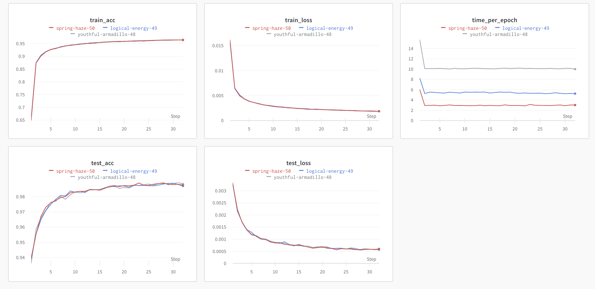
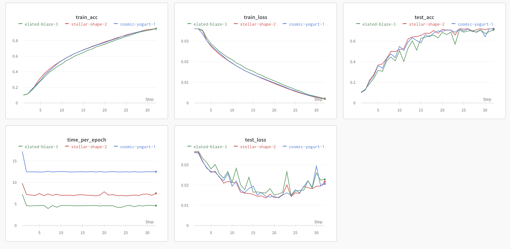

# Distributed training with PyTorch DDP

Author: Corey Adams corey.adams@anl.gov
Huihuo made some changes on the code. 

Pytorch has an additional built-in distributed data parallel package, DDP, short for Distributed Data Parallel.  It comes in pytorch 1.6 or higher, and wraps your model (__not__ your optimizer, like horovod) and performs computation and communication simultaneously.

Here is the pytorch documentation:
https://pytorch.org/tutorials/intermediate/ddp_tutorial.html

And their paper about this:
https://arxiv.org/abs/2006.15704

## How does DDP work?

In short, DDP wraps your model and figures out what tensors need to be allreduced
and when.  It leverages the situations where, during a sequential backward pass, the earlist tensors to be used going backwards (which are the latest in the model!) are ready for an allreduce operation much sooner than the latest tensors (which are the first in the model!).  So, during the backwards pass the allreduce of tensors that are no longer needed in the graph will happen while the backwards pass is still computing.

Additionally, DDP performs tensor fusion to create larger buffers for tensors.  Horovod also has the option, though DDP uses it by default.

## DDP support

DDP is only available in newer versions of python, and on ThetaGPU works most reliably using Nvidia's docker or singularity containers.  The examples here will use these containers.

For collective communication, DDP can use `NCCL` on GPUs, and `gloo` on CPUs.

## Setting up DDP

To start DDP, you need to call pytorch's `init_process_group` function from the `distributed` package.  This has a few options, but the easist is typically to use the environment variables.  You also need to assign each script you have a rank and world size - fortunately, DDP is compatible with MPI so this is no trouble using `mpi4py`.

To set up the environment, do something like this:

```python
# Get MPI:
from mpi4py import MPI

with_ddp=True
# Use openmpi environment variables to read the local rank:
local_rank = os.environ['OMPI_COMM_WORLD_LOCAL_RANK']
# Use MPI to get the world size and the global rank:
size = MPI.COMM_WORLD.Get_size()
rank = MPI.COMM_WORLD.Get_rank()


# Pytorch will look for these:
os.environ["RANK"] = str(rank)
os.environ["WORLD_SIZE"] = str(size)
os.environ['CUDA_VISIBLE_DEVICES'] = str(local_rank)

# Get the hostname of the master node, and broadcast it to all other nodes
# It will want the master address too, which we'll broadcast:
if rank == 0:
    master_addr = socket.gethostname()
else:
    master_addr = None

master_addr = MPI.COMM_WORLD.bcast(master_addr, root=0)
# Set the master address on all nodes:
os.environ["MASTER_ADDR"] = master_addr
# Port can be any open port
os.environ["MASTER_PORT"] = str(2345)
```

After this, you can use the `init_method='env://` argument in init_process.

### Other init methods?

Unlike hvd.init(), which use MPI and does everything under the hood, DDP is more steps and more options.  Other choices are to pass a common file all processes can write to.


## Wrapping your model in DDP:

It's easy:
```python
model = DDP(model)
```

You simply replace your model with `DDP(model)` and DDP will synchronize the weights and, during training, all reduce gradients before applying updates.  DDP handles all of it for you.

## DDP Performance

DDP Generally scales better than horovod for pytorch at large node counts because it can begin all reduce before the backwards pass has finished.  On Summit, with 1,536 V100 GPUs, one ALCF model had a scaling efficiency if 97% with DDP compared to ~60% with horovod.

### When to use DDP?

It's only available with pytorch.  It's only worthwhile with distributed training, and if your model is small than you won't see great scaling efficiency with either DDP or horovod.

# Examples

There are two examples included here, with pytorch using mnist and cifar10.  Both are as similar as possible to the horovod examples, but with horovod steps replaced via DDP.  Feel free to do a diff and see all the changes!

## Running in a container

Unfortunately, running in a container to use DDP requires two scripts, not one, to successfully launch the program.  The reason for this is that our container does not have `mpi4py` and so we launch singularity with MPI from the main cobalt script, and each singularity instance launches a shell script that itself launches python.  To be more clear:

- Cobalt script which runs on one node, and uses `mpirun` to launch `n` singularity instances, typically 8 per node.  
    - Each singularity instance launches the same shell script
    - Each shell script sets up a virtual environment, and then executes the main python script.

Take a look in the `submissions` folder for more details about this.

# Example Performance

Here I show the results I got measuring the time-per-epoch averaged over the last 5 epochs of a training run.  I scaled out over a single node, and out onto 4 nodes x 4 GPUs

```
for n in 1 2 4
do
    aprun -n $n python pytorch_cifar10.py --device gpu --wandb --project cifar10_ddp >& cifar10.$n.dat
    aprun -n $n python pytorch_mnist.py --device gpu --wandb --project mnist_ddp >& mnist.$n.dat
done    
```

| GPUs | Cifar10 Time/epoch [s] | MNIST Time/epoch [s] |
| ---- | ---------------------- | -------------------- |
|    1 |            12.6        |         10.09        |
|    2 |            6.40        |         5.28         |
|    4 |            2.66        |         2.98         |

* MNIST DDP Scaling

* Cifar10 DDP Scaling


## Comparison between DDP and Horovod
```bash
for n in 1 2 4
do  
    aprun -n $n python pytorch_mnist.py --device gpu --epochs 32 --wandb --project mnist_ddp_hvd_$n >& mnist_ddp.$n.dat
    aprun -n $n python ../Horovod/pytorch_mnist.py --device gpu --epochs 32 --wandb --project mnist_ddp_hvd_$n >& mnist_hvd.$n.dat
done
```

| GPUs | Cifar10-DDP Time/epoch [s] | Cifar10-HVD Time/epoch [s] |
| ---- | ---------------------- | -------------------- |
|    1 |            12.49        |         12.26        |
|    2 |            7.47        |         8.10         |
|    4 |            4.61        |          5.47        |


| GPUs | MNIST-DDP Time/epoch [s] | MNIST-HVD Time/epoch [s] |
| ---- | ---------------------- | -------------------- |
|    1 |            10.00        |         11.66        |
|    2 |            5.23        |         7.95         |
|    4 |            3.00        |          5.61        |