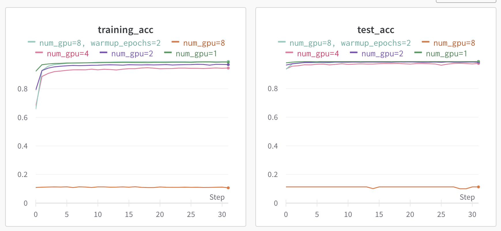

# Hands on for Data Parallel Deep Learning on ThetaGPU

0. (OPTIONAL) Follow the following instruction to register an weights&Bias account:
https://docs.wandb.ai/quickstart


1. Request an interactive session on Polaris:
      ```bash
      $ ssh <username>@polaris.alcf.anl.gov
      $ git clone https://github.com/argonne-lcf/sdl_workshop.git
      cd sdl_workshop
      ```
      Go to 
      [https://wandb.ai/authorize](https://wandb.ai/authorize) to find your wandb API key
   
      Put the following line into you ~/.bashrc 
      ```bash 
      export WANDB_API_KEY=YOU_API_KEY
      ```
      Connect to wandb (we need activate conda environment first)
      ```
      $ module load conda/2022-09-08
      $ conda activate
      $ wandb login
      ```
   
      ```
      $ qsub -l walltime=1:00:00 -A SDL_Workshop -q SDL_Workshop -l nodes=4:ppn=16 -I 
      ```

2. Setup the Python environment to include TensorFlow, Keras, PyTorch, and Horovod:
   ```bash
   module load conda
   conda activate
   ```
3. Run examples on a single node
      ```bash
      aprun -n 4 python pytorch_mnist.py --device gpu --wandb 
      ```
4. Visualize the results (replace ```hzheng``` with your wandb username): 
   https://wandb.ai/hzheng/sdl-pytorch-mnist

5. Test scaling:
   ```bash
   for n in 1 2 4
   do
     	aprun -n $n python pytorch_mnist.py --device gpu --wandb >& pytorch_mnist.out.$n
   done
   ```
   If you want to go to larger scale (8 GPUs), you could run on 2 nodes. 

   Currently, there is some issue with pytorch dataloader, one has to set ```num_workers=0``` which will hurt the performance.
  ```bash
  aprun -n 8 -N 4  python pytorch_mnist.py --device gpu --wandb >& pytorch_mnist.out.8
  ```

   You can check the test accuracy and the timing for different scales.


| GPUs | Cifar10 Time/epoch [s] | MNIST Time/epoch [s] |
| ---- | ---------------------- | -------------------- |
|    1 |            12.26        |         11.66        |
|    2 |            8.10        |         7.96         |
|    4 |            5.47        |         5.61         |


## Warmup epochs
It is easier to implement warmup epochs in tensorflow2 or keras. In this example, we will show that warmup epochs improve the convergence behavior at large scale.

   ```bash
   for n in 1 2 4 8 
   do
      aprun -n $n -N 4 python tensorflow2_mnist.py --device gpu --wandb --project warmup_epoch
   done
   aprun -n $n -N 4 python tensorflow2_mnist.py --device gpu --wandb --num_warmup_epochs 2 --project warmup_epoch 
   ```

