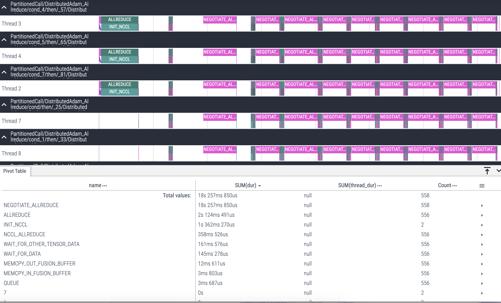

# Distributed Deep Learning
Author: Huihuo Zheng (<huihuo.zheng@anl.gov>). 

**Goals of this tutorial**
* Understand model parallelism and data parallelism
* Know how to modify your code with Horovod
* Know how to run distributed training on supercomputer


## I. Introduction to Data Parallel Deep Learning

The goal for train the model at large scale is to reduce the time-to-solution to reasonable amount. By using training the model in parallel, it reduces the total training time from weeks to minutes. 


### Model Parallelism and Data Parallelism

* **Model parallelization**: in this scheme, disjoint subsets of a neural network are assigned to different devices. All the computations associated to the subsets are performed concurrently. 
	
  Communication happens between devices whenever there is dataflow between two subsets. 
  
  Model parallelization is suitable when the model is too large to be fitted into a single device (CPU/GPU) because of the memory capacity. However, partitioning the model into different subsets is not an easy task, and there might potentially introduce load imbalance issues limiting the scaling efficiency.  

2. **Data parallelization**: in this scheme, all the workers own a replica of the model. The global batch of data is split into multiple minibatches, and processed by different workers. Each worker computes the corresponding loss and gradients with respect to the data it posseses. 
  
  Before the updating of the parameters at each epoch, the loss and gradients are averaged among all the workers through a collective operation. This scheme is relatively simple to implement. MPI_Allreduce is the only commu


## II. Horovod Data Parallel Frameworks

Reference: https://horovod.readthedocs.io/en/stable/
1. Sergeev, A., Del Balso, M. (2017) Meet Horovod: Uber’s Open Source Distributed Deep Learning Framework for TensorFlow. Retrieved from https://eng.uber.com/horovod/
2. Sergeev, A. (2017) Horovod - Distributed TensorFlow Made Easy. Retrieved from https://www.slideshare.net/AlexanderSergeev4/horovod-distributed-tensorflow-made-easy
3. Sergeev, A., Del Balso, M. (2018) Horovod: fast and easy distributed deep learning in TensorFlow. Retrieved from arXiv:1802.05799

* Our recent presentation about the data parallel training can be found here: https://youtu.be/930yrXjNkgM
* Other more complete training materials: https://github.com/argonne-lcf/sdl_ai_workshop.git

There are seven steps you need to do: 
  1. Initialize Horovod
  2. Pin GPU to each process
  3. Scale the learning rate
  4. Set distributed optimizer / gradient tape
  5. Broadcast the model & optimizer parameters to other rank
  6. Checking pointing on rank 0
  7. Adjusting dataset loading: number of steps (or batches) per epoch, dataset sharding, etc. 

### TensorFlow with Horovod
1) **Initialize Horovod**
```python
import horovod.tensorflow as hvd 
hvd.init()
```
After this initialization, the rank ID and the number of processes can be refered as ```hvd.rank()``` and ```hvd.size()```. Besides, one can also call ```hvd.local_rank()``` to get the local rank ID within a node. This is useful when we are trying to assign GPUs to each rank. 

2) **Assign GPUs to each rank**
```python
# Get the list of GPU
gpus = tf.config.experimental.list_physical_devices('GPU')
# Ping GPU to the rank
tf.config.experimental.set_visible_devices(gpus[hvd.local_rank()], 'GPU')
```
In this case, we set one GPU per process: ID=```hvd.local_rank()```

3) **Scale the learning rate by number of workers**

Typically, since we use multiple workers, if we keep the local batch size on each rank the same, the global batch size increases by $n$ times ($n$ is the number of workers). The learning rate should increase proportionally (assuming that the learning rate initially is 0.01).
```python
opt = tf.train.AdagradOptimizer(0.01*hvd.size())
```

4) **Wrap tf.GradientTape with Horovod Distributed Gradient Tape**

```python
tape = hvd.DistributedGradientTape(tape)
```
So that this can also ```tape``` operator will average the weights and gradients among the workers in the back propagating stage. 

5) **Broadcast the model and optimizer parameters from rank 0**

This is to make sure that all the workers will have the same starting point.
```python
hvd.broadcast_variables(model.variables, root_rank=0)
hvd.broadcast_variables(opt.variables(), root_rank=0)
```

6) **Checkpointing on root rank**

It is important to let only one process to do the checkpointing I/O. 
```python
if hvd.rank() == 0: 
     checkpoint.save(checkpoint_dir)
```

7) **Sharding the dataset**

In data parallelism, we distributed the dataset to different workers. It is important to make sure different workers work on different part of the dataset, and they together can cover the entire dataset at each epoch. 
```python
dataset = dataset.shard(hvd.size(), hvd.rank())
```

8) **Adjusting the number of steps per epoch**

The total number of steps per epoch is ```nsamples / hvd.size()```.

Example: [03_keras_cnn_verbose_hvd.py](Horovod/03_keras_cnn_verbose_hvd.py)


### Keras with Horovod
1) **Initialize Horovod**
```python
import horovod.tensorflow.keras as hvd 
hvd.init()
```
After this initialization, the rank ID and the number of processes can be refered as ```hvd.rank()``` and ```hvd.size()```. Besides, one can also call ```hvd.local_rank()``` to get the local rank ID within a node. This is useful when we are trying to assign GPUs to each rank. 

2) **Assign GPUs to each rank**
```python
# Get the list of GPU
gpus = tf.config.experimental.list_physical_devices('GPU')
# Ping GPU to the rank
tf.config.experimental.set_visible_devices(gpus[hvd.local_rank()], 'GPU')
```
In this case, we set one GPU per process: ID=```hvd.local_rank()```

3) **Scale the learning rate with number of workers**

Typically, since we use multiple workers, if we keep the local batch size on each rank the same, the global batch size increases by $n$ times ($n$ is the number of workers). The learning rate should increase proportionally (assuming that the learning rate initially is 0.01).
```python
opt = tf.optimizers.Adam(args.lr * hvd.size())
```

4) **Wrap tf.optimizer with Horovod DistributedOptimizer**

```python
opt = hvd.DistributedOptimizer(opt)
```
So that this optimizer can average the weights and gradients among the workers in the back propagating stage. 

5) **Broadcast the model from rank 0**

This is to make sure that all the workers will have the same starting point.
```python
callbacks = [
        hvd.callbacks.BroadcastGlobalVariablesCallback(0), ...
]

```
6) **Checkpointing on root rank**

It is important to let only one process to do the checkpointing I/O. 
```python
if hvd.rank() == 0:
    callbacks.append(tf.keras.callbacks.ModelCheckpoint('./checkpoints'))
```

7) **Loading data according to rank ID**

In data parallelism, we distributed the dataset to different workers. It is important to make sure different workers work on different part of the dataset, and they together can cover the entire dataset at each epoch. 

In general, one has two ways to deal with the data loading. 
1. Each worker randomly selects one batch of data from the dataset at each step. In such case, each worker can see the entire dataset. It is important to make sure that the different worker have different random seeds so that they will get different data at each step.
2. Each worker accesses a subset of dataset. One manually partition the entire dataset into different partions, and each rank access one of the partions. 

8) **Adjusting the number of steps per epoch**

The total number of steps per epoch is ```nsamples / hvd.size()```.


We provided some examples in: We provided some examples in: [04_keras_cnn_concise_hvd.py](Horovod/keras_cnn_concise_hvd.py)

## III. Other frameworks examples
For Pytorch, one can also use DDP and DeepSpeed to parallelize the code. The instruction on how to parallelize the code using DDP and DeepSpeed can be found here: 
* DDP: https://github.com/argonne-lcf/ALCF_Hands_on_HPC_Workshop/tree/master/distributedDeepLearning/DDP
* DeepSpeed: https://github.com/argonne-lcf/ALCF_Hands_on_HPC_Workshop/tree/master/distributedDeepLearning/DeepSpeed

We also provde examples in this GitHub repo
* DDP: 
[pytorch_cnn_ddp.py](DDP/pytorch_cnn_ddp.py)
* DeepSpeed: 
[pytorch_cnn_ds.py](DeepSpeed/pytorch_cnn_ds.py)

## IV. Evaluating Performance
Request Polaris nodes
```bash
ssh -CY user@polaris.alcf.anl.gov
cd ALCF_Hands_on_HPC_Workshop/learningFrameworks/distributedDeepLearning
qsub -l nodes=2:ppn=4 -l walltime=00:30:00 -A fallwkshp23 -I
```
Setup the environment
```bash
module load conda/2023-10-04; conda activate
```
Run the example with different number of GPUs
```bash
aprun -n 1 -N 1 --cc depth -d 64 python Horovod/keras_cnn_concise_hvd.py >& keras_cnn_concise_hvd.py.1.out
aprun -n 2 -N 2 --cc depth -d 32 python Horovod/keras_cnn_concise_hvd.py >& keras_cnn_concise_hvd.py.2.out
aprun -n 4 -N 4 --cc depth -d 16 python Horovod/keras_cnn_concise_hvd.py >& keras_cnn_concise_hvd.py.4.out
aprun -n 8 -N 4 --cc depth -d 16 python Horovod/keras_cnn_concise_hvd.py >& keras_cnn_concise_hvd.py.8.out
```

```bash
grep -nir "Total*" concise_*.out

keras_cnn_concise_hvd.py.1.out:Hvd Procs 1 Total time: 30.427427530288696 second
keras_cnn_concise_hvd.py.2.out:Hvd Procs 2 Total time: 24.19026517868042 second
keras_cnn_concise_hvd.py.4.out:Hvd Procs 4 Total time: 19.807720184326172 second
keras_cnn_concise_hvd.py.8.out:Hvd Procs 8 Total time: 17.904022216796875 second
```

## V. Large batch training and learning rate warmup
* No warmup up 
```bash
aprun -n 8 -N 4 --cc depth -d 16  python Horovod/keras_cnn_concise_hvd.py --warmup_epochs=0
```
```bash
14/14 [==============================] - 8s 15ms/step - loss: 5.2882 - accuracy: 0.1051 - lr: 0.0800
Epoch 1/49
14/14 [==============================] - 1s 16ms/step - loss: 9.7685 - accuracy: 0.1137 - lr: 0.0800
Epoch 2/49
14/14 [==============================] - 0s 12ms/step - loss: 2.3030 - accuracy: 0.1084 - lr: 0.0800
Epoch 3/49
14/14 [==============================] - 0s 20ms/step - loss: 2.3017 - accuracy: 0.1120 - lr: 0.0800
Epoch 4/49
14/14 [==============================] - 0s 17ms/step - loss: 2.3016 - accuracy: 0.1118 - lr: 0.0800
Epoch 5/49
14/14 [==============================] - 0s 11ms/step - loss: 2.3011 - accuracy: 0.1125 - lr: 0.0800
Epoch 6/49
14/14 [==============================] - 0s 18ms/step - loss: 2.3011 - accuracy: 0.1124 - lr: 0.0800
Epoch 7/49
14/14 [==============================] - 0s 20ms/step - loss: 2.3016 - accuracy: 0.1136 - lr: 0.0800
Epoch 8/49
14/14 [==============================] - 0s 11ms/step - loss: 2.3011 - accuracy: 0.1139 - lr: 0.0800
Epoch 9/49
14/14 [==============================] - 0s 28ms/step - loss: 2.3019 - accuracy: 0.1088 - lr: 0.0800
Epoch 10/49
14/14 [==============================] - 0s 12ms/step - loss: 2.3017 - accuracy: 0.1107 - lr: 0.0800
Epoch 11/49
14/14 [==============================] - 0s 13ms/step - loss: 2.3015 - accuracy: 0.1123 - lr: 0.0800
Epoch 12/49
14/14 [==============================] - 0s 11ms/step - loss: 2.3016 - accuracy: 0.1128 - lr: 0.0800
Epoch 13/49
```

* With warmup 
```bash
aprun -n 8 -N 4 --cc depth -d 16 python Horovod/04_keras_cnn_concise_hvd.py --warmup_epochs=3
```
```
14/14 [==============================] - 8s 21ms/step - loss: 1.3770 - accuracy: 0.5622 - lr: 0.0333
Epoch 1/49
14/14 [==============================] - 1s 16ms/step - loss: 1.7582 - accuracy: 0.4185 - lr: 0.0333
Epoch 2/49
14/14 [==============================] - 0s 14ms/step - loss: 0.5647 - accuracy: 0.8224 - lr: 0.0567
Epoch 3/49
13/14 [==========================>...] - ETA: 0s - loss: 0.3165 - accuracy: 0.9028
Epoch 3: finished gradual learning rate warmup to 0.08.
14/14 [==============================] - 0s 16ms/step - loss: 0.3098 - accuracy: 0.9072 - lr: 0.0800
Epoch 4/49
14/14 [==============================] - 0s 15ms/step - loss: 0.2391 - accuracy: 0.9269 - lr: 0.0800
Epoch 5/49
14/14 [==============================] - 0s 16ms/step - loss: 0.1897 - accuracy: 0.9429 - lr: 0.0800
Epoch 6/49
14/14 [==============================] - 0s 18ms/step - loss: 0.1668 - accuracy: 0.9505 - lr: 0.0800
Epoch 7/49
14/14 [==============================] - 0s 23ms/step - loss: 0.1520 - accuracy: 0.9546 - lr: 0.0800
Epoch 8/49
14/14 [==============================] - 0s 13ms/step - loss: 0.1520 - accuracy: 0.9546 - lr: 0.0800
Epoch 9/49
14/14 [==============================] - 0s 30ms/step - loss: 0.1427 - accuracy: 0.9568 - lr: 0.0800
Epoch 10/49
14/14 [==============================] - 0s 17ms/step - loss: 0.1417 - accuracy: 0.9565 - lr: 0.0800
Epoch 11/49
14/14 [==============================] - 0s 17ms/step - loss: 0.1413 - accuracy: 0.9574 - lr: 0.0800
Epoch 12/49
14/14 [==============================] - 0s 11ms/step - loss: 0.1294 - accuracy: 0.9609 - lr: 0.0800
Epoch 13/49
14/14 [==============================] - 0s 15ms/step - loss: 0.1218 - accuracy: 0.9633 - lr: 0.0800
Epoch 14/49
14/14 [==============================] - 0s 12ms/step - loss: 0.1185 - accuracy: 0.9640 - lr: 0.0800
```
## VI. MPI Communication profiling
* MPI profiling -- to see the MPI calls involved
```bash
  LD_PRELOAD=/soft/perftools/mpitrace/lib/libmpitrace.so aprun -n 8 -N 4 --cc depth -d 16 python keras_cnn_concise_hvd.py --epochs 10
```
This will generate files mpi_profile.*, which show the MPI flat profiling information. Please notice that this does not show NCCL communication calls. 
```
-----------------------------------------------------------------------
MPI Routine                        #calls     avg. bytes      time(sec)
-----------------------------------------------------------------------
MPI_Comm_rank                           7            0.0          0.000
MPI_Comm_size                           4            0.0          0.000
MPI_Bcast                             153       188295.1          0.014
MPI_Barrier                             1            0.0          0.000
MPI_Allreduce                       12170            8.0         12.775
MPI_Gather                             51            4.0          0.001
MPI_Gatherv                            51            0.0          0.015
MPI_Allgather                           3            5.3          0.000
-----------------------------------------------------------------------
total communication time = 12.805 seconds.
total elapsed time       = 13.899 seconds.
user cpu time            = 15.336 seconds.
system time              = 10.047 seconds.
max resident set size    = 4451.586 MiB.

...
MPI_Allreduce             #calls    avg. bytes      time(sec)
                              20           4.0          0.000
                           12150           8.0         12.775
```
* Horovod Timeline -- to see when MPI communication happens. 
To get the timeline trace, simply set the environment variable ```HOROVOD_TIMELINE``` to the output file name. Then copy the json file to your local machine, and visualize using Chrome trace (open your chrome and type chrome://tracing/ in the address bar, and then load the json file).
```bash
HOROVOD_TIMELINE=gpu.json mpirun -np 8 python Horovod/keras_cnn_concise_h
```

