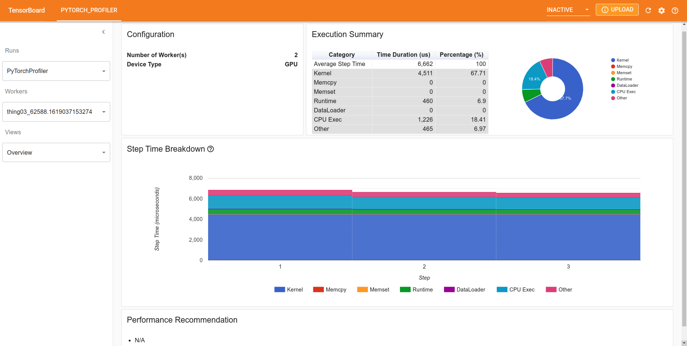

# PyTorch Profiler

Profiling is an efficient way of measuring the performance and optimize your PyTorch scripts. It allows you to examine a PyTorch script and understand if it has some performance issues. One can measure and analyze execution time and memory consumption as well as finding bottlenecks and trace source code. In this tutorial we discuss several ways to profile PyTorch scripts such as [`torch.autograd.profiler`](https://pytorch.org/docs/stable/autograd.html#torch.autograd.profiler.profile), [`torch.profiler`](https://pytorch.org/docs/stable/profiler.html#torch-profiler), [`torch.utils.bottleneck`](https://pytorch.org/docs/stable/bottleneck.html#torch-utils-bottleneck) and [Python cProfiler](https://docs.python.org/3/library/profile.html#module-cProfile).

In this tutorial we:
* demonstrate PyTorch autograd profiler interface, measure CPU execution time and memory allocation
* profile simple performance issue on CPU
* profile simple performance issue on GPU
* compare PyTorch profiler with Python cProfiler and PyTorch bottleneck
* demonstrate the PyTorch profiler dashboard with tensorboard plugin (introduced in PyTorch 1.8)

Table of Contents
* [Dependencies](#dependencies)
* [Demonstration of the PyTorch profiler](#demonstraion-of-the-pytorch-profiler)
  - [Analysis of execution time](#analysis-of-execution-time)
  - [Analysis of memory allocation](#analysis-of-memory-allocation)
  - [Fixing performance issue](#fixing-performance-issue)
* [Example of profiling](#example-of-profiling)
  - [Python cProfile](#python-cprofile)
  - [PyTorch bottleneck](#pyTorch-bottleneck)
  - [Warnings](#warnings)
* [New PyTorch profiler](#new-pytorch-profiler)


## Dependencies
Profiler is part of the PyTorch and can be used out of the box. PyTorch 1.8 [introduces new improved performance tool `torch.profiler`](https://pytorch.org/blog/introducing-pytorch-profiler-the-new-and-improved-performance-tool/). New profiler has a convenient dashboard in `tensorboard` so it has to be installed. Some examples in the tutorial use a model from `torchvision`. 

You can run these examples on Polaris. To do it you need to ssh into a login node:
```bash
ssh username@polaris.alcf.anl.gov
```
where you can get a node in interactive regime:
```bash
qsub -l select=1:system=polaris -l walltime=30:00 -l filesystems=home:eagle -I -A SDL_Workshop -q SDL_Workshop
```
Finally, you can activate conda environment
```bash
module load conda/2022-09-08
conda activate base
```
This environment includes all the dependencies we need, such as `tensorboard` and `torchvision`, except the [PyTorch profiler TensorBoard Plugin](https://github.com/pytorch/kineto/blob/master/tb_plugin/README.md). This package can be installed locally (in `~/.local/polaris/conda/2022-09-08/lib/python3.8/site-packages/`) with
```bash
pip install --user torch-tb-profiler
```
You can now run all the examples.


## Demonstraion of the PyTorch profiler
### Analysis of execution time
Let's start with analyzing execution time. We will use `resnet18` model from `torchvision` for demonstration.
```python
import torch
import torchvision.models as models
import torch.autograd.profiler as profiler

torch.set_default_tensor_type(torch.DoubleTensor)
model = models.resnet18()
inputs = torch.randn(128, 3, 224, 224)
```
One can profile execution with profiler as a context manager and print results:
```python
with profiler.profile() as prof:
    model(inputs)
print(prof.key_averages().table(sort_by="cpu_time_total", row_limit=10))
```
For convenience, this example is stored in [example1/v0.py](example1/v0.py). Profiler output is presented below
```bash
---------------------------------  ------------  ------------  ------------  ------------  ------------  ------------  
                             Name    Self CPU %      Self CPU   CPU total %     CPU total  CPU time avg    # of Calls  
---------------------------------  ------------  ------------  ------------  ------------  ------------  ------------  
                     aten::conv2d         0.01%      93.000us        84.81%        1.401s      70.039ms            20  
                aten::convolution         0.02%     377.000us        84.81%        1.401s      70.034ms            20  
               aten::_convolution         0.02%     279.000us        84.79%        1.400s      70.015ms            20  
                aten::thnn_conv2d         0.01%     120.000us        84.77%        1.400s      70.000ms            20  
       aten::_slow_conv2d_forward        84.72%        1.399s        84.76%        1.400s      69.994ms            20  
                 aten::batch_norm         0.00%      68.000us        10.00%     165.115ms       8.256ms            20  
     aten::_batch_norm_impl_index         0.01%     133.000us         9.99%     165.047ms       8.252ms            20  
          aten::native_batch_norm         9.95%     164.399ms         9.98%     164.873ms       8.244ms            20  
                 aten::max_pool2d         0.00%      15.000us         2.03%      33.541ms      33.541ms             1  
    aten::max_pool2d_with_indices         2.03%      33.526ms         2.03%      33.526ms      33.526ms             1  
---------------------------------  ------------  ------------  ------------  ------------  ------------  ------------  
Self CPU time total: 1.652s
```
In the output, the operators are sorted by total CPU time. It is important to note that `CPU total time` includes the time from all subroutines calls, but `Self CPU time` excludes it. For example, the total execution time of `aten::conv2d` consists of a negligible self time (`93.000us`), with most time spent calling other operators, which make in total `1.401s`. In opposite, for `aten::addmm_` no time is spent on calling other operators. It is possible to sort results by another metric such as `self_cpu_time_total` or [others](https://pytorch.org/docs/stable/autograd.html#torch.autograd.profiler.profile.table).

Most time of execution was spent in convolutional layers. This model has several convolutions and one can examine different layers if results are sorted by the shape of the input tensor (another approach would be to use labels, we will demonstrate it later) - [example1/v1.py](example1/v1.py).
```python
with profiler.profile(record_shapes=True) as prof:
    model(inputs)
print(prof.key_averages(group_by_input_shape=True).table(sort_by="cpu_time_total", row_limit=10))
```
In the output convolutions are grouped by input tensor shape
```bash
---------------------------------  ------------  ------------  ------------  ------------  ------------  ------------  --------------------------------------------------------------------------------
                             Name    Self CPU %      Self CPU   CPU total %     CPU total  CPU time avg    # of Calls                                                                      Input Shapes
---------------------------------  ------------  ------------  ------------  ------------  ------------  ------------  --------------------------------------------------------------------------------
                     aten::conv2d         0.00%      28.000us        27.16%     398.174ms      99.543ms             4                           [[128, 64, 56, 56], [64, 64, 3, 3], [], [], [], [], []]
                aten::convolution         0.01%      89.000us        27.16%     398.146ms      99.537ms             4                   [[128, 64, 56, 56], [64, 64, 3, 3], [], [], [], [], [], [], []]
               aten::_convolution         0.00%      66.000us        27.15%     398.057ms      99.514ms             4   [[128, 64, 56, 56], [64, 64, 3, 3], [], [], [], [], [], [], [], [], [], [], []]
                aten::thnn_conv2d         0.00%      33.000us        27.15%     397.988ms      99.497ms             4                               [[128, 64, 56, 56], [64, 64, 3, 3], [], [], [], []]
       aten::_slow_conv2d_forward        27.14%     397.790ms        27.15%     397.955ms      99.489ms             4                               [[128, 64, 56, 56], [64, 64, 3, 3], [], [], [], []]
                     aten::conv2d         0.00%      22.000us        14.34%     210.162ms      70.054ms             3                        [[128, 128, 28, 28], [128, 128, 3, 3], [], [], [], [], []]
                aten::convolution         0.00%      69.000us        14.33%     210.140ms      70.047ms             3                [[128, 128, 28, 28], [128, 128, 3, 3], [], [], [], [], [], [], []]
               aten::_convolution         0.00%      48.000us        14.33%     210.071ms      70.024ms             3  [[128, 128, 28, 28], [128, 128, 3, 3], [], [], [], [], [], [], [], [], [], [], [
                aten::thnn_conv2d         0.00%      24.000us        14.33%     210.021ms      70.007ms             3                            [[128, 128, 28, 28], [128, 128, 3, 3], [], [], [], []]
       aten::_slow_conv2d_forward        14.32%     209.878ms        14.33%     209.997ms      69.999ms             3                            [[128, 128, 28, 28], [128, 128, 3, 3], [], [], [], []]
---------------------------------  ------------  ------------  ------------  ------------  ------------  ------------  --------------------------------------------------------------------------------
Self CPU time total: 1.466s
```

### Analysis of memory allocation
Profiler also allows to analyze the memory allocated in different parts of the model. Similar to CPU execution time, 'self' memory accounts for memory allocated in the function excluding calls of subroutines. The profiler will analyze memory if attibute `profile_memory=True` is set  - [example1/v2.py](example1/v2.py).
```python
with profiler.profile(profile_memory=True) as prof:
    model(inputs)
print(prof.key_averages().table(sort_by="self_cpu_memory_usage", row_limit=10))
```
You may see some warning of the profiler mentioning that not all memory allocation/deallocation events are analyzed. 
This happens because we profile only model forward pass and some allocations in the initialization are missed. You will see the following profile:
```bash
---------------------------------  ------------  ------------  ------------  ------------  ------------  ------------  ------------  ------------  
                             Name    Self CPU %      Self CPU   CPU total %     CPU total  CPU time avg       CPU Mem  Self CPU Mem    # of Calls  
---------------------------------  ------------  ------------  ------------  ------------  ------------  ------------  ------------  ------------  
                      aten::empty         0.05%     723.000us         0.05%     723.000us       3.615us      16.38 Gb      16.38 Gb           200  
                    aten::resize_         0.02%     250.000us         0.02%     250.000us      12.500us       2.37 Gb       2.37 Gb            20  
    aten::max_pool2d_with_indices         2.08%      30.664ms         2.08%      30.664ms      30.664ms     392.00 Mb     392.00 Mb             1  
                      aten::addmm         0.05%     709.000us         0.05%     745.000us     745.000us    1000.00 Kb    1000.00 Kb             1  
                       aten::mean         0.00%      56.000us         0.02%     261.000us     261.000us     512.00 Kb     512.00 Kb             1  
              aten::empty_strided         0.00%       7.000us         0.00%       7.000us       7.000us           8 b           8 b             1  
                     aten::conv2d         0.01%     118.000us        86.39%        1.275s      63.767ms       2.37 Gb           0 b            20  
                aten::convolution         0.02%     350.000us        86.38%        1.275s      63.761ms       2.37 Gb           0 b            20  
               aten::_convolution         0.02%     282.000us        86.36%        1.275s      63.743ms       2.37 Gb           0 b            20  
          aten::_nnpack_available         0.00%      23.000us         0.00%      23.000us       1.150us           0 b           0 b            20  
---------------------------------  ------------  ------------  ------------  ------------  ------------  ------------  ------------  ------------  
Self CPU time total: 1.476s
```

### Fixing performance issue
You may have noticed that PyTorch uses the operator `aten::thnn_conv2d` for convolution layers, which then calls `aten::_slow_conv2d_forward` that, as the name suggests, is a slow operator. For execution on CPU PyTorch is optimized with [MKLDNN library](https://github.com/rsdubtso/mkl-dnn) and should have used the corresponding convolution. This issue could reduce performance. In this example, PyTorch used a slower algorithm because the convolution algorithm in double precision is missing in MKLDNN, so switching to float precision will turn MKLDNN on - [example1/v3.py](example1/v3.py):
```bash
---------------------------------  ------------  ------------  ------------  ------------  ------------  ------------  
                             Name    Self CPU %      Self CPU   CPU total %     CPU total  CPU time avg    # of Calls  
---------------------------------  ------------  ------------  ------------  ------------  ------------  ------------  
                     aten::conv2d         0.01%      91.000us        76.98%     479.882ms      23.994ms            20  
                aten::convolution         0.06%     369.000us        76.96%     479.791ms      23.990ms            20  
               aten::_convolution         0.04%     234.000us        76.90%     479.422ms      23.971ms            20  
         aten::mkldnn_convolution        76.81%     478.847ms        76.86%     479.188ms      23.959ms            20  
                 aten::batch_norm         0.01%      73.000us        14.01%      87.332ms       4.367ms            20  
     aten::_batch_norm_impl_index         0.02%     120.000us        14.00%      87.259ms       4.363ms            20  
          aten::native_batch_norm        13.92%      86.797ms        13.97%      87.116ms       4.356ms            20  
                 aten::max_pool2d         0.00%      23.000us         4.77%      29.765ms      29.765ms             1  
    aten::max_pool2d_with_indices         4.77%      29.742ms         4.77%      29.742ms      29.742ms             1  
                      aten::relu_         0.04%     228.000us         1.84%      11.495ms     676.176us            17  
---------------------------------  ------------  ------------  ------------  ------------  ------------  ------------  
Self CPU time total: 623.420ms
```
As a result, `aten::mkldnn_convolution` was used. Due to optimizations in MKLDNN, execution time was decreased more than twice (0.623s  vs 1.466s).

## Example of profiling
In this section let's build a simple model and profile it. We build a model which takes a tensor of size 512, does several linear transformations with activation, and calculates a threshold. We want to compare this threshold with our mask and get indexes:
```python
import torch
import numpy as np
import torch.autograd.profiler as profiler


class MyModule(torch.nn.Module):
    def __init__(
            self, in_features: int,
            out_features: int,
            hidden_sizes: list,
            bias: bool = True):
        super(MyModule, self).__init__()

        sizes = [in_features] + hidden_sizes + [out_features]
        layers = []
        for s in range(len(sizes)-1):
            layers.append(torch.nn.Linear(sizes[s], sizes[s+1], bias))
            layers.append(torch.nn.ReLU())
        self.linear = torch.nn.Sequential(*layers)

    def forward(self, input, mask):
        with profiler.record_function("LABEL1: linear pass"):
            out = self.linear(input)

        with profiler.record_function("LABEL2: masking"):
            threshold = out.sum(axis=1).mean().item()
            hi_idx = np.argwhere(mask.cpu().numpy() > threshold)
            hi_idx = torch.from_numpy(hi_idx).cuda()

        return out, hi_idx
```
Here we demonstrate how to measure the time spent in different sections of the model. 
We use the context manager `with profiler.record_function("LABLE NAME"):` to label and aggregate results for a given section of code. 
We can profile this model running [example2/v0.py](example2/v0.py):
```python
torch.set_default_tensor_type(torch.cuda.FloatTensor)
model = MyModule(512, 8, [32, 32, 32])
input = torch.rand(512 * 512, 512)
mask = torch.rand((512, 512, 512))

# warm-up
model(input, mask)

with profiler.profile() as prof:
    out, idx = model(input, mask)
print(prof.key_averages().table(sort_by='self_cpu_time_total', row_limit=8))
```
This time we execute models on GPU. At the first call, CUDA does some benchmarking and chose the best algorithm for convolutions, therefore we need to warm up CUDA to ensure accurate performance benchmarking. 
```bash
-------------------------------------------------------  ------------  ------------  ------------  ------------  ------------  ------------  
                                                   Name    Self CPU %      Self CPU   CPU total %     CPU total  CPU time avg    # of Calls  
-------------------------------------------------------  ------------  ------------  ------------  ------------  ------------  ------------  
                                        LABEL2: masking        86.07%        1.293s        99.93%        1.502s        1.502s             1  
                                        cudaMemcpyAsync        13.84%     207.960ms        13.84%     207.960ms      69.320ms             3  
                                            aten::empty         0.03%     407.000us         0.03%     407.000us     101.750us             4  
                                            aten::addmm         0.01%     206.000us         0.02%     249.000us      62.250us             4  
                                    LABEL1: linear pass         0.01%     133.000us         0.04%     576.000us     576.000us             1  
                                       cudaLaunchKernel         0.01%      88.000us         0.01%      88.000us       5.500us            16  
                                                aten::t         0.00%      51.000us         0.00%      75.000us      18.750us             4  
                                        aten::clamp_min         0.00%      51.000us         0.00%      66.000us      16.500us             4  
-------------------------------------------------------  ------------  ------------  ------------  ------------  ------------  ------------  
Self CPU time total: 1.503s
```
The profile shows that the execution time of section `LABEL2: masking` takes 99.93% of total CPU time while in section `LABEL1: linear pass` code spends only 0.04%. Operations of copying tensors `cudaMemcpyAsync` take about 14% of execution time. We can optimize it if instead of using `np.argwhere` we do indexing directly on GPU with `torch.nonzero` - [example2/v1.py](example2/v1.py):
```python
    def forward(self, input, mask):
        with profiler.record_function("LABEL1: linear pass"):
            out = self.linear(input)

        with profiler.record_function("LABEL2: masking"):
            threshold = out.sum(axis=1).mean()  # removed.item()
            hi_idx = (mask > threshold).nonzero(as_tuple=True)
        return out, hi_idx
```
```bash
-------------------------------------------------------  ------------  ------------  ------------  ------------  ------------  ------------  
                                                   Name    Self CPU %      Self CPU   CPU total %     CPU total  CPU time avg    # of Calls  
-------------------------------------------------------  ------------  ------------  ------------  ------------  ------------  ------------  
                                        cudaMemcpyAsync        48.85%       1.486ms        48.85%       1.486ms       1.486ms             1  
                                            aten::empty        14.14%     430.000us        14.14%     430.000us     107.500us             4  
                                            aten::addmm         9.04%     275.000us        10.78%     328.000us      82.000us             4  
                                    LABEL1: linear pass         4.83%     147.000us        22.45%     683.000us     683.000us             1  
                                       cudaLaunchKernel         4.01%     122.000us         4.01%     122.000us       5.545us            22  
-------------------------------------------------------  ------------  ------------  ------------  ------------  ------------  ------------  
Self CPU time total: 3.042ms
```
After this optimization total execution time was improved by O(100) times which is much better than just eliminating the copy operation. 
The main reason for the improvement is that previously we computed `np.argwhere` on CPU while now we do this operation on GPU. 
PyTorch profile does not analyze NumPy operations so we missed them in the profile. 

### Python cProfile
PyTorch profile analyses only PyTorch operations which makes understanding of hotspots confusing. 
To profile all operations, one may use the python profiler `cProfile` - [example2/v2.py](example2/v2.py):
```bash
         92 function calls (80 primitive calls) in 1.522 seconds

   Ordered by: cumulative time

   ncalls  tottime  percall  cumtime  percall filename:lineno(function)
     10/1    0.000    0.000    1.522    1.522 module.py:1124(_call_impl)
        1    0.033    0.033    1.522    1.522 v2.py:24(forward)
        1    0.000    0.000    1.247    1.247 <__array_function__ internals>:2(argwhere)
      4/1    0.000    0.000    1.247    1.247 {built-in method numpy.core._multiarray_umath.implement_array_function}
        1    0.002    0.002    1.247    1.247 numeric.py:571(argwhere)
        2    0.000    0.000    1.244    0.622 fromnumeric.py:51(_wrapfunc)
        1    0.000    0.000    0.810    0.810 <__array_function__ internals>:2(nonzero)
        1    0.000    0.000    0.810    0.810 fromnumeric.py:1829(nonzero)
        1    0.810    0.810    0.810    0.810 {method 'nonzero' of 'numpy.ndarray' objects}
        1    0.000    0.000    0.435    0.435 <__array_function__ internals>:2(transpose)
        1    0.000    0.000    0.435    0.435 fromnumeric.py:601(transpose)
        1    0.000    0.000    0.435    0.435 fromnumeric.py:38(_wrapit)
        1    0.435    0.435    0.435    0.435 {built-in method numpy.asarray}
        1    0.170    0.170    0.170    0.170 {method 'cuda' of 'torch._C._TensorBase' objects}
        1    0.070    0.070    0.070    0.070 {method 'cpu' of 'torch._C._TensorBase' objects}
        1    0.001    0.001    0.001    0.001 {method 'item' of 'torch._C._TensorBase' objects}
```
Most of the time (`1.247s`) was spent in the `argwhere` function, which was computed on CPU. 


### PyTorch bottleneck
Modifying your script for running python cProfiler or PyTorch profiler with different arguments could be discouraging and may not be necessary for the first step. 
There is a convenient and simple tool called [`torch.utils.bottleneck`](https://pytorch.org/docs/stable/bottleneck.html#torch-utils-bottleneck) which can be used with your script with no modification. It summarizes the analysis of your script with both Python cProfiler and PyTorch profiler. Using it for fine-tuning is not a good practice (because it lacks warm-up, measuring initialization, etc.) but it is a good initial step for debugging bottlenecks in your script.
```bash
python -m torch.utils.bottleneck example2/v3.py
```
The output of the bottleneck is too big to show it here. Basically, it combines outputs of python cProfile, `torch.autorgrad.profile` for CPU and CUDA modes.

#### Warning
* Profiling tools collect events and analyze them and have a huge overhead. Profiler is helpful in searching for performance issues but slows down training/evaluation. Make sure to remove it when you finish your code investigation.


## (new) PyTorch profiler
With PyTorch 1.8 release [the new PyTorch profiler was introduced](https://pytorch.org/blog/introducing-pytorch-profiler-the-new-and-improved-performance-tool/). It is the next version of `torch.autorgrad.profile` and will replace it in future releases. The new `torch.profile` has a different [API](https://pytorch.org/docs/stable/profiler.html#torch-profiler) but it can be easily used in place of  `torch.autorgrad.profile`. In fact, all previous examples also work with the new profiler, with the following edits to the scripts:
```python
#import torch.autograd.profiler as profiler  # old profiler
import torch.profiler as profiler   # new profiler
```
and
```python
#with profiler.profile() as prof:  # old profiler
with profiler.profile(activities=[torch.profiler.ProfilerActivity.CPU]) as prof:  # new profiler
```
By default, running the new profiler without the `activities` argument will collect both CPU and CUDA activities, providing more detailed GPU hardware level information. 

More interestingly, the new profiler provides a convenient dashboard with a summary of all events and recommendations for optimization - [example3/v0.py](example3/v0.py)
```python
import torch
import torchvision.models as models

torch.set_default_tensor_type(torch.cuda.FloatTensor)
model = models.resnet18()
inputs = torch.randn(32, 3, 224, 224)

dir_name = './'

with torch.profiler.profile(
        activities=[torch.profiler.ProfilerActivity.CPU,
                    torch.profiler.ProfilerActivity.CUDA],
        schedule=torch.profiler.schedule(wait=0, warmup=1, active=3),
        on_trace_ready=torch.profiler.tensorboard_trace_handler(dir_name)
        ) as prof:

    for _ in range(8):
        model(inputs)
        prof.step()
```
In this example, we collect activities on both CPU and GPU. For the `schedule` argument, we can use `torch.profiler.schedule` with arguments `wait=0` to skip no iteration, `warmup=1` to start warming up on the first, `active=3` to record the second to fourth iterations, and when the trace becomes available `torch.profiler.tensorboard_trace_handler` is called to save it. This cycle starts again with the fifth iteration so in our example two traces will be saved, unless a maximum number of cycles is specified using the argument `repeat`. 
After execution, we will have `some_name.pt.trace.json` and `some_name_2.pt.trace.json` traces saved.

The [PyTorch profiler TensorBoard Plugin](https://github.com/pytorch/kineto/blob/master/tb_plugin/README.md) allows to examine the PyTorch profiler result in TensorBoard. 
To do so one has to run tensorboard specifying `logdir` where the traces are stored. On a Polaris login node run:
```bash
tensorboard --port <PORT> --bind_all --logdir </path/to/log/output/>
```
To access the server from your local machine you will need to do ssh port forwarding: 
```bash
ssh -L PORT:localhost:PORT username@polaris.alcf.anl.gov
```

Now you can open tensorboard in your browser at `http://localhost:PORT`.




The argument `with_stack=True`, as shown in [example3/v1.py](example3/v1.py), allows to track the line in the source code where each operator was called.
This information can be accessed from TensorBoard's Operator view by clicking on the "View Callstack" link next to an operator.

More examples and details of the new PyTorch profile can be found on its [github page](https://github.com/pytorch/kineto/tree/master/tb_plugin).


#### References and additional information
- [PyTorch autograd profiler example](https://pytorch.org/tutorials/beginner/profiler.html)
- [PyTorch profiler](https://pytorch.org/tutorials/recipes/recipes/profiler_recipe.html)
- [PyTorch profiler with TensorBoard](https://pytorch.org/tutorials/intermediate/tensorboard_profiler_tutorial.html?highlight=tensorboard)


