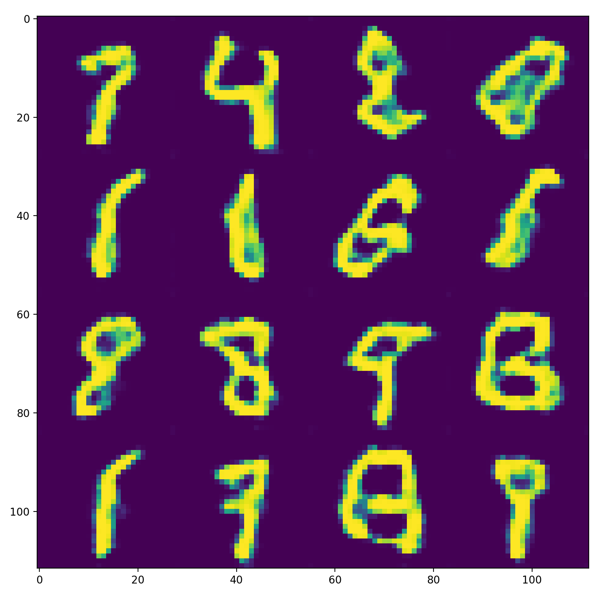

# Profiling TensorFlow

In this example, we'll profile a Generative network.  We'll go through several steps of profile, each time enabling a new tool or optimization.  At the end of the exercise, you'll have a GAN that can generate images like this:



The tools behind the GAN are not the subject for this talk but feel free to reach out on Slack if you have questions about it!

Find the original script in `train_GAN.py`.

All the scripts used here work in the conda module:

```bash
$ module load conda/2022-09-08
$ conda activate
```


## A Starting Point

<!--
To download the mnist dataset, make sure to enable http forwarding:
```bash
export http_proxy=http://theta-proxy.tmi.alcf.anl.gov:3128
export https_proxy=https://theta-proxy.tmi.alcf.anl.gov:3128
``` -->
First, request a node. See [this page](https://github.com/argonne-lcf/sdl_workshop/blob/master/Polaris%20Tips%20and%20Tricks.md) for a reminder of how to do this on Polaris. 

Run the original script, single node, like so: `python train_GAN.py`.  Feel free to ctrl+C once it hits a stable throughput.

Take note of the throughput reported!

```
INFO:root:(0, 0), G Loss: 0.699, D Loss: 0.672, step_time: 1.508, throughput: 84.883 img/s.
INFO:root:(0, 1), G Loss: 0.892, D Loss: 0.612, step_time: 0.428, throughput: 299.274 img/s.
INFO:root:(0, 2), G Loss: 0.867, D Loss: 0.591, step_time: 0.427, throughput: 299.728 img/s.
INFO:root:(0, 3), G Loss: 0.846, D Loss: 0.584, step_time: 0.429, throughput: 298.436 img/s.
INFO:root:(0, 4), G Loss: 0.848, D Loss: 0.580, step_time: 0.428, throughput: 299.203 img/s.
INFO:root:(0, 5), G Loss: 0.794, D Loss: 0.582, step_time: 0.428, throughput: 298.880 img/s.
INFO:root:(0, 6), G Loss: 0.760, D Loss: 0.609, step_time: 0.445, throughput: 287.366 img/s.
INFO:root:(0, 7), G Loss: 0.722, D Loss: 0.600, step_time: 0.438, throughput: 292.149 img/s.
INFO:root:(0, 8), G Loss: 0.699, D Loss: 0.602, step_time: 0.429, throughput: 298.461 img/s.
INFO:root:(0, 9), G Loss: 0.666, D Loss: 0.617, step_time: 0.427, throughput: 299.560 img/s.
INFO:root:(0, 10), G Loss: 0.655, D Loss: 0.634, step_time: 0.427, throughput: 299.887 img/s.
INFO:root:(0, 11), G Loss: 0.636, D Loss: 0.654, step_time: 0.428, throughput: 299.198 img/s.
INFO:root:(0, 12), G Loss: 0.663, D Loss: 0.645, step_time: 0.427, throughput: 299.976 img/s.
INFO:root:(0, 13), G Loss: 0.658, D Loss: 0.647, step_time: 0.427, throughput: 299.484 img/s.
INFO:root:(0, 14), G Loss: 0.692, D Loss: 0.646, step_time: 0.427, throughput: 299.853 img/s.
INFO:root:(0, 15), G Loss: 0.678, D Loss: 0.655, step_time: 0.426, throughput: 300.195 img/s.
INFO:root:(0, 16), G Loss: 0.701, D Loss: 0.646, step_time: 0.428, throughput: 299.311 img/s.
INFO:root:(0, 17), G Loss: 0.686, D Loss: 0.649, step_time: 0.432, throughput: 296.549 img/s.
INFO:root:(0, 18), G Loss: 0.678, D Loss: 0.661, step_time: 0.444, throughput: 287.965 img/s.
INFO:root:(0, 19), G Loss: 0.686, D Loss: 0.649, step_time: 0.428, throughput: 298.792 img/s.

```

On average, the A100 system is moving about 299 Images / second through this training loop.  Let's dig in to the first optimization in the [`line_profiler`](https://github.com/argonne-lcf/CompPerfWorkshop-2021/tree/main/09_profiling_frameworks/TensorFlow/line_profiler) directory.

Below are the wrap up conclusions which you can read ahead or come back to later.

# Conclusions

Try the `optimized` version of the code - what throughput are you getting?  It should be a good deal faster! (~177000 Img/s - about 590x faster)  So, after all the profiling, what optimizations did we learn?

 - Make sure that IO isn't a bottleneck.  In this case it was simple.  With big datasets it can be a challenge to keep the GPU fed and not idle on IO.
 - Make sure to use graph compilation where you can.  It's easy to make mistakes here: you must make sure to use only tensorflow operations!
 - Use XLA.  It can give excellent speed ups by fusing operations.
 - Use reduced precision ... if there isn't a bug.  Reduced precision becomes particularly powerful when XLA is involved, allowing you to keep the tensorcores chugging along with less memory-bound operations.

In general, if you have an application running in tensorflow, it's a great idea to profile periodically and make sure you've got all the basic optimizations down!
