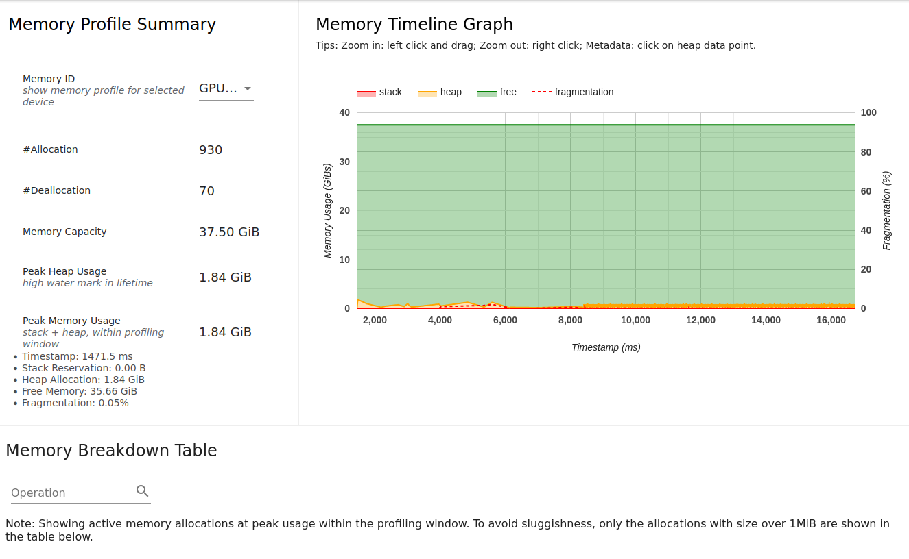

# Reduced Precision

Switching to reduced precision is not that hard in TensorFlow:

```python
tf.keras.mixed_precision.set_global_policy("mixed_float16")
```

In this case, there are also a bunch of places where I hard-coded `float32` - oops!  Fix those too.

Next, run with mixed precision (profiling is still turned on here):

```
INFO:root:(9, 16), G Loss: 0.754, D Loss: 0.615, step_time: 0.025, throughput: 162552.695 img/s.
INFO:root:(9, 17), G Loss: 0.762, D Loss: 0.620, step_time: 0.025, throughput: 162734.387 img/s.
INFO:root:(9, 18), G Loss: 0.755, D Loss: 0.629, step_time: 0.025, throughput: 163159.402 img/s.
INFO:root:(9, 19), G Loss: 0.777, D Loss: 0.639, step_time: 0.025, throughput: 162735.928 img/s.
INFO:root:(9, 20), G Loss: 0.752, D Loss: 0.637, step_time: 0.025, throughput: 162651.189 img/s.
INFO:root:(9, 21), G Loss: 0.848, D Loss: 0.644, step_time: 0.025, throughput: 162032.965 img/s.
INFO:root:(9, 22), G Loss: 0.683, D Loss: 0.649, step_time: 0.025, throughput: 162702.022 img/s.
INFO:root:(9, 23), G Loss: 1.082, D Loss: 0.664, step_time: 0.025, throughput: 163047.910 img/s.
INFO:root:(9, 24), G Loss: 0.592, D Loss: 0.671, step_time: 0.025, throughput: 162345.324 img/s.
INFO:root:(9, 25), G Loss: 1.044, D Loss: 0.648, step_time: 0.025, throughput: 162668.130 img/s.
INFO:root:(9, 26), G Loss: 0.707, D Loss: 0.638, step_time: 0.025, throughput: 161794.912 img/s.
INFO:root:(9, 27), G Loss: 0.949, D Loss: 0.625, step_time: 0.025, throughput: 162225.750 img/s.
INFO:root:(9, 28), G Loss: 0.778, D Loss: 0.621, step_time: 0.025, throughput: 163931.614 img/s.
```

This is not bad!  We ran with mixed precision and it is about 50% faster.  Let's look into the profile to discover why.

Here's the overview page.  We note right away that in the bottom left, it IS using a good amount of reduced precision (> 50%, in this case).


Scrolling down:


Compared to the float32 top-10 operations, this is a little different.  The resize operations, which were negligible in float32, are now nearly 10% of the total time - and NOT using the TensorCores.  One option here would be to alter the model to use a different resizing operation that is TensorCore eligible.

Here is the Kernel Statistics page again:


Just like we saw in the top10 apps list, the xla_compile apps are expensive compared to the total runtime here.  That said, this is a very small model and profiling run.  And the top two operations that DO actually run (290 times!) are the resize operations.  The tensorflow stats also give an interesting insite:


On the main page, you may have noticed that not ALL of the apps were on the device.  Here, you can see pretty clearly what is happening on the host device: mostly compiling to IR (Intermediate Representation), and after that it's data loading.

And there is also a timeline view of all ops (trace viewer)


And zoomed:


Zooming in on one iteration here shows us something interesting, part of which we already knew of course.  The main gaps in the "XLA Ops" and "XLA Modules" here are occuring in between batches (at 10,090ms) as well as for the resize operations.  It's very very likely that additional performance could be gained by using a different resize operation and working with a tf dataloader.  But the resize would technically change the model, which we are trying to avoid in this particular tutorial.

Lastly, the memory allocation of this model is REALLY SMALL:



We could certainly squeeze a bigger dataset onto this GPU without trouble.


NOTE: you may have seen an earlier version of this tutorial from ~2020 and 2021 that talked about a reduced precision bug.  Happy to report that bug is fixed.