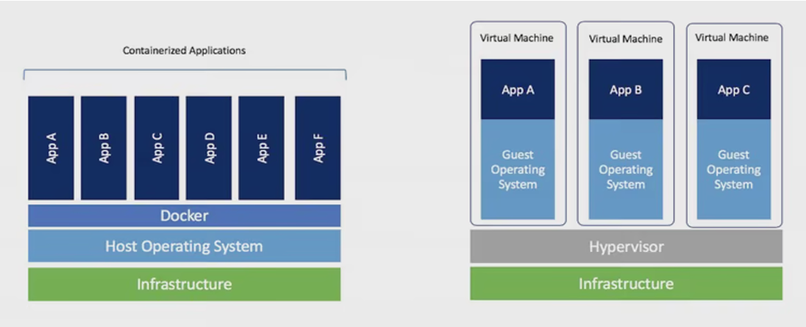

# Containers at ALCF
A container is a software package that wraps a software process or microservice to make it executable in all computing environments. It encapsulates an application and its dependencies into a "container". It runs natively on the operating system's kernel, sharing the kernel with other containers. 

Ideally, a container can be copied from one system to another, and the contained software runs without changes to the installation. [Containers are often compared to virtual machines (VMs)](https://www.ibm.com/blog/containers-vs-vms/) 

# Advantages of Containers
* **Portability**: Consistent behavior across different environments.
* **Lightweight**: Quick startups and efficient resource use.
* **Isolation**: Secure and conflict-free application environments.
* **Efficiency**: Maximizes system resource utilization.
* **Microservices**: Supports breaking apps into smaller, scalable services.
* **Scalability**: Easily scales with tools like Kubernetes.
* **Version Control**: Infrastructure can be tracked and managed like code.
* **CI/CD**: Simplifies continuous deployment and integration.
* **Developer Productivity**: Consistent local development setup.
* **Strong Ecosystem**: Vast community and third-party tool support.

# Singularity on Polaris
* At ALCF, users must run [Singularity](https://docs.sylabs.io/guides/3.8/user-guide/index.html) containers. Singularity is a container technology built for supercomputers with security in mind. Singularity has now joined Linux Foundation and has been renamed [Apptainer](https://apptainer.org/)
* Either build a singularity container from scratch or build a [docker](https://docs.docker.com/) container locally on your machine and subsequently convert it to a singularity container. An example to build a docker container locally can be found in our [user docs](https://docs.alcf.anl.gov/theta-gpu/data-science-workflows/containers/containers/).
* We have a [registry](https://github.com/argonne-lcf/container-registry/tree/main) for different containers at ALCF. A walkthrough of running a MPI container on Polaris is [here](https://github.com/argonne-lcf/container-registry/tree/main/containers/mpi/Polaris)

