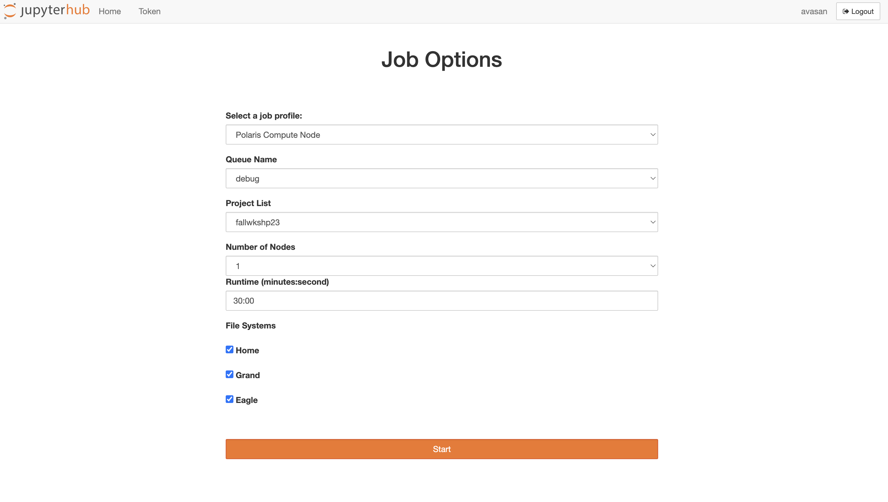
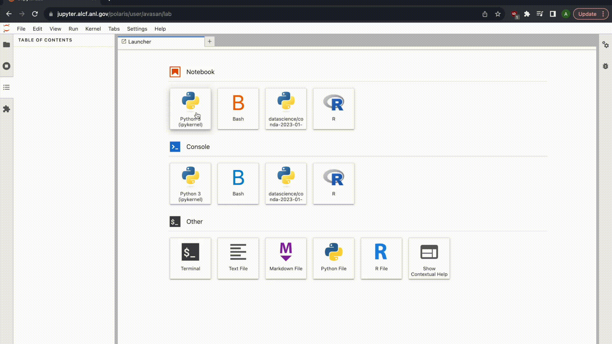
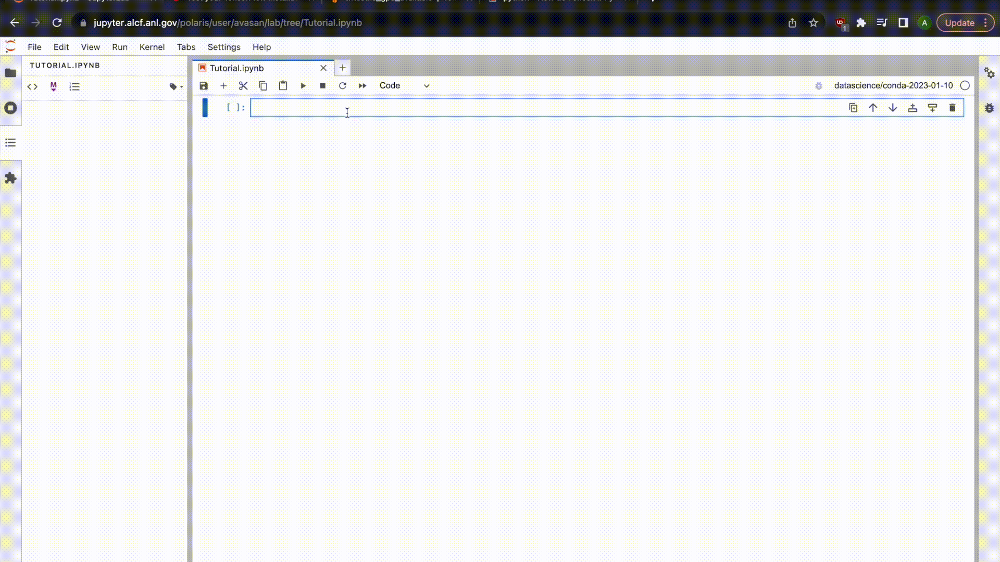

# Python on Polaris

## Logging in to interactive node

Request an interactive node on Polaris with:

```qsub -I -A fallws23single -l select=1 -l walltime=01:00:00 -l filesystems=home:grand:eagle -q debug```

## Creating conda environments in Polaris
Polaris uses modules to control loading of software environments. Loading modules will add/remove certain executables from the search space but will not install software or change the software location.

Here are some module associated commands:

```module list```: list currently loaded modules

```module avail```: list modules available to be loaded

```module load <module-name>```: load a module

```module unload <module-name>```: unload a module

ALCF has prebuilt environments containing GPU-supported builds of torch, tensorflow (both with horovod support for multi-node calculations), jax, and many other commonly-used Python modules.

To use a prebuilt conda environment do the following:

```
module load conda/2023-01-10-unstable
conda activate
``` 
If you need to load an earlier conda environment for your application you can search for available conda environments via:

```
module avail conda
```
and load one of these environments via:

```
module load conda/2022-09-08
```

If you need more flexibility to install your own packages (e.g. using conda install, pip install), then you can clone the base conda environment:

```
module load conda/2023-01-10-unstable
conda activate
conda create --clone base --prefix /path/to/envs/base-clone
conda activate /path/to/envs/base-clone
```
Note: make sure to change /path/to/envs/base-clone to an appropriate location for the environment.

## Running a simple multi process Python run

Polaris has 64 CPUs and 4 A100 GPUs on each of its compute nodes. To parallelize your run across these use MPI:
```mpiexec -n NPROC -ppn PROC_PER_NODE yourrun```
where NPROC is number of total processes to run on and PROC_PER_NODE is the number of processes on each node. Replace yourrun with your specific application.

Here is a test application of MPI with Python using the mpi4py program:

``` python
from mpi4py import MPI

comm = MPI.COMM_WORLD
size = comm.Get_size()
rank = comm.Get_rank()

print(f'My rank is {rank} of {size} total ranks')
```

This program creates an MPI World, gets the numer of ranks (size), and the specific rank and prints the rank id across all processes.

Example output using three total processes is:
```
My rank is 2 of 3 total ranks
My rank is 0 of 3 total ranks
My rank is 1 of 3 total ranks
```

# Using Jupyter Notebooks on Polaris

## Logging in 

Login via: https://jupyter.alcf.anl.gov/

Select "Login Polaris" and use your ALCF credentials and Multi-Factor Authentication.


## Server settings and start up
You want to setup your server options to these following:
* Job profile: Polaris Compute Node
* Queue Name: debug
* Project List: fallws23single
* Number of Nodes: 1-2
* Runtime: please spec



When you click "Start" you are submitting a job to the batch queue and waiting for the job to begin.

## Creating a new notebook and running python programs

Once the job begins, start a new notebook and feel free to rename it.

To use a conda environment with most of the necessary python modules (e.g. numpy, matplotlib, pandas, pytorch), please change your kernel for the notebook to datascience/conda-2023-01-10.

In this video, we are showing the steps of setting up a notebook, loading the appropriate environment and running a simple python script.



## Running Machine learning modules

Finally, we show how to load machine learning modules Tensorflow and Pytorch. These are installed natively in the datascience/conda-2023-01-10 module. We also show how to check GPU usage for each module.


